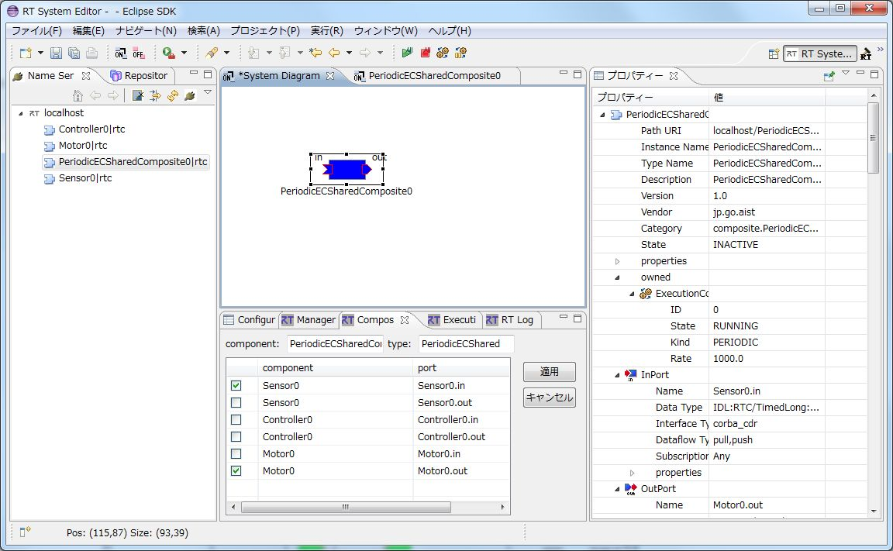
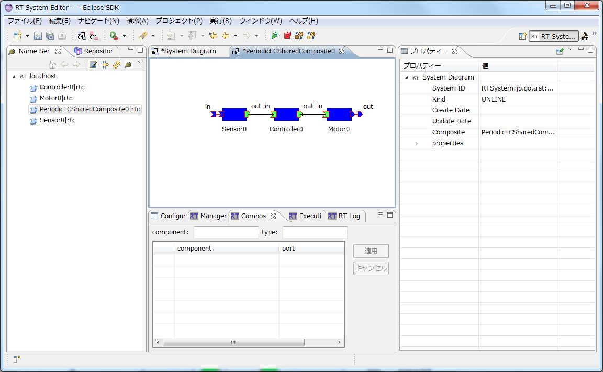
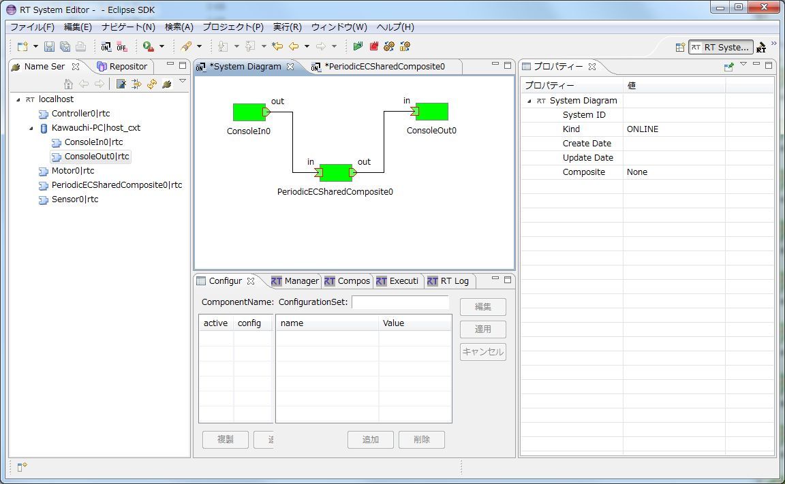
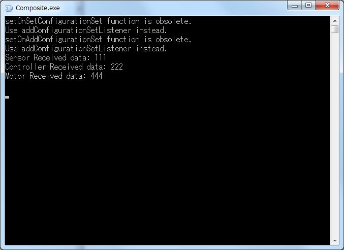
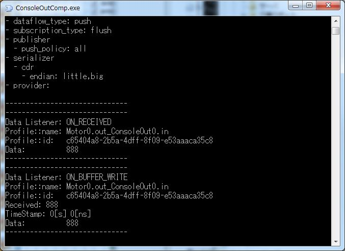

<!-- Title: Composite -->
#contents

This sample is included with the C++, Python, and Java editions of OpenRTM-aist.

### Overview

This sample demonstrates how to use the Composite component.

Before activating the Composite component, it is necessary to connect the child components that make up the Composite component.

- The Composite component contains three child components: Sensor, Controller, and Motor.
- The operation of the Composite component can be verified by connecting it to the ConsoleIn and ConsoleOut components.

### Startup Screens

- When the Composite component is started, four component names are displayed in the Name Service View.
- The component that combines Controller, Motor, and Sensor is PeriodicECSharedComposite. Drag and drop it onto the System Editor.

<strong>Composite Execution Example (Dragging and Dropping the Composite Component)</strong>

 

To display the contents of the composite component, double-click PeriodicECSharedComposite. It will be displayed in another editor, where you can connect the child components.

 

<strong>Composite Execution Example (Connecting Child Components in the Composite Component)</strong>

 

The example below shows operation when connected to the ConsoleIn and ConsoleOut components.

 

<strong>Composite Execution Example (RTSystemEditor Connection Screen)</strong>

 

If "111" is entered in ConsoleIn and "888" is displayed in ConsoleOut, the operation is correct.

The child components that make up the composite component each double the input value (the value displayed on the console screen) before outputting it.

; 

;

<strong>Composite Execution Example (Left: Composite Component Screen, Right: ConsoleOut Screen)</strong>

### Usage

The Composite sample receives a value through its input data port. The three child components each double the received value before passing it on, resulting in the Composite output data port producing a value that is eight times the original input.

- Procedure

  - Start RTSystemEditor and open a new SystemEditor. For details on using RTSystemEditor, refer to [RTSystemEditor]({{ site.baseurl }}/en/doc/toolmanuals/rtsystemeditor-1_2_0/).

  - Start the Composite component. The startup method depends on the operating system and OpenRTM-aist language edition. Refer to the table below.

<table class="table-alt">
  <tr>
    <th></th>
    <th>Windows</th>
    <th>Linux</th>
  </tr>
  <tr>
    <td>C++ Edition</td>
    <td>Composite.bat</td>
    <td>Composite</td>
  </tr>
  <tr>
    <td>Python Edition</td>
    <td>Composite.bat</td>
    <td>Composite.py</td>
  </tr>
  <tr>
    <td>Java Edition</td>
    <td>Composite.bat</td>
    <td>Composite.sh</td>
  </tr>
</table>

  - PeriodicECSharedComposite will appear in the Name Service View of RTSystemEditor. Drag it onto the SystemEditor.

  - Double-click PeriodicECSharedComposite and connect the ports between the child components.

  - Start both the ConsoleIn and ConsoleOut components, and connect their corresponding ports to PeriodicECSharedComposite. (Refer to the Composite execution example above.)

  - Right-click either component and select [Activate Systems].
