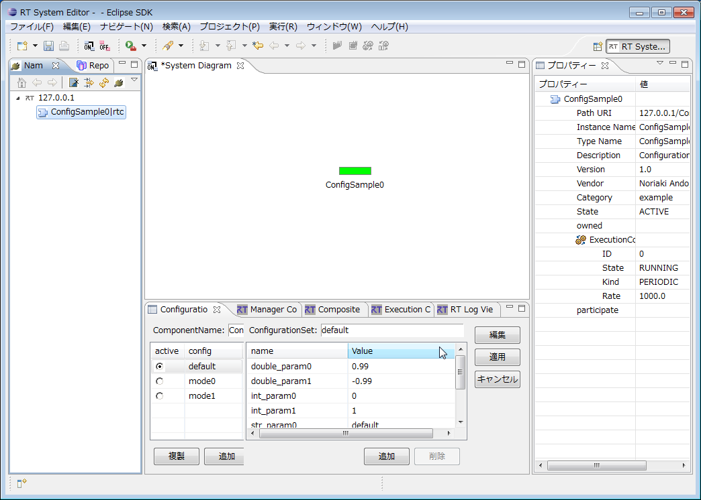

<!-- Title: ConfigSample -->
#contents
このサンプルは、OpenRTM-aist のC++版、Python版、Java版に付属しています。
### 概要
RTコンポーネントのコンフィギュレーションセットの使用方法を示したサンプルです。
ConfigSampleコンポーネントを起動します。コンポーネントが正常に起動されると、コンフィギュレーション・セットが予め設定された状態となっております。
RTSystemEditorを利用してコンフィギュレーション・セットを確認してみてください。

※コンポーネント起動時に｢指定されたパスが見つかりません。｣というエラーが発生してしまう場合は、

RTMExamples/ConfigSampleディレクトリ内にあるrtc.confファイル内の｢example.ConfigSample.config_file｣を次のように修正してください。

- 次に示すパスに置き換えます。
```
 .\\RTMExamples\\ConfigSample\\configsample.conf
 (ディレクトリ名やファイル名の間の文字は'\'ではなく、'\\'とします)
```

- または「configsample.conf」へのフルパスに書き換えます。この場合も、上記と同様にディレクトリ名やファイル名の間の文字に'\\'を使用します。

### 起動画面

<div align="center"><a href="ConfigSample_example_rtse_ja.png"></a></div>
<div align="center"><strong>ConfigSample実行例</strong></div>

### 使い方
RTSystemEditorのConfigrationViewで選択・設定したConfigrationSetに従ったデータセットをプロンプト上に表示し、絶えず表示更新をし続けます。

- 手順
  - RTSystemEditorを起動し、SystemEditorを用意します。RTSystemEditorの使用方法の詳細については[RTSystemEditor ]({{ site.baseurl }}/ja/doc/toolmanuals/rtsystemeditor-1_2_0)を参照
  - ConfigSampleコンポーネントを起動します。コンポーネントの起動はOSやOpenRTM-aistの言語によって異なりますので、以下の表を参考に起動します。
<table class="table-alt">
  <tr>
    <th></th>
    <th>Windowsの場合</th>
    <th>Linuxの場合</th>
  </tr>
  <tr>
    <td>C++版</td>
    <td>ConfigSample.bat</td>
    <td>ConfigSampleComp</td>
  </tr>
  <tr>
    <td>Python版</td>
    <td>ConfigSample.bat</td>
    <td>ConfigSample.py</td>
  </tr>
  <tr>
    <td>Java版</td>
    <td>ConfigSample.bat</td>
    <td>ConfigSample.sh</td>
  </tr>
</table>
  - RTSystemEditorのName Service Viewにこのコンポーネントが表示されるので、SystemEditor上にドラッグします。
  - RTSystemEditorのConfigration Viewから適当なConfigrationSet(default、mode0、mode1)を選びます。
  - 必要に応じてvalueを変更します。
  - [適用]ボタンをクリックします。

