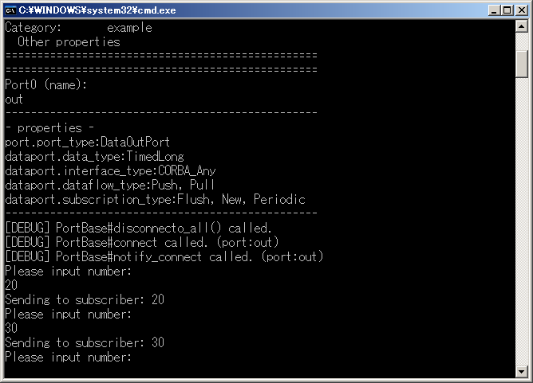
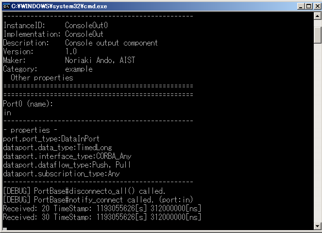
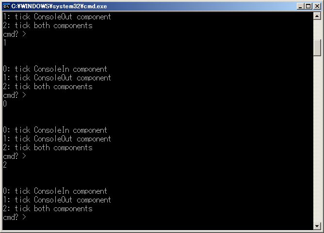

-------jp page!!-------
<!-- Title: ExtTrigger -->

### 概要
外部からの入力(イベント)により処理が実行されるExecutionContextのサンプルです。
- ExtConsoleIn.batとExtConsoleOut.batを実行し、2つのサンプル・コンポーネントを起動します。
- 両コンポーネントを起動後、ExtConnector.batを実行し、2つのコンポーネントのPort間を接続します。

### 起動画面

<strong>ExtTrigger実行例(ExtConsoleIn)</strong>

<strong>ExtTrigger実行例(ExtConsoleOut)</strong>

<strong>ExtTrigger実行例(ExtConnector)</strong>

Port間の接続が成功すると、ExtConnectorを実行したコンソールにどのコンポーネントの処理を進めるか選択するメニューが表示されます。
この入力値により、それぞれのコンポーネントは処理を１周期づつ進めていきます。

-------jp page!!-------
