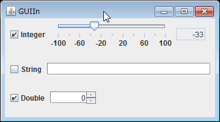
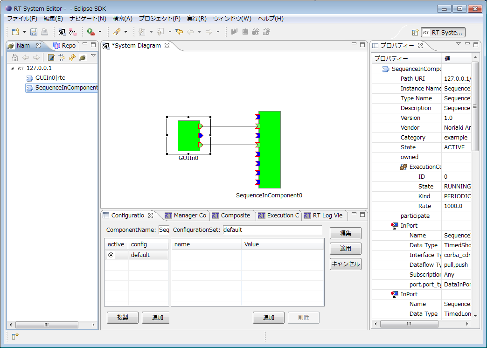

<!-- Title: GUIIn -->
#contents

This sample is included only with the Java edition of OpenRTM-aist. Please note that it is not included with the C++ or Python editions.

### Overview / Startup Screen

This is a sample RT Component with a GUI interface. On Windows, run GUIIn.bat; on Linux, run GUIIn.sh to start the sample component.

<strong>GUIIn Execution Example (GUIIn)</strong>

<strong>GUIIn Execution Example (RTSystemEditor Connection Screen)</strong>

The relationship between each GUI element and its corresponding port is as follows.

- Slider (Top): TimedLong OutPort
- Text Box (Middle): TimedString OutPort
- Spinner (Bottom): TimedDouble OutPort

After connecting the corresponding ports, input data is transmitted by turning on the checkbox next to the GUI element. (Use RTSystemEditor to connect the ports. To verify output data, use another sample such as SeqIn.)

### Usage

When you operate a checked control (slider or spinner) in the GUIIn component's GUI window, the values displayed in the SeqIn console window change according to the value changes.

- Procedure

  - Start RTSystemEditor and open a new SystemEditor. For details on using RTSystemEditor, refer to [RTSystemEditor]({{ site.baseurl }}/en/doc/toolmanuals/rtsystemeditor-1_2_0).

  - Start both the GUIIn and SeqIn components. The startup method depends on the operating system. On Windows, run GUIIn.bat; on Linux, run GUIIn.sh.

  - These components will appear in the Name Service View of RTSystemEditor. Drag both of them onto the System Editor.

  - Connect the corresponding ports of the two components. (Refer to the GUIIn execution example shown above.)

  - Right-click either component and select [Activate Systems].
