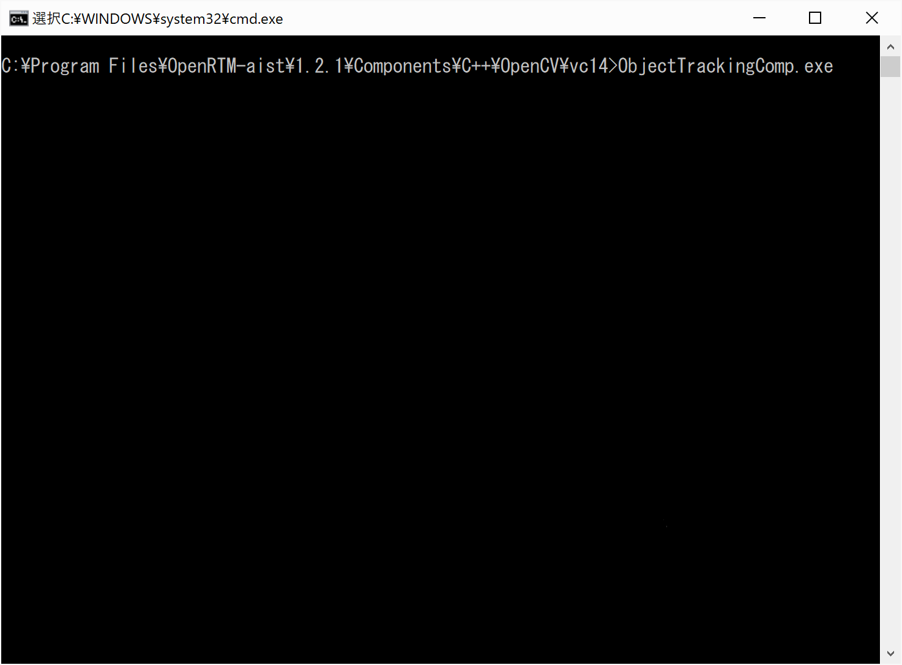
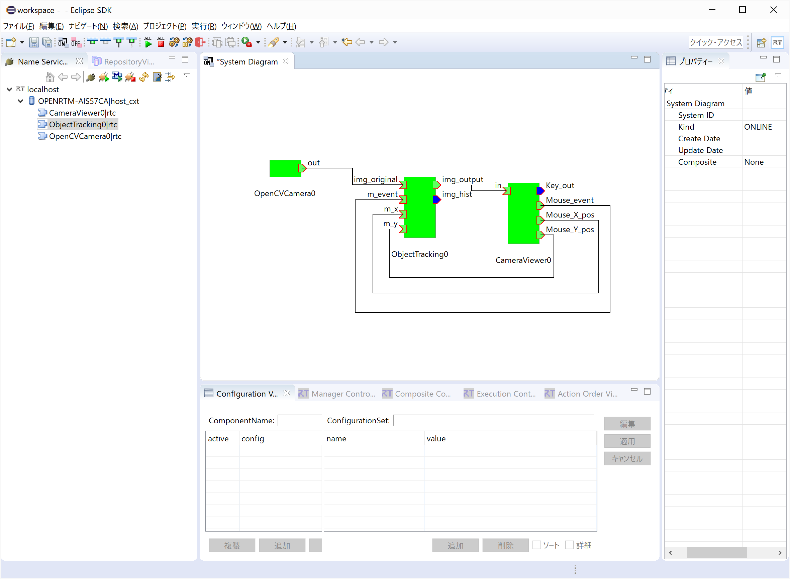
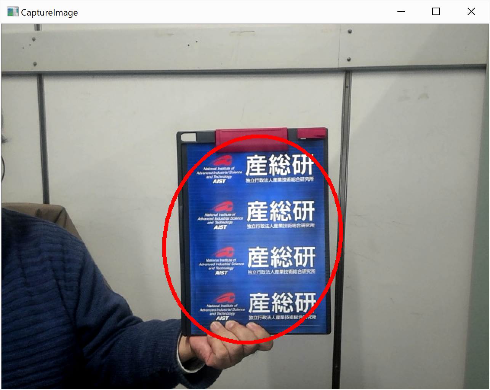

<!-- Title: ObjectTracking -->

#contents

OpenRTM-aistのPython版、Java版には付属していませんのでご注意ください。また、Linux上では、[LinuxにおけるOpenCVサンプルコードのビルド手順]({{ site.baseurl }}/ja/doc/installation/sample_components/opencv_sample_build)に従ってビルドしてインストールしてください。

### 概要
ObjectTrackingは、画面上から選択したオブジェクトを追跡して、その位置を赤い楕円形でかこんでしめすOpenCVコンポーネントのサンプルです。
OpenCVCamera、CameraViewerといっしょに使用します。

### 起動画面

<strong>ObjectTrackingコンポーネンの実行画面</strong>

### 使い方
ObjectTrackingは、画面上から選択したオブジェクトを追跡して、その位置を赤い楕円形でかこんでしめすコンポーネントです。ここではUSB Cameraから画像を取り込むためのOpenCVCameraコンポーネント、処理した画像を表示し、またマウスを用いてオブジェクトを選択するために使われるCameraViewerコンポーネントと共に使用します。以下ではWindowsにおいての使い方の説明をします。

- 手順 
  - [OpenRTPの起動手順(1.2系、Windows)]({{ site.baseurl }}/ja/doc/installation/install_1_2/start_openrtp_proc_windows_1_2)に従いOpenRTPを起動しRTSystemEditorを起動し、Name Service ViewにRTCが表示されるようにします。RTSystemEditorの使用方法の詳細については[RTSystemEditor]({{ site.baseurl }}/ja/doc/toolmanuals/rtsystemeditor-1_2_0)を参照してください。
  - エクスプローラーで\Program Files\OpenRTM-aist\1.2.1\Components\C++\OpenCVとたどります。
  - CameraViewer.batをダブルクリックします。
  - OpenCVCamera.batをダブルクリックします。
  - ObjectTracker.batをダブルクリックします。
  - RTSystemEditorの画面のName Service viewのところの[>]をクリックして、起動したコンポーネントCameraViewer, ObjectTracking, OpenCVCameraのコンポーネントが表示されているのを確認します。
  - RTSystemEditorで上部の[Open New System Editor]ボタンをクリックし、新規System Editorを開き、[System Dialgram]を新たに表示させます。
  - 上記の3つのコンポーネントをSystem Diagram上にドラッグ&ドロップします。
  - 下記の画面のように各コンポーネントのポートを接続します。

<strong>ObjectTrackingコンポーネントの接続</strong>

  - どれかのコンポーネントを右クリックし、[Activate Systems]を選択します。
  - 画面のウィンドウを動かしながらCameraViewerの画面を表示させます。

<strong>ObjectTracking出力画像</strong>

  - マウスを左クリックしながら、選択したいオブジェクトを選択します。この時矩形の反転選択画面がでるようにしてください。(場合によっては、でるようになるまで時間がかかることがあります。)
  - 選択がうまくされると上図のように赤い楕円があらわれます。このオブジェクトを物理的に動かすと、画面上で、そのオブジェクトといっしょに楕円がいっしょに動くことを確認してください。
  - なお"img_histgram"のOutPortからは上記の矩形選択時に、選択した画像のヒストグラムが一瞬表示されます。

