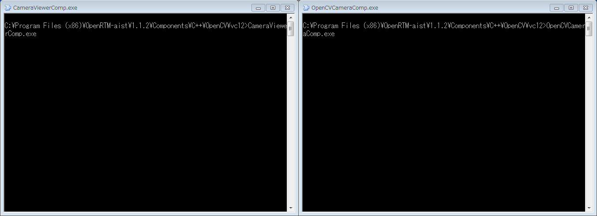
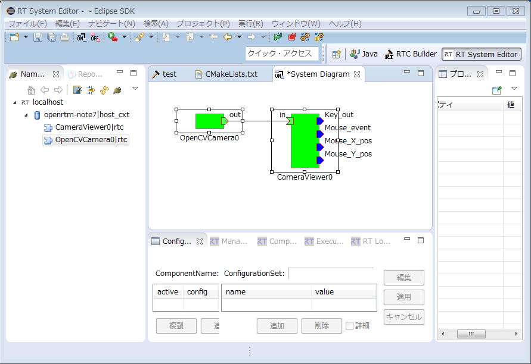
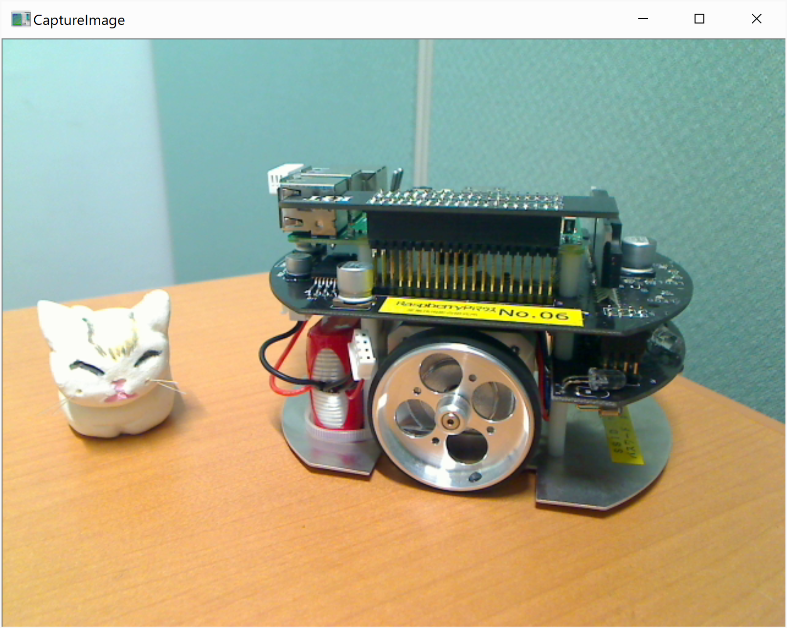
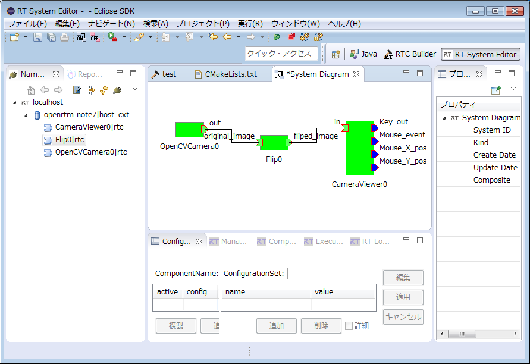
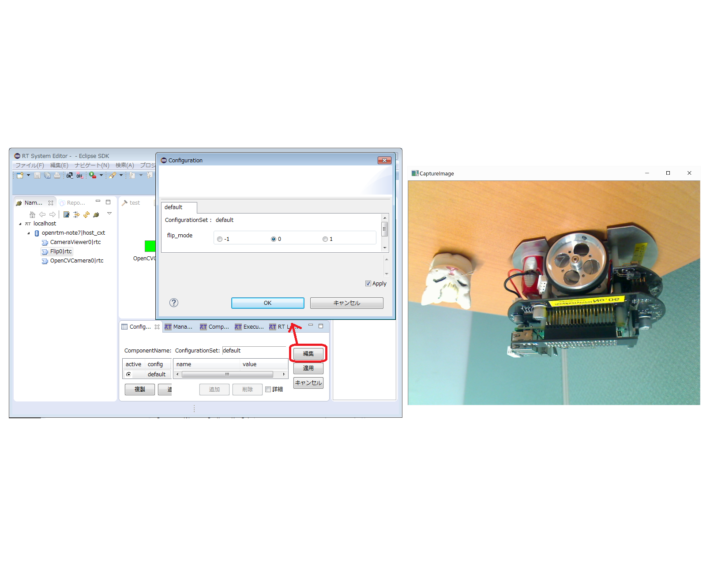

-------jp page!!-------

<!-- Title: OpenCVCamera/CameraViewerとシンプルOpenCVサンプル -->
#contents

OpenRTM-aistのPython版、Java版には付属していませんのでご注意ください。また、Linux上では、[LinuxにおけるOpenCVサンプルコードのビルド手順]({{ site.baseurl }}/ja/doc/installation/sample_components/opencv_sample_build)に従ってビルドしてインストールしてください。

### 概要
OpenCVCamera、CameraViewerを起動することで、USBカメラの画像をモニターに表示します。OpenCV画像処理サンプルRTCコンポーネントを接続し、エフェクトをかけられます。

### 起動画面

<strong>OpenCVCameraコンポーネントとCameraViewerコンポーネントの実行例</strong>

<strong>OpenCVCamera実行例(RTSystemEditor)</strong>

<strong>CameraViewer実行例(モニター)</strong>

### 使い方
OpenCVCameraはUSBカメラの画像データを取得し、CameraViewerコンポーネントでモニター上に表示するサンプルです。
OpenCVのRTサンプルコンポーネントを間に接続し、画像データにエフェクトをかけることもできます。

- 手順
  - RTSystemEditorを起動し、新規SystemEditorを開きます。RTSystemEditorの使用方法の詳細については[RTSystemEditor]({{ site.baseurl }}/ja/doc/toolmanuals/rtsystemeditor-1_2_0)を参照
  - OpenCVCamera(openCVCamera.bat)とCameraViewer(CameraViewer.bat)の両コンポーネントを起動します。
    - サンプルOpenCV画像処理RTコンポーネントを使用する場合は、インストール後、スタート＞OpenRTM-aist 1.2.1 x86_64＞C++_OpenCV-Examplesから(32bit環境では、スタート>OpenRTM-aist 1.2.1 x86>C++_OpenCV-Examplesから)起動してください。
  - RTSystemEditorのName Service Viewにこれらのコンポーネントが現れるので、二つともSystemEditor上にドラッグします。
  - 両コンポーネントの対応ポートを結びます。(上図RTSystemEditor実行例を参照)
  - どちらかのコンポーネントを右クリックし、[Activate Systems]を選択します。

- OpenCVのFlipを使用する
  - Flipコンポーネントをスタート＞OpenRTM-aist 1.2.1 x86_64＞C++_OpenCV-Examplesから(32bit環境では、スタート>OpenRTM-aist 1.2.1 x86>C++_OpenCV-Examplesから)起動してください。
  - SystemEditor上にドラッグして表示し、OpenCVCameraとCameraViewer両コンポーネントと接続し「Activate」します。（下図Flip実行例を参照）
  - FlipはConfigure「flip_mode」の値を変更する事で、出力データを変更することも可能です。（下図flip_modeの変更を参照）
    - Flipの詳しい使い方・解説は[こちら](http://www.openrtm.org/openrtm/ja/node/6057)をご確認ください。

<strong>Flip実行例(RTSystemEditor)</strong>

<strong>flip_modeの変更(RTSystemEditorとモニター)</strong>

- OpenCV使用のその他のサンプルについて
<table class="table-alt">
  <tr>
    <th>起動コマンド</th>
    <th>機能</th>
    <th>configurationパラメータ</th>
  </tr>
  <tr>
    <td>Affine.bat</td>
    <td>入力画像のアフィン変換をします。</td>
    <td>Affine行列</td>
  </tr>
  <tr>
    <td>BackgroundSubtractionSimple.bat</td>
    <td>入力画像においてKey入力があった時点の画像から変化分を出力します。</td>
    <td>画像の変化検出の方法示すパラメータ</td>
  </tr>
  <tr>
    <td>Binarization.bat</td>
    <td>入力画像を二値化した白黒画像に変換します。</td>
    <td>二値化の閾値</td>
  </tr>
  <tr>
    <td>DialationErosion.bat</td>
    <td>ダイアレーション/エロージョン処理を行います。</td>
    <td>二値化の閾値</td>
  </tr>
  <tr>
    <td>Edge.bat</td>
    <td>X方向一次微分画像、Y方向一次微分画像、ラプラシアン画像(二次微分画像)を出力します</td>
    <td>アパーチャーサイズ</td>
  </tr>
  <tr>
    <td>Findcontour.bat</td>
    <td>輪郭抽出をして、輪郭を画像中に表示します。</td>
    <td>処理前の二値化の閾値、階層化のレベル、表示時の輪郭線のサイズ、輪郭の近似手法</td>
  </tr>
  <tr>
    <td>Histgram.bat</td>
    <td>白黒化した画像の明度/コントラストの変更処理をしながら、ヒストグラムの変化を表示します。</td>
    <td>明度、コントラスト</td>
  </tr>
  <tr>
    <td>Hough.bat</td>
    <td>ハフ変換による直線抽出</td>
    <td>ハフ変換のパラメータや検出した直線の描画パラメータ</td>
  </tr>
  <tr>
    <td>Perspective.bat</td>
    <td>画像のパースペクティブ変換(斜め下から見たように変換します。</td>
    <td>項目なし</td>
  </tr>
  <tr>
    <td>RockPaperScissors.bat</td>
    <td>画像でグーチョキパーを判定します。</td>
    <td>solidityに対するジャンケン判定用閾値と膨張縮小処理による欠損補完パラメータ</td>
  </tr>
  <tr>
    <td>Rotate.bat</td>
    <td>画像を回転と縮小拡大処理をします。</td>
    <td>反時計周りの回転角と縮小拡大率</td>
  </tr>
  <tr>
    <td>Scale.bat</td>
    <td>画像の縮小拡大処理をします。</td>
    <td>X方向Y方向の拡大縮小率</td>
  </tr>
  <tr>
    <td>Sepia.bat</td>
    <td>画像のセピア化を行います。</td>
    <td>セピア化の色味</td>
  </tr>
  <tr>
    <td>Translate.bat</td>
    <td>画像の2次元移動処理をします。</td>
    <td>移動方向</td>
  </tr>
</table>

-------jp page!!-------
