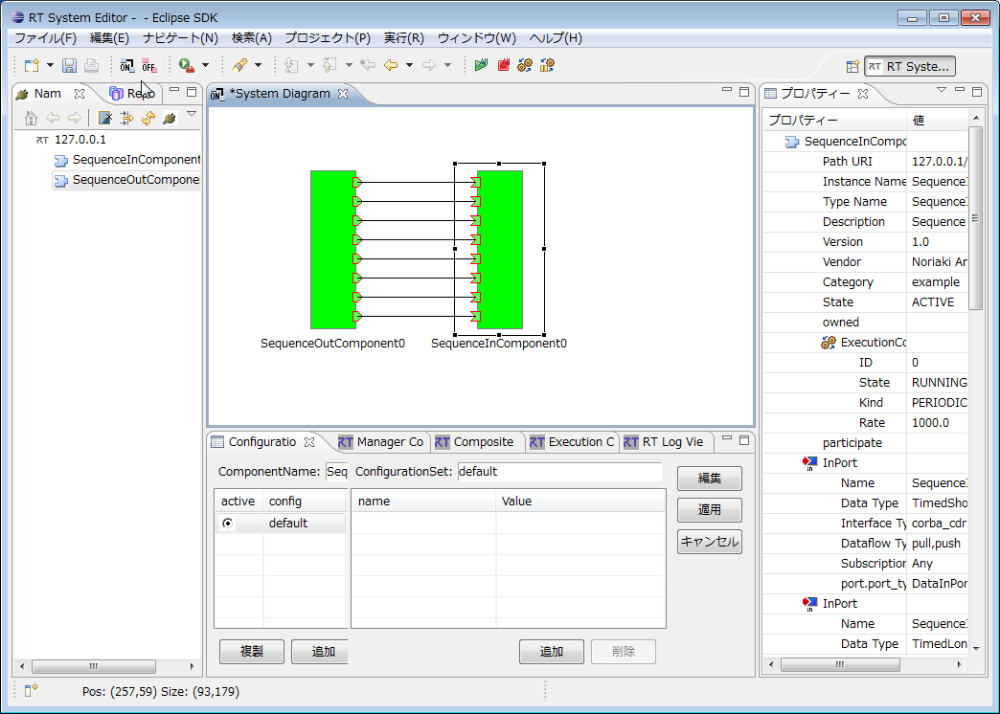
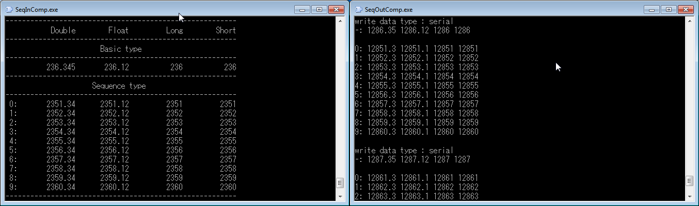
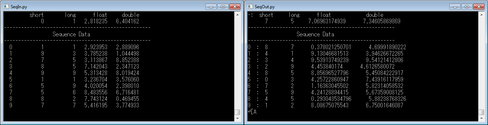
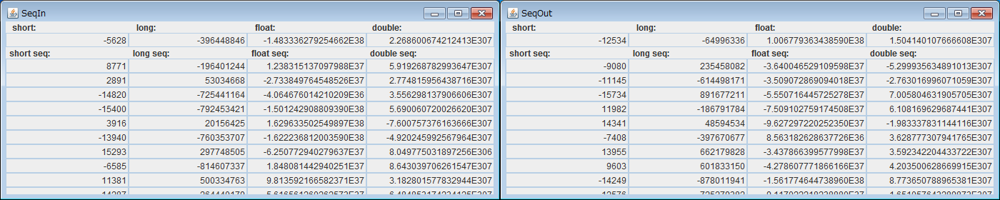

<!-- **SeqIO -->
#contents
このサンプルは、OpenRTM-aistのC++版、Python版、Java版に付属しています。 
### 概要
InPort、OutPortの使用方法を示したサンプルです。SeqInコンポーネントとSeqOutコンポーネントを起動するとGUIまたはコンソール画面が表示されます。
SeqIn、SeqOutともに以下の型のDataPortを備えています。
TimedShort、TimedLong、TimedFLoat、TimedDouble、TimedShortSeq、TimedLongSeq、TimedFLoatSeq、TimedDoubleSeq、各Portの出力は乱数で決定しており、各Port間を接続するとSeqOut側の出力値、SeqIn側の入力値がそれぞれのGUIまたはコンソール画面に表示されます。(Port間の接続にはRTSystemEditorを利用ください。)

### 起動画面

<strong>SeqIO実行例(RTSystemEditor接続画面)</strong>

<strong>SeqInコンポーネントとSeqOutコンポーネントの実行例(C++版)</strong>

<strong>SeqInコンポーネントとSeqOutコンポーネントの実行例(Python版)</strong>

<strong>SeqInコンポーネントとSeqOutコンポーネントの実行例(Java版)</strong>

### 使い方
SeqIOのサンプルは、SeqOutから連続して出力される数値データをデータポートからSeqInへ送り、GUIまたはコンソール上に表示させるサンプルです。
SeqOutとSeqInの対応するポートをRTSystemEditor上で接続してください。両コンポーネントをアクティベートするとSeqOutだけでなくSeqInの出力される数値も連続的に変化し、データポートの入出力が観察できます。

- 手順
  - RTSystemEditorを起動し、SystemEditorを用意します。RTSystemEditorの使用方法の詳細については[RTSystemEditor]({{ site.baseurl }}/ja/doc/toolmanuals/rtsystemeditor-1_2_0)を参照
  - SeqOutとSeqInの両コンポーネントを起動します。コンポーネントの起動はOSやOpenRTM-aistの言語によって異なりますので、以下の表を参考に起動します。
<table class="table-alt">
  <tr>
    <th></th>
    <th colspan="2">Windowsの場合</th>
    <th colspan="2">Linuxの場合</th>
  </tr>
  <tr>
    <td></td>
    <td>SeqInコンポーネント</td>
    <td>SeqOutコンポーネント</td>
    <td>SeqInコンポーネント</td>
    <td>SeqOutコンポーネント</td>
  </tr>
  <tr>
    <td>C++版</td>
    <td>SeqIn.bat</td>
    <td>SeqOut.bat</td>
    <td>SeqInComp</td>
    <td>SeqOutComp</td>
  </tr>
  <tr>
    <td>Python版</td>
    <td>SeqIn.bat</td>
    <td>SeqOut.bat</td>
    <td>SeqIn.py</td>
    <td>SeqOut.py</td>
  </tr>
  <tr>
    <td>Java版</td>
    <td>SeqIn.bat</td>
    <td>SeqOut.bat</td>
    <td>SeqIn.sh</td>
    <td>SeqOut.sh</td>
  </tr>
</table>
  - RTSystemEditorのNameServiceViewに両コンポーネントが現れるので、それらをSystemEditor上にドラッグします。
  - 両コンポーネントの対応ポートを接続します。(上図SeqIO実行例を参照)
  - どちらかのコンポーネントを右クリックし、[Activate System]を選択します。

