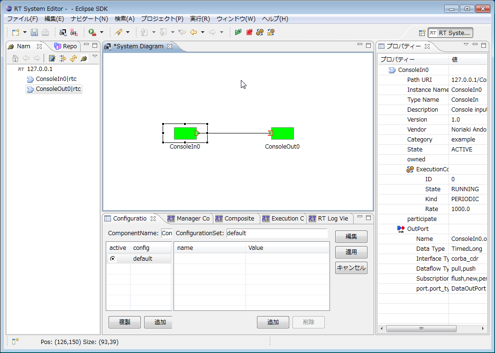
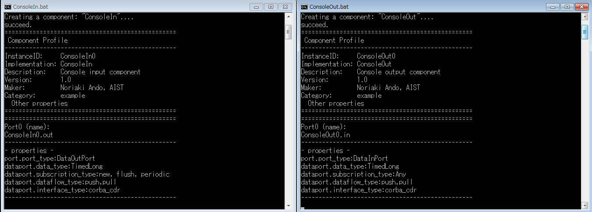

<!-- Title: SimpleIO -->

#contents

This sample is included with the C++, Python, and Java editions of OpenRTM-aist.

### Overview

This sample demonstrates the use of InPorts and OutPorts.

Start the ConsoleIn and ConsoleOut components. When the ports are connected, numbers entered on the ConsoleIn side are displayed on the ConsoleOut side.

Ports can be connected either using RTSystemEditor or by executing rtshell commands.

### Startup Screens

<strong>SimpleIO Execution Example (RTSystemEditor Connection Screen)</strong>

<strong>ConsoleIn and ConsoleOut Component Execution Example</strong>

### Usage

The SimpleIO sample sends numbers entered in ConsoleIn to ConsoleOut through a data port and displays the same numbers in ConsoleOut.

Enter a number in the ConsoleIn window. The same number will then be displayed in the ConsoleOut window.

- Procedure

  - Start OpenRTP and open RTSystemEditor. For details on using RTSystemEditor, refer to [RTSystemEditor]({{ site.baseurl }}/en/doc/toolmanuals/rtsystemeditor-1_2_0).

  - Start both the ConsoleIn and ConsoleOut components.

    The startup method depends on the operating system and the OpenRTM-aist language edition. Refer to the table below.

<table class="table-alt">
  <tr>
    <th></th>
    <th colspan="2">Windows</th>
    <th colspan="2">Linux</th>
  </tr>
  <tr>
    <td></td>
    <td>ConsoleIn Component</td>
    <td>ConsoleOut Component</td>
    <td>ConsoleIn Component</td>
    <td>ConsoleOut Component</td>
  </tr>
  <tr>
    <td>C++ Edition</td>
    <td>ConsoleIn.bat</td>
    <td>ConsoleOut.bat</td>
    <td>ConsoleInComp</td>
    <td>ConsoleOutComp</td>
  </tr>
  <tr>
    <td>Python Edition</td>
    <td>ConsoleIn.bat</td>
    <td>ConsoleOut.bat</td>
    <td>ConsoleIn.py</td>
    <td>ConsoleOut.py</td>
  </tr>
  <tr>
    <td>Java Edition</td>
    <td>ConsoleIn.bat</td>
    <td>ConsoleOut.bat</td>
    <td>ConsoleIn.sh</td>
    <td>ConsoleOut.sh</td>
  </tr>
</table>

  - Both components will appear in the Name Service View of RTSystemEditor. Drag them onto the SystemEditor.

  - Connect the ports of the two components. (Refer to the SimpleIO execution example above.)

  - Right-click either component and select [Activate Systems].

  - The prompt "Please input number:" will appear in the ConsoleIn window. Enter a number.

  - The same number will be displayed in the ConsoleOut window.
