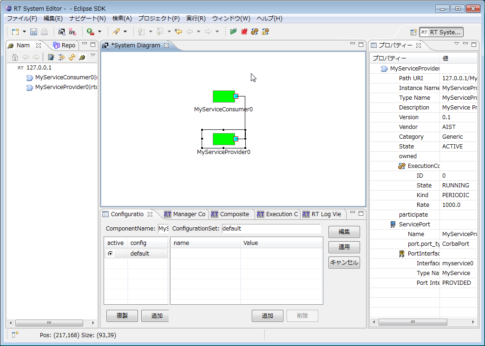
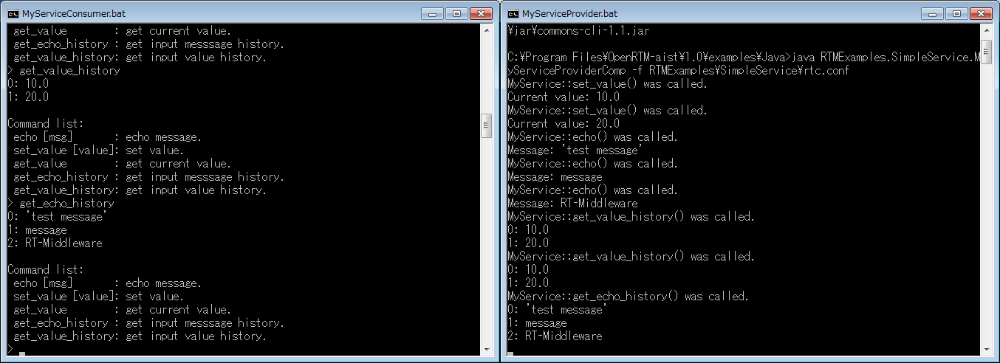

<!-- Title: SimpleService -->
#contents
このサンプルは、OpenRTM-aistのC++版、Python版、Java版に付属しています。

### 概要
ServicePortの使用方法を示したサンプルです。以下に示すIDLを使用してサービスを定義しています。

```
 typedef sequence<string> EchoList;
 typedef sequence<float> ValueList;
 
 interface MyService
 {
   string echo(in string msg);
   EchoList get_echo_history();
   void set_value(in float value);
   float get_value();
   ValueList get_value_history();
 };
```

- MyServiceConsumerコンポーネントとMyServiceProviderコンポーネントを起動します。
- Consumer側コンポーネントをActivateすると、コンソールに利用可能なコマンドリストが表示されますので、各コマンドをお試しください。(Port間の接続にはRTSystemEditorを使用してください。)


### 起動画面

<div align="center"><a href="SimpleService_example_rtse_ja.png"></a></div>
<div align="center"><strong>SimpleService実行例(RTSystemEditor接続画面)</strong></div>

<div align="center"><a href="MyService_example.png"></a></div>
<div align="center"><strong>MyServiceConsumerコンポーネントとMyServiceProviderコンポーネントの実行例</strong></div>

### 使い方
SimpleServiceは、MyServiceConsumerからコマンドを送り、MyServiceProviderでそれを処理させるというサンプルです（※正確には、コマンドの解釈はConsumer側であり、Provider側の関数を呼び出す形で実装されています）。
MyServiceConsumerとMyServiceProviderの対応するポートをRTSystemEditor上で接続し、両コンポーネントをアクティベートします(ActivateするのはConsumer側コンポーネントだけでもよい)とConsumer側プロンプトにコマンド一覧が表示されるので、適当なコマンドを入力してください。Provider側の応答がプロンプト上で観察できます。

- 手順
  - RTSystemEditorを起動し、新規SystemEditorを開きます。RTSystemEditorの使用方法の詳細については[RTSystemEditor]({{ site.baseurl }}/en/doc/toolmanuals/rtsystemeditor-1_2_0)を参照
  - MyServiceConsumerとMyServiceProviderの両コンポーネントを起動します。

コンポーネントの起動はOSやOpenRTM-aistの言語によって異なりますので、以下の表を参考に起動します。
<table class="table-alt">
  <tr>
    <th></th>
    <th colspan="2">Windowsの場合</th>
    <th colspan="2">Linuxの場合</th>
  </tr>
  <tr>
    <td></td>
    <td>MyServiceConsumerコンポーネント</td>
    <td>MyServiceProviderコンポーネント</td>
    <td>MyServiceConsumerコンポーネント</td>
    <td>MyServiceProviderコンポーネント</td>
  </tr>
  <tr>
    <td>C++版</td>
    <td>MyServiceConsumer.bat</td>
    <td>MyServiceProvider.bat</td>
    <td>MyServiceConsumerComp</td>
    <td>MyServiceProviderComp</td>
  </tr>
  <tr>
    <td>Python版</td>
    <td>MyServiceConsumer.bat</td>
    <td>MyServiceProvider.bat</td>
    <td>MyServiceConsumer.py</td>
    <td>MyServiceProvider.py</td>
  </tr>
  <tr>
    <td>Java版</td>
    <td>MyServiceConsumer.bat</td>
    <td>MyServiceProvider.bat</td>
    <td>MyServiceConsumer.sh</td>
    <td>MyServiceProvider.sh</td>
  </tr>
</table>
  - RTSystem EditorのName Service Viewに両コンポーネントが現れるので、それらをSystemEditor上にドラッグします。
  - 両コンポーネントの対応ポートを結びます。(上図SimpleService実行例を参照)
  - どちらかのコンポーネントを右クリックし、[Activate Systems]を選択します。（この場合は、Consumer側コンポーネントをActivateするだけでも動作します。）
  - Consumer側プロンプトにコマンドを入力します。

- コマンド
  - echo <message>：任意の<message>をエコー
  - set_value<value>：任意の<value>をProvider側にセット
  - get_value：現在Provider側にセットされている値を取得して表示
  - get_echo_history：今までのエコーメッセージの履歴をProvider側から取得
  - get_value_history：今までにセットしてきた値の履歴をProvider側から取得


