<!-- Title: TkCalibGUI -->

#contents
## TkCalibGUI
OpenRTM-aistのPython版、Java版には付属していませんのでご注意ください。また、Linux上では、[LinuxにおけるOpenCVサンプルコードのビルド手順]({{ site.baseurl }}/ja/doc/installation/sample_components/opencv_sample_build)に従ってビルドしてインストールしてください。

### 概要 
GUI画面を持ったRTコンポーネントのサンプルです。TkCalibGUI.batを実行することでサンプル・コンポーネントが起動します。
カメラキャリブレーションを行う ImageCalibrationコンポーネント用のGUIです。

本コンポーネントを実行して選択可能リストの中からカメラコンポーネントを指定すると、ImageCalibrationCompと合わせて自動起動し、コンポーネント間のポート接続も自動で行います。
GUIのボタン操作でキャリブレーションに必要なカメラ画像の保存、及び、カメラパラメーターの算出を行うことができます。

<br>
### コンポーネントの実行条件
OpenRTM-aist C++のWindows用インストーラーを使ってインストールされた場合は、TkCalibGUI.batを実行するだけで動作します。

ソースからビルドされた場合は、実行条件を整える必要があります。本コンポーネントでは実行に必要な環境のチェックを行っています。
条件に合わないと以下のようなメッセージダイアログを表示します。指示に従ってインストールしてください。

<div align="center"><a href="calib9.jpg">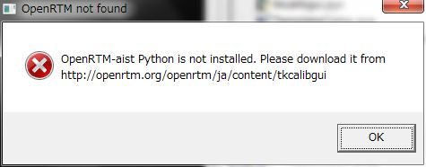</a></div>
<div align="center"><strong>実行条件を満たさない場合に表示されるメッセージ</strong></div>

#### Windows環境向け
<table class="table-alt">
  <tr>
    <td>メッセージ内容</td>
    <td>対応処理</td>
  </tr>
  <tr>
    <td>OpenRTM-aist Python is not installed.</td>
    <td><a href="{{ site.baseurl }}/download/openrtm-aist-python/openrtm-aist-python_1_2_1_release">OpenRTM-aist Python版</a>のページからWindows用インストーラーをダウンロードできます。<br>インストーラーのOSのバージョン(32bit or 64bit)は、OpenRTM-aist C++版に合わせてください。</td>
  </tr>
  <tr>
    <td>Ttk is not installed.</td>
    <td><a href="https://pypi.python.org/pypi/pyttk/0.3">pyttk</a>をインストールしてください。python2.7には含まれていますが、python2.6では別途インストールが必要です。</td>
  </tr>
  <tr>
    <td>PIL is not installed.</td>
    <td><a href="http://www.pythonware.com/products/pil/">PIL</a>をインストールしてください。</td>
  </tr>
  <tr>
    <td>NumPy is not installed.</td>
    <td><a href="http://sourceforge.net/projects/numpy/files/NumPy/">numpy</a>をインストールしてください。</td>
  </tr>
  <tr>
    <td>rtctree is not installed.</td>
    <td>rtctree-3.0.1以上が必要<br>近日インストーラーを公開予定ですが、それまでは<a href="http://github.com/gbiggs/rtctree">githubのページ</a>の右下の「Download Zip」をクリックし、rtc-master.zipファイルをダウンロード・展開し、setup.pyを実行してインストールしてください。（> python setup.py install）<br> site-packages\rtctree\rtmidlへのパスをシステム環境変数のPYTHONPATHに追加してください。<br>例）C:\Python27\Lib\site-packages\rtctree\rtmidl</td>
  </tr>
</table>

#### Linux(Ubuntu）環境向け
<table class="table-alt">
  <tr>
    <td>メッセージ内容</td>
    <td>対応処理</td>
  </tr>
  <tr>
    <td>OpenRTM-aist Python is not installed.</td>
    <td><a href="http://openrtm.org/openrtm/ja/content/openrtm-aist-python-110-release">OpenRTM-aist Python版</a>のページから一括インストールスクリプトをダウンロードできます。</td>
  </tr>
  <tr>
    <td>Ttk is not installed.</td>
    <td>$ sudo apt-get install python-tk</td>
  </tr>
  <tr>
    <td>PIL is not installed.</td>
    <td>$ sudo apt-get install python-pil.imagetk</td>
  </tr>
  <tr>
    <td>NumPy is not installed.</td>
    <td>$ sudo apt-get install python-numpy</td>
  </tr>
  <tr>
    <td>rtctree is not installed.</td>
    <td>rtctree-3.0.1以上が必要 <br> githubからダウンロードし、setup.pyを実行してインストールする手順はWindows環境と同じ。`/.bashrcなどにPYTHONPATHを追加してください。` export PYTHONPATH="/usr/local/lib/python2.7/dist-packages/rtctree/rtmidl"</td>
  </tr>
</table>


### 起動画面

<div align="center"><a href="calib1.jpg">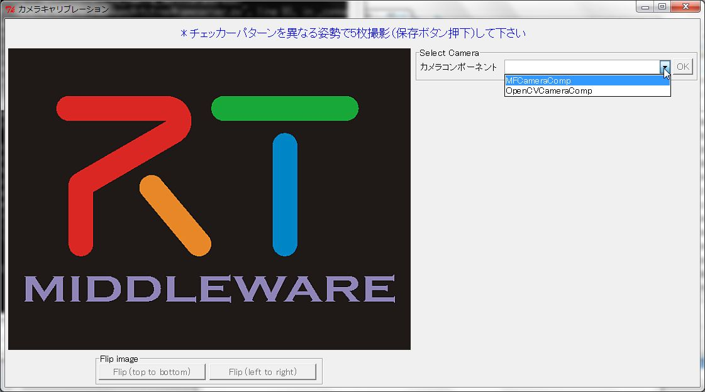</a></div>

最初に使用するカメラコンポーネントをリストの中から選択します。このリストには実行環境で使用可能なカメラコンポーネント名が表示されています。
Windows 10のVC2019の環境ではOpenCVCameraCompとMFCameraCompが選択可能です。この2つはどちらも同じような動作をしますが、OpenCVCameraCoｍpの方が新しく環境依存性も少ないようです。また、このtkCalibGUI.batで起動される実行ファイルにより、ImageCalibrationコンポーネントが起動されます。また、このコンポーネントはImageCalibration.batによって単体起動できますが、単体起動した場合に接続して動作確認するようなコンポーネントは別途準備されていませんので、tkCalibGUIを用いずにImageCalibrationコンポーネントを使用したい場合は、別途接続するコンポーネントをユーザ側で作成してください。


<div align="center"><a href="calib2.jpg">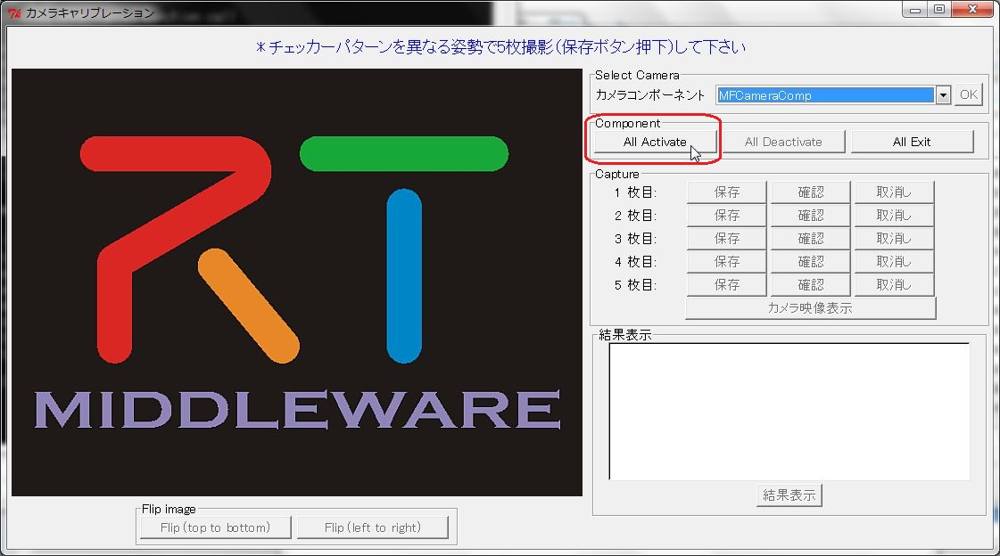</a></div>

[All Activate]ボタンをクリックするとカメラ映像が表示されます。
この時の全コンポーネントの接続状態は下図の通りです。TkCalibGUI以外のコンポーネントは自動起動され、コンポーネント間も自動接続しています。


<div align="center"><a href="calib10.jpg">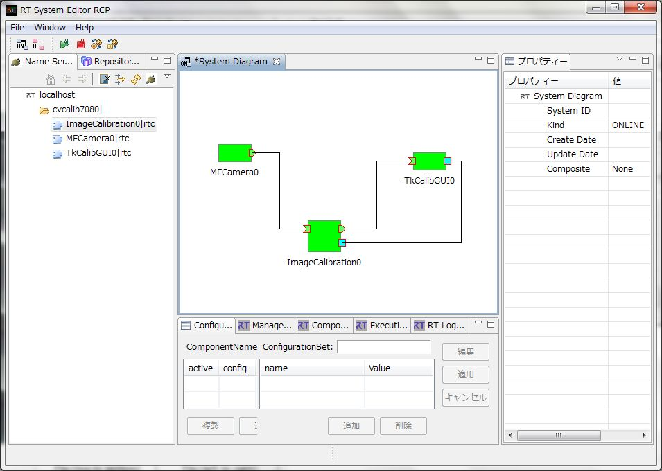</a></div>

### 使い方

チェッカーパターン(キャリブレーションパターン)を用意します。参考として、ここでは<div align="center"><a href="checkerboard.pdf"></a></div>; を使っています。
チェッカーパターンのコーナー数は、ImageCalibrationのConfigurationで指定する必要があります。パターンの縦横の白と黒四角の共有している頂点の数(checker_h, checker_w)ーこれは白黒の四角の数-1です、と撮影枚数(image_num)もConfigurationで変更可能です。

チェッカーパターンの取り込みは、そのパターンをいろいろな角度でなるべく画面全体をカバーするような形で指定枚数分保存します。[確認]ボタンで保存画像の確認が可能です。[取消し]ボタンをクリックするとその画像は削除されますので保存し直してください。

<div align="center"><a href="calib3.jpg">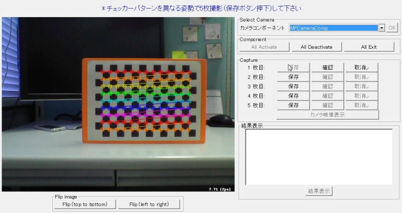</a><a href="calib4.jpg">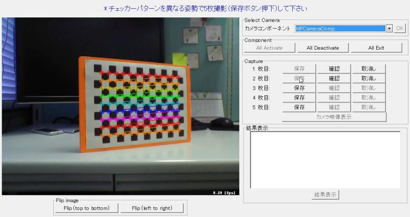</a></div>
<div align="center"><a href="calib5.jpg">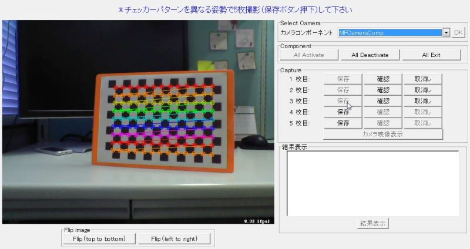</a><a href="calib6.jpg">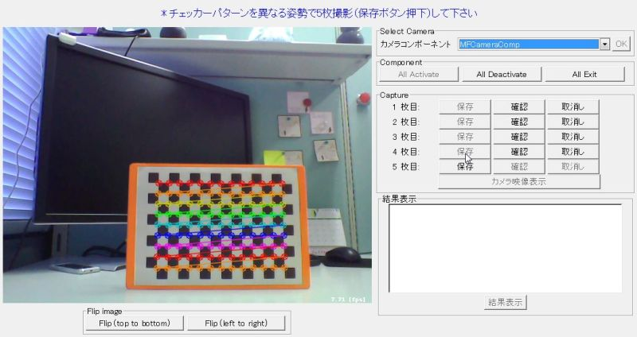</a></div>

指定枚数の保存が終了すると[結果表示]ボタンが有効です。これをクリックするとカメラパラメーター値が表示されます。

<div align="center"><a href="calib8.jpg">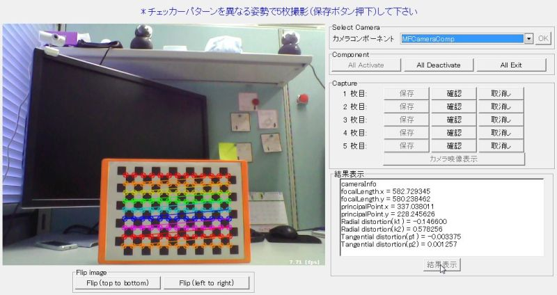</a></div>

カメラパラメーターはcamera.ymlのファイル名でコンポーネントの実行ファイルと同じディレクトリに出力されます。

```
  %YAML:1.0
  calibration_time: "Thu May 22 16:38:06 2014\n"
  image_width: 640
  image_height: 480
  board_width: 13
  board_height: 9
  cameraMatrix: !!opencv-matrix
     rows: 3
     cols: 3
     dt: d
     data: [ 5.8272934483011682e+002, 0., 3.3703801084645710e+002, 0.,
         5.8023846162074653e+002, 2.2824562602176763e+002, 0., 0., 1. ]
  distCoeffs: !!opencv-matrix
     rows: 1
     cols: 5
     dt: d
     data: [ -1.4659954975042236e-001, 5.7825601645508595e-001,
         -3.3745642103035984e-003, 1.2569676956708463e-003,
         -9.8011775330916773e-001 ]
```

### 画像出力（参考資料）

参考として[保存]ボタンをクリックした時の画像ファイルをシステム環境変数のTEMP、またはTMPのディレクトリに出力しています。
- ファイル名：capture0.jpg～capture4.jpg(５枚保存した場合：グレースケール画像)


<div align="center"><a href="capture0.jpg">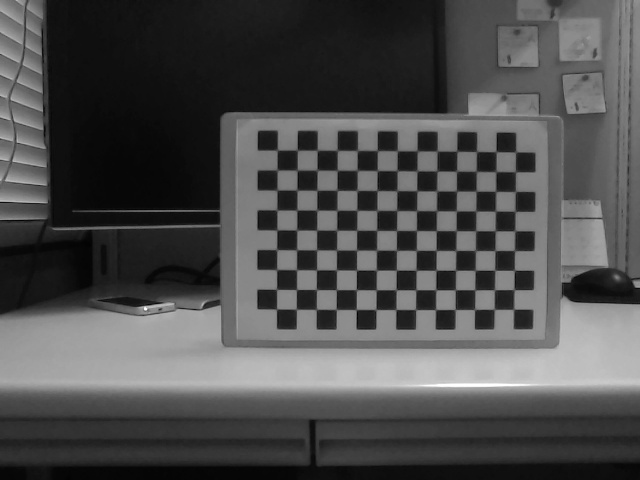</a></div>

作成したカメラパラメーターを用いて上記の画像に対しゆがみ補正したファイルも同じディレクトリに出力されます。
- ファイル名：undistorted0.jpg～undistorted4.jpg(ファイルの番号はcapture*.jpgに対応)


<div align="center"><a href="undistorted0.jpg">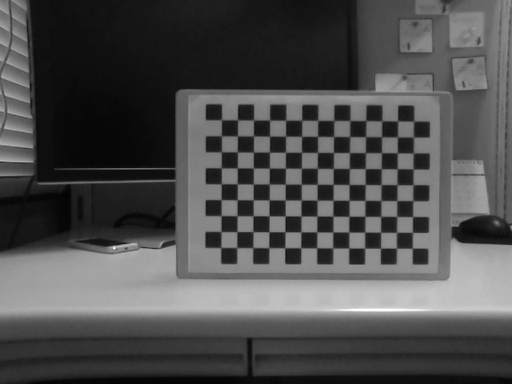</a></div>


