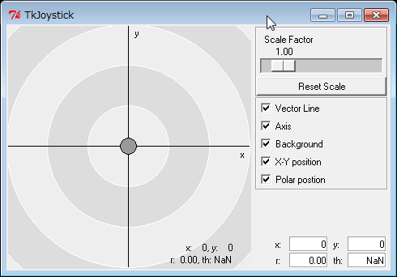
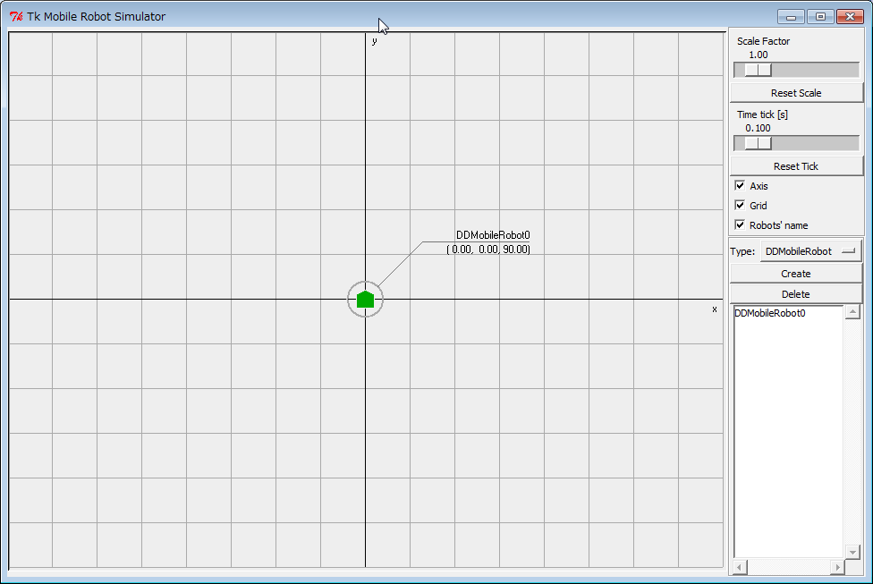
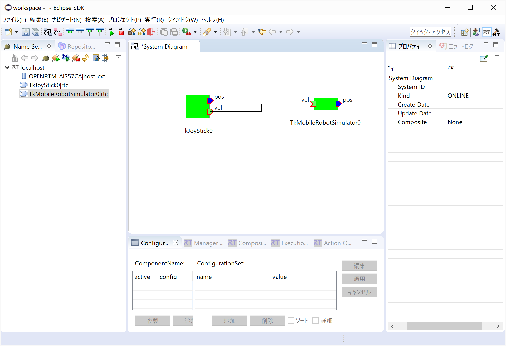

<!-- Title: TkJoyStick/TkMobileRobotSimulator -->
#contents

## TkJoyStick

This sample is included with the Python edition of OpenRTM-aist. Please note that it is not included with the C++ or Java editions.

### Overview

This is a sample RT Component with a GUI interface. The sample component can be started by running TkJoyStickComp.bat.

It outputs position values (x, y) corresponding to the location where the joystick is dragged within the GUI.

### Startup Screen

<div align="center"><a href="TkJoystick.png"></a></div>
<div align="center"><strong>TkJoyStick Execution Example</strong></div>

### Usage

- Drag the small circle displayed in the center of the screen to output (x, y) values corresponding to its position.
- The scale of the output coordinates can be adjusted using the **Scale Factor** slider in the upper-right corner.
- The lower-right area of the screen displays both Cartesian coordinates (x, y) and polar coordinates (r, θ).

There are two OutPorts:

- **pos**: Outputs values corresponding directly to the joystick position.
- **vel**: Outputs values rotated 45 degrees counterclockwise from the position coordinates.

For example, if the value from **pos** is:

```text
(10, 10)
```

then the value from **vel** will be:

```text
(14.142, 0)
```

---

## TkMobileRobotSimulator

This sample is included with the Python edition of OpenRTM-aist. Please note that it is not included with the C++ or Java editions.

### Overview

This is a sample RT Component with a GUI interface. The sample component can be started by running TkMobileRobotSimulator.bat.

### Startup Screen

<div align="center"><a href="TkMobileRobotSimulator.png"></a></div>
<div align="center"><strong>TkMobileRobotSimulator Execution Example</strong></div>

### Usage

To make the system recognize the simulator as an RTC and display it in the Name Service, click the **[Create]** button located near the center-right side of the GUI.

A pentagonal object representing a motor-driven mobile robot will appear on the GUI.

The pentagon moves according to values received through the InPort.

The InPort inputs correspond to the rotational speeds of the left and right wheel motors used to drive the robot.

For the robot to move straight toward the direction of its front vertex, both wheel speeds must be equal.

---

## System Configuration

<div align="center"><a href="SysEdit.png"></a></div>
<div align="center"><strong>RTSystemEditor Execution Example</strong></div>

### Usage

Connect TkJoyStick (input device) to TkMobileRobotSimulator and simulate robot motion controlled by the joystick through the GUI.

- Procedure

  - Start RTSystemEditor and open a new SystemEditor. For details on using RTSystemEditor, refer to [RTSystemEditor]({{ site.baseurl }}/en/doc/toolmanuals/rtsystemeditor-1_2_0).

  - Start both TkJoyStickComp.py and TkMobileRobotSimulator.py.

  - Click the **[Create]** button once in the TkMobileRobotSimulator GUI.

  - Both components will appear in the Name Service View of RTSystemEditor. Drag them onto the SystemEditor.

  - Connect the corresponding ports (**vel** on both components). (Refer to the RTSystemEditor example above.)

  - Right-click either component and select **[Activate Systems]**.

  - Drag the center point in the TkJoyStickComp window. The pentagonal object (representing the robot) in TkMobileRobotSimulator will move accordingly.

    - Moving the joystick in the **Y direction (up/down)** changes the robot's forward/backward speed.
    - Moving the joystick in the **X direction (left/right)** changes the robot's rotation speed and rotation direction.

  - When using the **vel** OutPort of TkJoyStick:

    - Moving the joystick vertically produces two identical values in the output vector.
    - Moving the joystick horizontally produces two values with opposite signs.

    When these values are sent to TkMobileRobotSimulator:

    - Vertical joystick movement causes both motors to rotate at the same speed in the same direction, resulting in straight-line motion toward the robot's front vertex.
    - Horizontal joystick movement causes the left and right motors to rotate at equal speeds in opposite directions, causing the robot to rotate in place.

