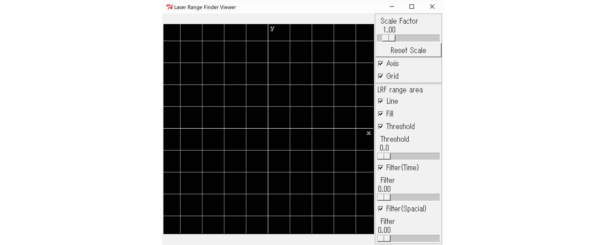
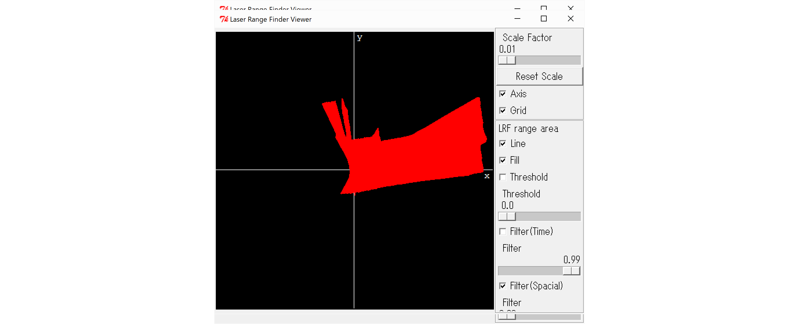

<!-- Title: tkLRFViewer -->

#contents

This sample is included only with the Python edition.

### Overview

tkLRFViewer is an example RTC that displays output from a Laser Range Finder (LRF) sensor.

It is used by connecting it to an RTC that acquires input from a laser range finder. The RTC used for connection depends on the specific sensor device being used. For example, refer to the documentation for the [Hokuyo Electric URG Series]({{ site.baseurl }}/node/4974).

An LRF sensor scans the surrounding environment by rotating a laser distance sensor and continuously outputs measured distance data. The output data typically consists of:

- Start angle of the scan
- End angle of the scan
- Angular interval between measurements
- Sequence of measured distance values

This component is used to visualize the scanned distance data.

<!-- English page: note/5085 -->

### Startup Screen

When this component is started, the following GUI window is displayed.

<div align="center"><a href="tkLRFViewGUI.png"></a></div>
<div align="center"><strong>tkLRFViewer GUI Window</strong></div>

### Usage

To use this RTC, you must first prepare an RTC that:

1. Reads sensor output from an external Laser Range Finder.
2. Converts the sensor data into the [RangeData type](https://github.com/Nobu19800/DataTypeManual/blob/master/docs/RobotInterface.md#rangedata).
3. Outputs the converted data through an OutPort.

Please refer to the Laser Range Finder resources mentioned above when preparing the required RTC.

- In Windows environments, tkLRFViewer can be started by opening:

```text
Program Files\OpenRTM-aist\1.2.x\Components\Python
```

and double-clicking:

```text
tkLRFViewer.bat
```

Start the RTC corresponding to your sensor and connect it to this component using RTSystemEditor or a similar tool.

---

The tkLRFViewer GUI contains four sliders:

- Scale Factor
- Threshold
- Filter(Time)
- Filter(Spatial)

It also contains:

- Axis checkbox
- Grid checkbox
- Line checkbox
- Fill checkbox
- Threshold checkbox
- Filter(Time) checkbox
- Filter(Spatial) checkbox
- Reset Scale button

The functions of these controls are described below.

| Name | Function |
|--------|----------|
| Scale Factor | Controls display scaling. The display is based on a virtual space of 480 m × 480 m and is scaled according to this value. For typical measurements within a few meters, values around 0.01 are recommended.* |
| Reset Scale Button | Resets the Scale Factor to 1.0. |
| Axis Checkbox | Displays the X and Y coordinate axes when checked. |
| Grid Checkbox | Displays grid lines when checked. |
| Line Checkbox | Draws range measurement data as connected curves when checked. |
| Fill Checkbox | Draws range measurement data as filled polygons when checked. |
| Threshold Checkbox and Slider | Enables threshold processing when checked. If an input distance is smaller than the specified lower limit*, it is treated as invalid and displayed as if the distance were 1000 m. |
| Filter(Time) Checkbox and Slider | Enables temporal filtering when checked. The slider controls the strength of filtering applied across time. |
| Filter(Spatial) Checkbox and Slider | Enables spatial filtering when checked. The slider controls filtering strength applied to changes between adjacent scan points in the rotational scanning direction. |

\* The current scaling behavior and threshold implementation are not necessarily practical for real-world applications. For actual use, modifying and tuning the source code according to your environment is recommended.

# GUI Output Example

The GUI displays scan results as shown below.

<div align="center"><a href="tkLRFViewGUIinUse.png"></a></div>
<div align="center"><strong>GUI Display During Operation</strong></div>

