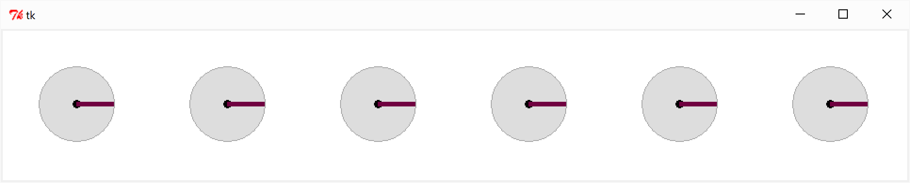
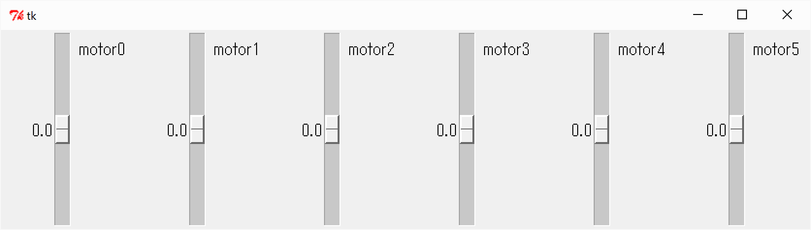
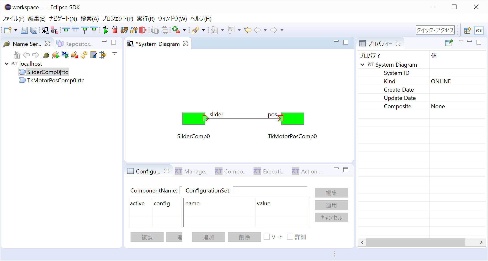

<!-- Title: TkMotorComp/SliderComp -->

#contents

## TkMotorPosComp

This sample is included with the Python edition of OpenRTM-aist.

Please note that it is not included with the C++ or Java editions.

### Overview

This is a sample RT Component with a GUI interface. The sample component can be started by running:

```text
TkMotorPosComp.bat
```

Unlike TkMotorComp, which controls rotational speed through InPort input values, this component controls the rotational angle through InPort input values.

### Startup Screen

<div align="center"><a href="tkmotorposcomp.png"></a></div>
<div align="center"><strong>TkMotorPosComp Execution Example</strong></div>

---

## SliderComp

This sample is included with the Python edition of OpenRTM-aist.

Please note that it is not included with the C++ or Java editions.

### Overview

This is a sample RT Component with a GUI interface. The sample component can be started by running:

```text
SliderComp.bat
```

(The screen shown below is from a Windows environment.)

### Startup Screen

<div align="center"><a href="slidercompN.png"></a></div>
<div align="center"><strong>SliderComp Execution Example</strong></div>

---

## System Configuration

<div align="center"><a href="RTSE_Slider_MotorPos.png"></a></div>
<div align="center"><strong>SliderComp and TkMotorPosComp in RTSystemEditor</strong></div>

### Usage

SliderComp and TkMotorPosComp provide a GUI-based simulation environment for controlling motor rotation angles using slider controls.

- Procedure

  - Start RTSystemEditor and open a new SystemEditor.

    For details on using RTSystemEditor, refer to:

    [RTSystemEditor]({{ site.baseurl }}/en/doc/toolmanuals/rtsystemeditor-1_2_0)

  - Start both components:

    ```text
    SliderComp.bat
    TkMotorPosComp.bat
    ```

  - Both components will appear in the Name Service View of RTSystemEditor. Drag them onto the SystemEditor.

  - Connect the corresponding ports of the two components. (Refer to the RTSystemEditor example shown above.)

  - Right-click either component and select:

    ```text
    [Activate Systems]
    ```

  - In the TkMotorPosComp GUI, disks representing motor-driven actuators will be displayed.

  - Verify that the rotational angle of each disk can be controlled using the vertical slider knobs in the SliderComp GUI.

  - The six slider knobs correspond to six simulated motors, each controlling the rotational angle of its corresponding disk.

