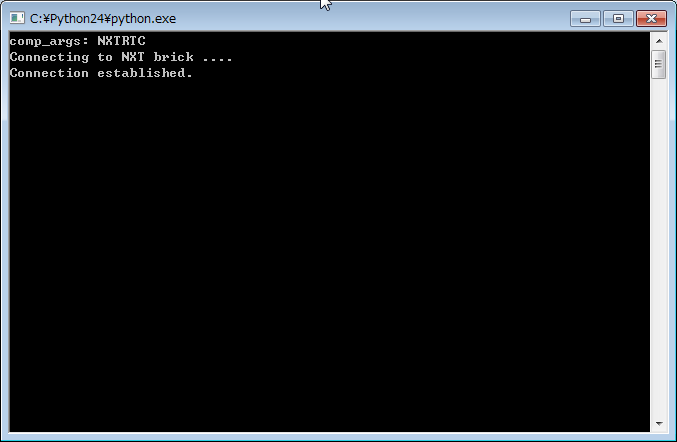
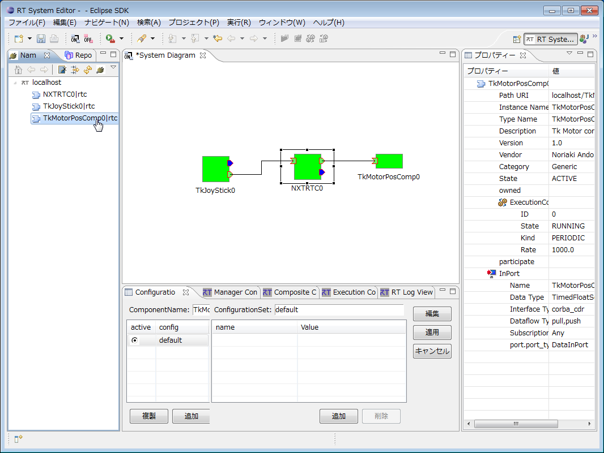

-------jp page!!-------

init
<!-- Title: NXTRTC -->

#contents

このサンプルは、OpenRTM-aistのPython版に付属しています。
C++版、Java版には付属していませんのでご注意ください。

### 概要
NXTRTC.pyは、LEGO Mindstorm NXTのモーター制御や、センサーデータを出力するコンポーネントです。

- 参考
  - [RTコンポーネント作成(LEGO Mindstorm編)](/node/752)

### 起動画面

<strong>NXTRTC実行例(NXTRTC)</strong>

<strong>TkMotorComp実行例(TkMotorComp)</strong>

<strong>NXTRTC 実行例(RTSystemEditor)</strong>

 
#### 使い方
GUIをもったTkJoystick(入力デバイス)と、TkMotor(出力デバイス)に接続し、LEGOのモータ制御と値の確認をします。

※詳細は[RTコンポーネント作成(LEGO Mindstorm編)](/node/752)マニュアルでごご覧ください。

 

- 手順
  - RTSystemEditorを起動し、新規SystemEditorを開きます。RTSystemEditorの使用方法の詳細については[RTSystemEditor](/node/6401)を参照
  - [こちら](/node/753)を参考にPCとLEGO MindstormをBluetooth、又はUSB接続してください。
  - NXTRTC.py、入力デバイスTkJoyStickComp.py、TkMotorComp、各コンポーネントを起動します。
  - RTSystemEditorのName Service Viewにコンポーネントが表示されるので、それらをSystemEditor上にドラッグします。
  - 両コンポーネントの対応ポートを結びます。(上図SystemEditor実行例を参照)
  - どちらかのコンポーネントを右クリックし、[Activate Systems]を選択します。

-------jp page!!-------
