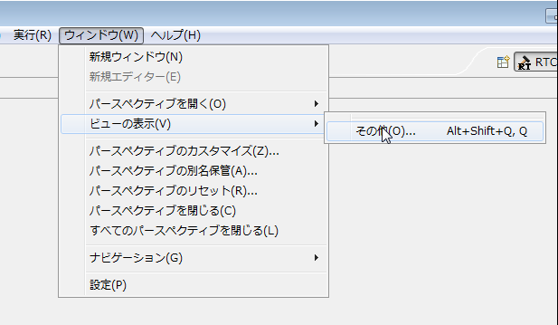
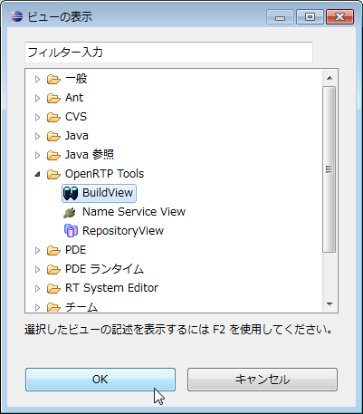

<!-- Title: Screen Layout and Functions (Build View) -->
#contents
<!-- ***Build View  -->
The Build View is a view for graphically displaying the configuration details of the RT component being created.
An example of the Build View is shown below.
 

<strong>Build View</strong>

 

In the Build View, the configured RT component name, the number and names of data ports (InPort/OutPort), the number and names of service ports, and the number and names of service interfaces are displayed.
Each port is also displayed at the position specified in each configuration screen.
 

### Displaying the Build View
If the Build View is not displayed when switching to the "RTCBuilder" perspective, it can be displayed by following the steps below.
From the menu at the top of the screen, select [Window] > [Show View] > [Other]. In the displayed "Show View" screen, select [OpenRTP Tools] > [BuildView].
 

<table class="table-alt">
  <tr>
    <td>

</td>
    <td>

</td>
  </tr>
  <tr>
    <td style="text-align: center;" colspan="2">Displaying the Build View</td>
  </tr>
</table>
 

