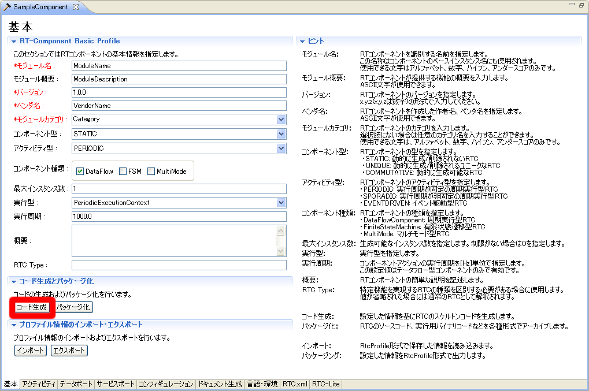
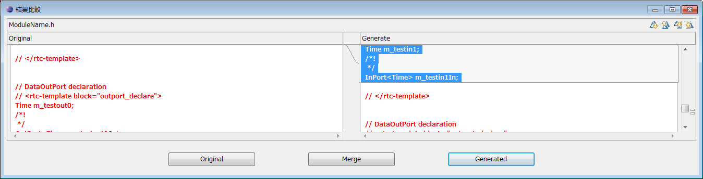
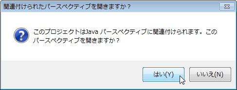
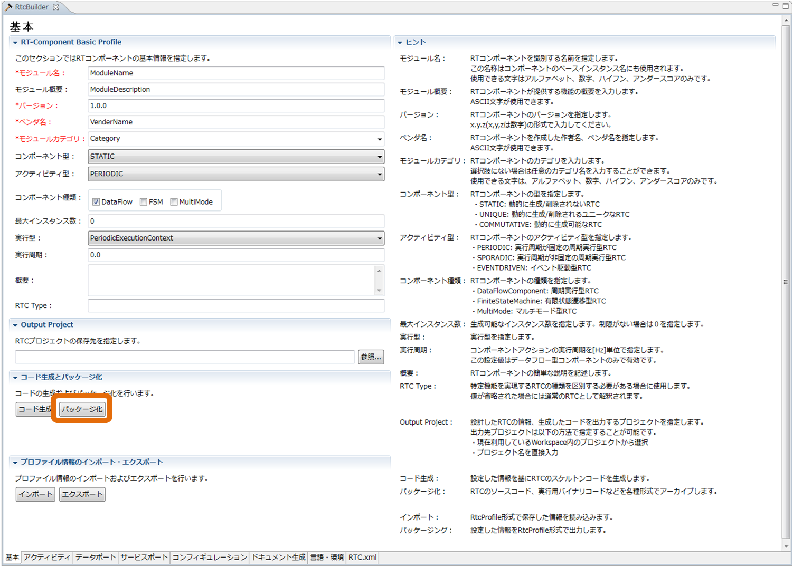
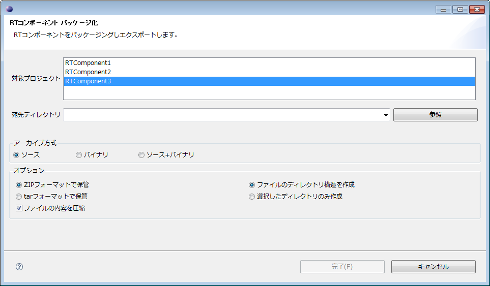
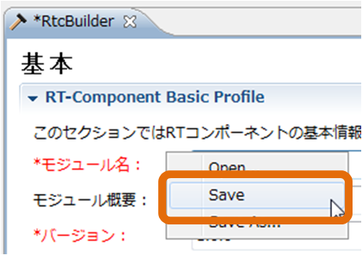
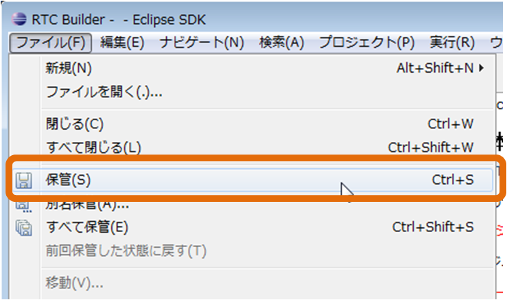
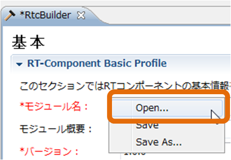
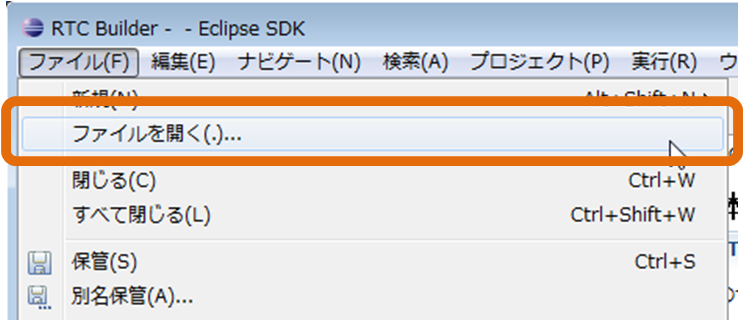

<!-- Title: コード生成・セーブとロード -->
#contents

## コード生成
生成対象 RTコンポーネントの各種プロファイル情報を設定した後、テンプレートコードの生成を行います。
基本プロファイル入力ページの [コード生成] ボタンをクリックすると、入力したプロファイル情報に応じたテンプレートコードの生成が行われます。
 

<strong>テンプレートコードの生成</strong>

 

各言語を選択した際のコード生成実行時に生成されるテンプレートファイルは以下のとおりです。

<strong>生成ファイル一覧</strong>

- C++ ( 「 Use old build environment. 」のチェックボックスを ON しない場合 )

<table class="table-alt">
  <tr style="text-align: center;">
    <td>ファイル名</td>
    <td>説明</td>
  </tr>
  <tr>
    <td>&lt;RTC名&gt; Comp.cpp</td>
    <td>RTコンポーネントを起動するコードです。</td>
  </tr>
  <tr>
    <td>&lt;RTC名&gt;.h</td>
    <td>RTコンポーネント本体のヘッダです。</td>
  </tr>
  <tr>
    <td>&lt;RTC名&gt;.cpp</td>
    <td>RTコンポーネント本体のコードです。</td>
  </tr>
  <tr>
    <td>&lt;サービス型名&gt;SVC_impl.h</td>
    <td>サービスプロバイダーのヘッダです。（※） ServiceProvider にて指定された Type のみが出力されます。</td>
  </tr>
  <tr>
    <td>&lt;サービス型名&gt;SVC_impl. cpp</td>
    <td>サービスプロバイダーの実装コードです。（※） ServiceProvider にて指定された Type のみが出力されます。</td>
  </tr>
  <tr>
    <td>CMakeLists.txt</td>
    <td>CMake用の設定ファイルファイルです。</td>
  </tr>
  <tr>
    <td>doc/</td>
  </tr>
  <tr>
    <td>doxyfile.in</td>
    <td>Doxygen 用の設定ファイルファイルです。</td>
  </tr>
  <tr>
    <td>cmake/</td>
  </tr>
  <tr>
    <td>uninstall_target.cmake.in</td>
    <td>アンインストールターゲット追加の雛形ファイル（CMake用）</td>
  </tr>
  <tr>
    <td>cpack_options.cmake</td>
    <td>WiX パッケージ作成用モジュール（CMake/WiX用）</td>
  </tr>
  <tr>
    <td>License.rtf</td>
    <td>パッケージ情報に含まれるライセンス表示（CMake/WiX用）</td>
  </tr>
  <tr>
    <td>wix.xsl.in</td>
    <td>WiX パッケージに含めるファイルを指定するテンプレート（CMake/WiX用）</td>
  </tr>
  <tr>
    <td>cmake/Modules/</td>
  </tr>
  <tr>
    <td>FindOpenRTM.cmake</td>
    <td>OpenRTM-aist 環境設定取得用モジュール（CMake用）</td>
  </tr>
</table>

 

- C++ ( [Use old build environment.] のチェックボックスを ON した場合 )
<table class="table-alt">
  <tr style="text-align: center;">
    <td>ファイル名</td>
    <td>説明</td>
  </tr>
  <tr>
    <td>&lt;RTC名&gt; Comp.cpp</td>
    <td>RTコンポーネントを起動するコードです。</td>
  </tr>
  <tr>
    <td>&lt;RTC名&gt;.h</td>
    <td>RTコンポーネント本体のヘッダです。</td>
  </tr>
  <tr>
    <td>&lt;RTC名&gt;.cpp</td>
    <td>RTコンポーネント本体のコードです。</td>
  </tr>
  <tr>
    <td>&lt;サービス型名&gt;SVC_impl.h</td>
    <td>サービスプロバイダーのヘッダです。（※） ServiceProvider にて指定された Type のみが出力されます。</td>
  </tr>
  <tr>
    <td>&lt;サービス型名&gt;SVC_impl. cpp</td>
    <td>サービスプロバイダーの実装コードです。（※） ServiceProvider にて指定された Type のみが出力されます。</td>
  </tr>
  <tr>
    <td>Makefile.&lt;RTC名&gt;</td>
    <td>コンパイルするための Makefile です。</td>
  </tr>
  <tr>
    <td>&lt;RTC名&gt; _vc8.sln </td>
    <td>Visual Studio 2005用のソリューションファイルです。</td>
  </tr>
  <tr>
    <td>&lt;RTC名&gt;_vc8.vcproj</td>
    <td>Visual Studio 2005用の RTコンポーネントプロジェクトファイルです。</td>
  </tr>
  <tr>
    <td>&lt;RTC名&gt;Comp_vc8.vcproj</td>
    <td>Visual Studio 2005用の起動コード用プロジェクトファイルです。</td>
  </tr>
  <tr>
    <td>&lt;RTC名&gt;_vc9.sln</td>
    <td>Visual Studio 2008用のソリューションファイルです。</td>
  </tr>
  <tr>
    <td>&lt;RTC名&gt;_vc9.vcproj</td>
    <td>Visual Studio 2008用の RTコンポーネントプロジェクトファイルです。</td>
  </tr>
  <tr>
    <td>&lt;RTC名&gt;Comp_vc9.vcproj</td>
    <td>Visual Studio 2008用の起動コード用プロジェクトファイルです。</td>
  </tr>
  <tr>
    <td>Copyprops.bat</td>
    <td>プロパティ・ファイルコピー用バッチファイルです。</td>
  </tr>
  <tr>
    <td>User_config.vsprops</td>
    <td>ユーザー定義用プロパティ・ファイルです。</td>
  </tr>
  <tr>
    <td>OpenRTM-aist.vsprops</td>
    <td>OpenRTM-aist 用プロパティ・ファイルです。</td>
  </tr>
</table>

 

- Java

 
<table class="table-alt">
  <tr style="text-align: center;">
    <td>ファイル名</td>
    <td>説明</td>
  </tr>
  <tr>
    <td>&lt;RTC名&gt;Comp.java</td>
    <td>RTコンポーネントの起動用クラスです。</td>
  </tr>
  <tr>
    <td>&lt;RTC名&gt;.java</td>
    <td>RTコンポーネントの Component Profile、初期化処理などを定義したクラスです。</td>
  </tr>
  <tr>
    <td>&lt;RTC名&gt;Impl.java</td>
    <td>RTコンポーネントの本体です。</td>
  </tr>
  <tr>
    <td>build_&lt;RTC名&gt;.xml</td>
    <td>RTコンポーネントのビルド用ファイルです。</td>
  </tr>
  <tr>
    <td>&lt;サービス型名&gt; SVC_impl.java</td>
    <td>サービスプロバイダーの実装クラスです。（※）</td>
  </tr>
  <tr>
    <td>CMakeLists.txt</td>
    <td>CMake用の設定ファイルファイルです。</td>
  </tr>
  <tr>
    <td>doc/</td>
  </tr>
  <tr>
    <td>doxyfile.in</td>
    <td>Doxygen用の設定ファイルファイルです。</td>
  </tr>
  <tr>
    <td>cmake_modules/</td>
  </tr>
  <tr>
    <td>cmake_javacompile.cmake.in</td>
    <td>Java コンパイルターゲット追加の雛形ファイル（CMake用）</td>
  </tr>
  <tr>
    <td>FindOpenRTMJava.cmake</td>
    <td>OpenRTM-aist-Java 環境設定取得用モジュール（CMake用）</td>
  </tr>
  <tr>
    <td>cmake/</td>
  </tr>
  <tr>
    <td>uninstall_target.cmake.in</td>
    <td>アンインストールターゲット追加の雛形ファイル（CMake用）</td>
  </tr>
  <tr>
    <td>cpack_options.cmake</td>
    <td>WiXパッケージ作成用モジュール（CMake/WiX用）</td>
  </tr>
  <tr>
    <td>License.rtf</td>
    <td>パッケージ情報に含まれるライセンス表示（CMake/WiX用）</td>
  </tr>
  <tr>
    <td>cpack_resources/</td>
  </tr>
  <tr>
    <td>wix.xsl.in</td>
    <td>WiXパッケージに含めるファイルを指定するテンプレート（CMake/WiX用）</td>
  </tr>
</table>

 

- Python

<table class="table-alt">
  <tr style="text-align: center;">
    <td>ファイル名</td>
    <td>説明</td>
  </tr>
  <tr>
    <td>&lt;RTC名&gt;.py</td>
    <td>RTコンポーネントのコードです。</td>
  </tr>
  <tr>
    <td>&lt;サービス型名&gt;_idl.py</td>
  </tr>
  <tr>
    <td>&lt;サービス型名&gt;_idl_example.py</td>
    <td>サービスプロバイダーの実装ファイルです。（※）</td>
  </tr>
  <tr>
    <td>CMakeLists.txt</td>
    <td>CMake用の設定ファイルファイルです。</td>
  </tr>
  <tr>
    <td>doc/</td>
  </tr>
  <tr>
    <td>doxyfile.in</td>
    <td>Doxygen用の設定ファイルファイルです。</td>
  </tr>
  <tr>
    <td>cmake_modules/</td>
  </tr>
  <tr>
    <td>FindOpenRTMPython.cmake</td>
    <td>OpenRTM-aist-Python 環境設定取得用モジュール（CMake用）</td>
  </tr>
  <tr>
    <td>cmake/</td>
  </tr>
  <tr>
    <td>uninstall_target.cmake.in</td>
    <td>アンインストールターゲット追加の雛形ファイル（CMake用）</td>
  </tr>
  <tr>
    <td>cpack_options.cmake</td>
    <td>WiXパッケージ作成用モジュール（CMake/WiX用）</td>
  </tr>
  <tr>
    <td>License.rtf</td>
    <td>パッケージ情報に含まれるライセンス表示（CMake/WiX用）</td>
  </tr>
  <tr>
    <td>cpack_resources/</td>
  </tr>
  <tr>
    <td>Description.txt</td>
    <td>パッケージ情報に含まれる説明（CMake用）</td>
  </tr>
  <tr>
    <td>License.txt</td>
    <td>パッケージ情報に含まれるライセンス表示（CMake/Linux用）</td>
  </tr>
  <tr>
    <td>wix.xsl.in</td>
    <td>WiXパッケージに含めるファイルを指定するテンプレート（CMake/WiX用）</td>
  </tr>
</table>

 

※ RtcBuilder は、このサービスプロバイダーの実装ファイルを出力する際、オペレーションのテンプレートを生成するために、IDL をパースします。しかし、このパース機能には以下のような制限が存在します。
- プリプロセッサにおいて、#include ディレクティブのみ使用可能。（#ifdef などは単に無視される）
- 生成されるオペレーションは直接指定されたインタフェースのオペレーションのみで、親から継承したオペレーションは含まれない。

### 出力選択
RtcBuilder は、生成したファイルと同名のファイルが出力先に既に存在し、既存ファイルと生成ファイルの間で出力内容に差異が存在する場合、どちらの出力を利用するかを選択する確認画面が表示されます。
 

<strong>出力選択画面</strong>

 

出力の選択では、以下の3つ出力候補の中から選択します。
- Original ： 既に存在するファイルをそのまま残す
- Merge ： マージブロックを利用したマージを行う（**※１**）
- Generate ： 新たに生成した内容で上書きする
<!-- -Cancel ： 既に存在するファイルをそのまま残す -->

**※１** Mergeでは、`<rtc-template block=”block”>`タグで囲まれた範囲のみを最新の生成内容で上書します。生成したテンプレートは、ユーザーが変更しない範囲をあらかじめこのタグで囲んでいます。
このタグの中は変更後もマージすることで消えてしまいますので、修正しないようにしてください。

### パースペクティブ切り替え
生成対象言語の開発環境用プラグインがインストールされている場合、コード生成実行後にパースペクティブ切り替えの確認メッセージが表示されます。
対象のプラグインがインストールされている場合には以下のようなメッセージが表示されますので、パースペクティブの切り替えを行うかどうかを選択してください。
 

<strong>パースペクティブ切り替え確認メッセージ</strong>

 
生成言語と開発環境用プラグインの関係は以下のとおりです。
- Java ： JDT(Java Development Tools) → あらかじめ Eclipse に含まれている開発環境です。
- C++ ： CDT(C/C++ Development Tooling)
- Python ： PyDev

**※**各言語用の開発環境用プラグインがインストールされており、出力対象プロジェクトが新規作成プロジェクトの場合は、各プロジェクトのプロパティに対象言語の属性が設定されます。

## 生成ファイルのパッケージング機能
生成したテンプレートファイル、テンプレートファイルを基に作成した RT コンポーネントの実行用バイナリファイルなどを各種形式でアーカイブする機能です。
基本プロファイル入力ページの [パッケージ化] ボタンをクリックすると、パッケージング内容を設定するための「RTコンポーネント パッケージ化」画面が表示されます。
 

<!-- CENTER:''図 6-1 各種成果物のパッケージング機能'' -->

<strong>各種成果物のパッケージング機能</strong>

 
 

<!-- CENTER:''図 6-2 RTコンポーネント エクスポート画面'' -->

<strong>RTコンポーネント パッケージ化画面</strong>

 
以下、各項目について説明いたします。

<strong>RTコンポーネント パッケージ化画面 項目説明</strong>

<table class="table-alt">
  <tr>
    <td>項目</td>
    <td>説明</td>
  </tr>
  <tr>
    <td>対象プロジェクト</td>
    <td>パッケージング対象のプロジェクトを選択してください。</td>
  </tr>
  <tr>
    <td>宛先ディレクトリ</td>
    <td>パッケージングした成果物を出力するディレクトリーを入力してください。｢参照｣ボタンを使用することで、ディレクトリー選択ダイアログが表示されます。</td>
  </tr>
  <tr>
    <td>アーカイブ方式</td>
    <td>作成するアーカイブの形式を選択してください。</td>
  </tr>
  <tr>
    <td>オプション</td>
    <td>各アクション内での動作に関する概要説明。省略可能項目。</td>
  </tr>
  <tr>
    <td>アーカイブ形式</td>
    <td>ZIP フォーマットを利用したアーカイブと、tar フォーマットを利用したアーカイブを作成することが可能です。使用するフォーマット形式を選択してください。</td>
  </tr>
  <tr>
    <td>アーカイブ内容の圧縮</td>
    <td>アーカイブ内容を圧縮する場合には、チェックボックスを ON にしてください。</td>
  </tr>
  <tr>
    <td>ディレクトリー構造</td>
    <td>アーカイブ対象プロジェクトのディレクトリ構造をそのまま保持した形でアーカイブを行うか、全てルートディレクトリに入れた形でアーカイブを行うかを選択してください。</td>
  </tr>
</table>
**※**アーカイブ方式(｢ソース｣｢バイナリ｣｢ソース＋バイナリ｣)ごとに、どのファイル種類をアーカイブに含めるかは、後述の｢設定画面｣にて設定することができます。

 

## 設定内容のセーブとロード 
RTCBuilder では、RTC プロファイルエディタで入力した内容を RTC プロファイル XML(RTC.xml) に保存したり、保存した内容を再度読み込むことが可能です。

### セーブ
RTC プロファイルエディタで入力した内容は、RTC プロファイル XML(RTC.xml) に保存することが可能です。入力内容は以下の操作により保存することができます。
- エディタを右クリックし、表示されたコンテクストメニューから [Save] もしくは [Save As…] を選択
- メニューバーの [File] > [Save…] もしくは [File] > [Save As…] を選択

**※**[Save As…] を選んだ場合、任意のプロジェクト内に保存することが可能です。
 

<table class="table-alt">
  <tr>
    <td>

</td>
    <td>

</td>
  </tr>
  <tr>
    <th colspan="2">セーブ</th>
  </tr>
</table>
 

<!-- ''　※''任意のプロジェクト以外のディレクトリーを保存先に指定した場合は、以下のメッセージが表示され保存されません。保存先を任意のプロジェクト内のディレクトリーに指定し直してください。 -->
<!-- #br -->
<!--  -->
<!-- #ref(SaveError.png,nolink,center) -->
<!-- CENTER:''保存先の指定が不正の場合のエラー'' -->
<!--  -->
### ロード
RTC プロファイルエディタの内容を保存した RTC プロファイル XML(RTC.xml) は以下の操作により読み込むことが可能です。
- エディタを右クリックし、コンテクストメニューから [Open] を選択
- メニューバーの [ファイル] > [ファイルを開く…] を選択
 

<table class="table-alt">
  <tr>
    <td>

</td>
    <td>

</td>
  </tr>
  <tr>
    <th colspan="2">ロード</th>
  </tr>
</table>
 

