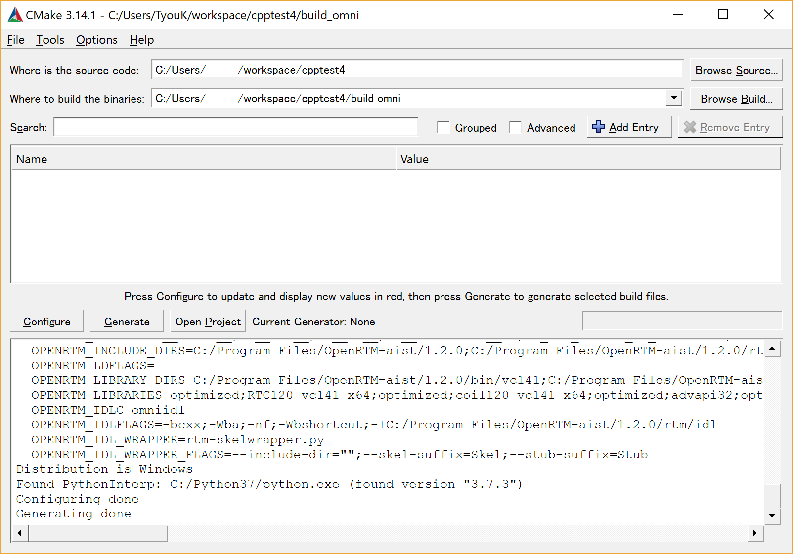
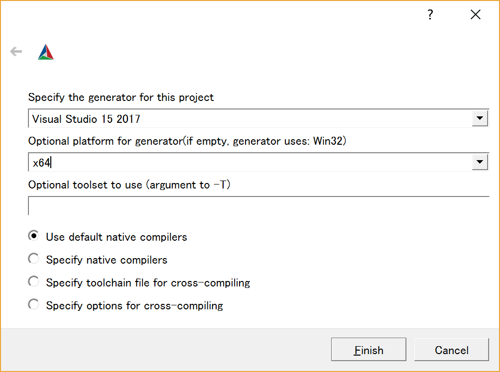
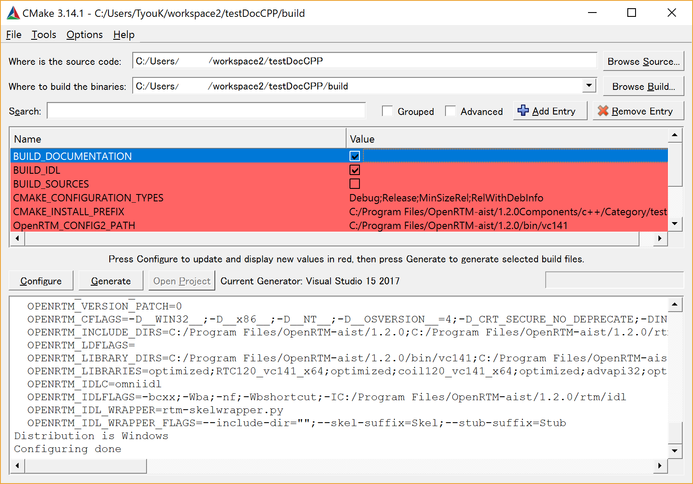
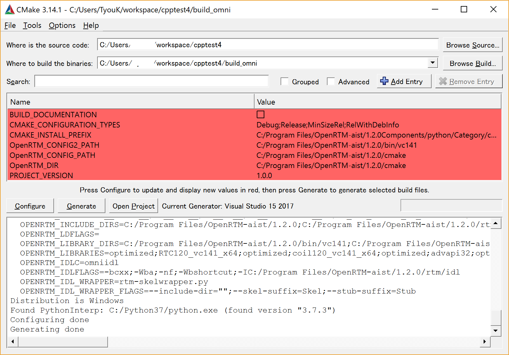
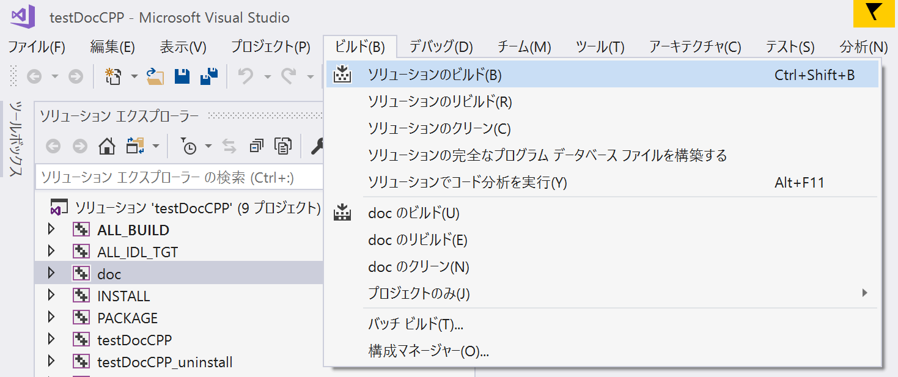
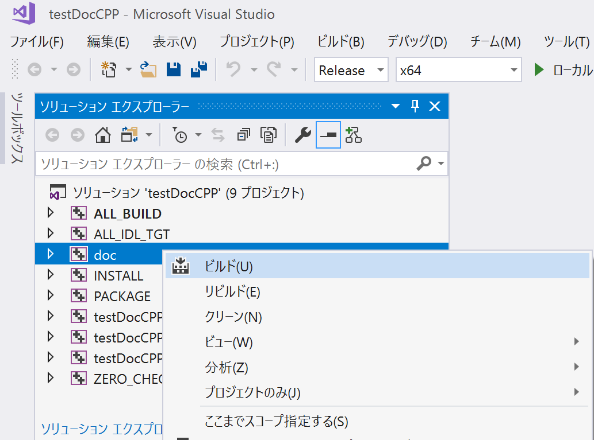
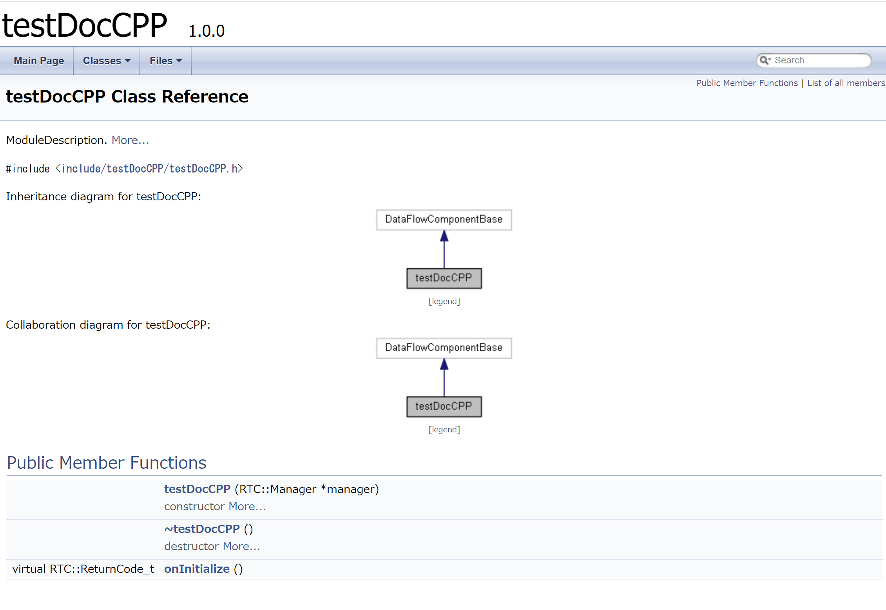
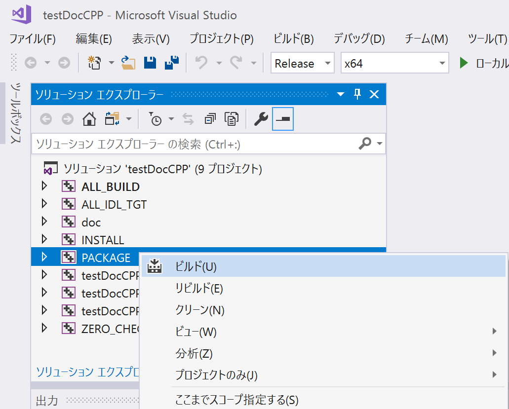

-------jp page!!-------
<!-- Title: コンパイル方法 (Windows、CMake 利用、C++ 編 ) -->
Windows でのビルド方法を説明します。

#contents

## 環境準備
### 環境

<table class="table-alt">
  <tr>
    <th>Visual C++( バージョン 2005 以上 )</th>
    <th>vc++開発環境</th>
  </tr>
  <tr>
    <td>CMake( バージョン 2.8.5 以上 )</td>
    <td>開発環境にあったビルドファイルを生成するツール</td>
  </tr>
  <tr>
    <td>Doxygen</td>
    <td>ドキュメンテーションジェネレーター</td>
  </tr>
  <tr>
    <td><a href="https://graphviz.gitlab.io/download/">Graphviz</a></td>
    <td>dot言語で記述したグラフ構造を画像に出力するツール</td>
  </tr>
  <tr>
    <td><a href="https://wixtoolset.org/releases/">Wix Windows Installer XML toolset</a> ( バージョン 3.5以上)</td>
    <td>Windows Installer(MSI) パッケージを作成するためのツールセット</td>
  </tr>
</table>

Wix、Graphvizをインストールしたディレクトリ(**C:\Program Files (x86)\WiX Toolset v3.11\bin**、**C:\Program Files (x86)\Graphviz2.44.1\bin**)が環境変数PATHに設定されていない場合は設定してください。

Graphvizはインストール後にプラグインの登録状況を dot -v コマンドで確認して下さい。　手順については [こちら]({{ site.baseurl }}/ja/doc/installation/install_1_2/cpp_1_2/install_windows_1_2#Graphviz) のページをご覧ください。

## ビルド手順

ビルド手順を示します。
図は VC++ 2017 、CMake 3.14.1 です。

### Cmake の設定
GUI 版 Cmake を起動してディレクトリーを指定します。

<table class="table-alt">
  <tr>
    <td>Where is the source code</td>
    <td>RTCBuilder で生成したコードのフォルダーを指定します。</td>
  </tr>
  <tr>
    <td>Where to build the binaries</td>
    <td>ソリューション/プロジェクト/ワークスペースなどのファイルを出力するフォルダーを指定します。</td>
  </tr>
</table>

<strong>ディレクトリーを指定</strong>

 

### Configure の実行
[Configure] ボタンをクリックして実行します。その後、使用するプラットフォームを選択します。
例では「Visual Studio 15 2017」を選択しています。

<strong>プラットフォームの選択</strong>

 

### BUILD_DOCUMENTATIONを有効にする
ドキュメント生成のために**BUILD_DOCUMENTATION**オプションを有効にします。

<strong>BUILD_DOCUMENTATIONを有効化</strong>

 

### Generate の実行
Configure が正常終了したら、[Generate] ボタンをクリックします。

<strong>Generate の実行</strong>

 

### VC++ の実行
[Open Project]ボタンを押してソリューションファイル(*.sln)を開きます。

### ビルドの実行
[ビルド] > [ソリューションのビルド] を実行してソリューションをビルドします。

<strong>ビルドの実行</strong>

 

## ドキュメント生成手順
### doxygen の実行
ソリューションエクスプローラで「doc」を選び、右クリックします。
そこで「ビルド」を選択して実行します。

<strong>doxygen の実行</strong>

 
### ドキュメント
「Where to build the binaries」で指定したフォルダー配下の doc/html/doxygen/html にドキュメントが生成されます。

<strong>ドキュメント例</strong>

 

## パッケージ生成手順
パッケージ生成には、CMake に同梱されている cpack と Wix を使用しています。

### PACKAGE ビルドの実行
ソリューションエクスプローラで「PACKAGE」を選び、右クリックします。
そこで「ビルド」を選択して実行します。

<strong>PACKAGE ビルドの実行</strong>

 

### パッケージ
「Where to build the binaries」で指定したフォルダー配下に msi 形式のイントールパッケージが生成されます。

<パッケージ名>_rtm120_win64.msi

このイントールパッケージを実行すると下記へインストールされます。

C:\Program Files\OpenRTM-aist\1.2.0\Components\<言語>\<カテゴリ名>\<パッケージ名>

-------jp page!!-------
