<!-- Title: コンパイル方法 (Windows、Java 編 ) -->
#contents
This section explains how to build with Java.
## Preparation
You need to install Java Development Kit 6 in advance. (Note: It does not work with Java 1.5 (5.0).)

## Build Procedure from RTC Builder
1. On the RTC Profile Editor screen, open the [Language/Environment] tab and select [Java].<br><br>
<div align="center"><a href="Python-lang_01.png">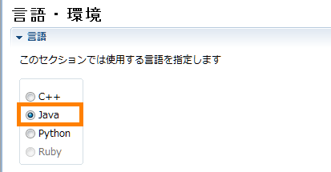</a></div>
<br><br>
1. Open the [Basic] tab and click the [Generate Code] button to generate the code.<br><br>
<div align="center"><a href="Python-lang_02.png"></a></div>
<br><br>
1. If a development environment plugin for the code generation target language is installed, the following confirmation message is displayed, so click [Yes]. Then, in the displayed dialog, select [Java (default)] and click the [OK] button.<br>
For the Java language, JDT (Java Development Tools) is included in Eclipse in advance.<br><br>
<div align="center"><a href="Python-lang_03.png"></a></div>
<br>
<div align="center"><a href="Python-lang_04.png">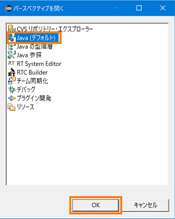</a></div>
<br><br>
1. The project information is displayed in the Package Explorer, but some information is not displayed, so select [File] > [Refresh] from the menu, or click the [F5] key in the Package Explorer to refresh the information.<br><br>
1. Right-click the [build_module name.xml] file and select [Run] > [1 Ant Build].<br><br>
<div align="center"><a href="Python-lang_05.png">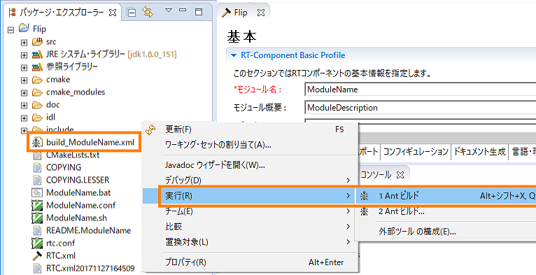</a></div>
<br><br>
1. The build is executed, and the build results are displayed on the console screen.<br><br>
<div align="center"><a href="Python-lang_06.png">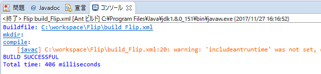</a></div>
<br><br>

- If an error is displayed on the console screen, check whether the JDK is installed correctly. From the menu, select [Window] > [Preferences] > [Installed JREs].
Check whether the installed JDK is selected. If it is not displayed, add the installed JDK using the [Add] or [Search] button. <br><br>
<div align="center"><a href="Python-lang_07.png">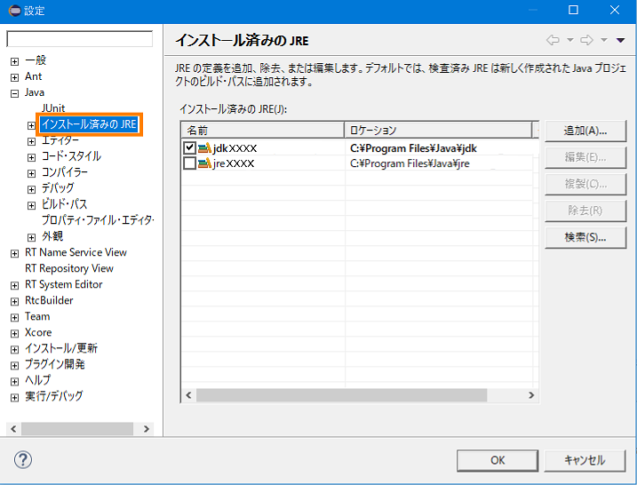</a></div>
<br><br>
**References**
- [A new Java project cannot be created as JDK6 (1.6) compliant]({{ site.baseurl }}/en/doc/faq/faq_rtc_creation#errorjavaJDK)
- [How do I set a classpath to an arbitrary folder and perform an Ant build?]({{ site.baseurl }}/en/doc/faq/faq_rtc_creation#Antbuild)
- [An exception is displayed when building from the command line using Ant with Java]({{ site.baseurl }}/en/doc/faq/faq_rtc_creation#Antbuilderror)

## Build Procedure from the Command Prompt
1. Download Apache Ant from the following site. Apache Ant is software for executing builds. Eclipse includes the Ant plugin by default, but you need to download it in order to execute builds from the command prompt.<br><br>
[Download: the Apache Ant Website](http://ant.apache.org/bindownload.cgi)<br><br>
1. Extract the Zip file and change the folder name as desired. (Example: apache-ant-x.xx.x → ant)<br><br>
1. Move it to any folder. (Example: C:\Program Files\ant)<br><br>
1. Set the environment variables. (The screen shown is from Windows 10.)<br>
  1. Open the System Properties screen and click the [Environment Variables] button.<br><br>
<div align="center"><a href="system-property_01.png"></a></div>
<br><br>
  1. Click the [New] button under "System variables".<br><br>
<div align="center"><a href="system-property_02.png">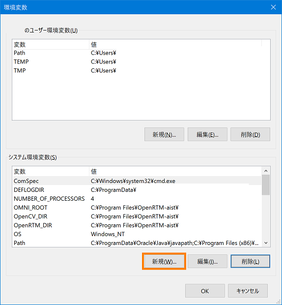</a></div>
<br><br>
  1. Enter "ANT_HOME" for the variable name and "C:\Program Files\ant" for the variable value, then click the [OK] button. * Specify the path to the ant folder as the variable value.<br><br>
<div align="center"><a href="system-property_03.png">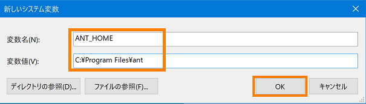</a></div>
<br><br>
  1. From the "System variables" list, select the variable name "Path" and click the [Edit] button.<br><br>
<div align="center"><a href="system-property_04.png"></a></div>
<br><br>
  1. Click the [New] button, enter "%ANT_HOME%\bin", and click the [OK] button.<br><br>
<div align="center"><a href="system-property_05.png">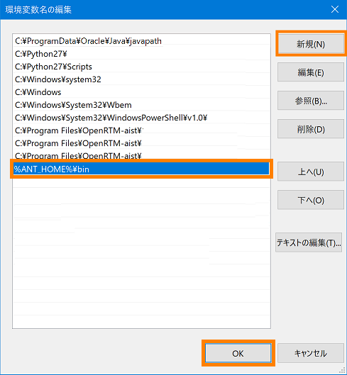</a></div>
<br><br>
  1. Set JAVA_HOME. This is not necessary if it is already set.<br>
Click the [New] button under "System variables".<br><br>
<div align="center"><a href="system-property_02.png"></a></div>
<br><br>
  1. Enter "JAVA_HOME" for the variable name and "C:\Program Files\Java\jdkx.x.x.x_xxx" for the variable value, then click the [OK] button.<br>
* Specify the path to the Java installation folder as the variable value.<br><br>
<div align="center"><a href="system-property_06.png">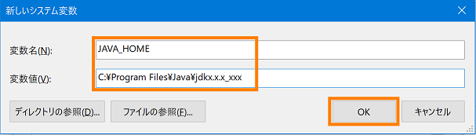</a></div>
<br><br>
  1. Return to the System Properties screen and click the [OK] button to close the screen.<br><br>
1. Restart the PC.<br><br>
1. After restarting, start the command prompt and enter "ant -version" to check the Apache Ant version.<br><br>
<div align="center"><a href="system-property_07.png"></a></div>
<br><br>
1. Similarly, enter "java -version" to check the Java version.<br><br>
<div align="center"><a href="system-property_08.png">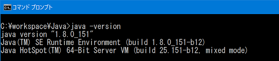</a></div>
<br><br>
1. Build from the command prompt.<br>
In the folder of the specified RTC project, enter the following command to start the build.
```
 ant -f  build_*****.xml  (***** はモジュール名)
```
If the build succeeds, the following display appears.<br><br>
<div align="center"><a href="system-property_09.png">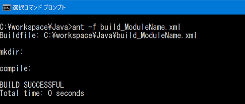</a></div>
<br><br>

