-------jp page!!-------
<!-- Title: CPack で msi 作成（Windows） -->
#contents(4)

## はじめに

msi インストーラーは Visual Studio でビルドして作成します。<br>

## doxygen ドキュメントを含めない場合の作成手順
※デフォルトでは、ドキュメントビルドは OFF になっているため生成されません。

Visual Studio のソリューション エクスプローラーから「PACKAGE」を右クリックして「ビルド」を選択し実行します。
<br>
<div align="center"><a href="doxygenoff1-1.png">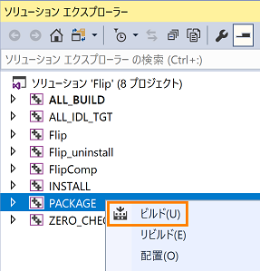</a></div>

<br>

## doxygen ドキュメントを含める場合の作成手順
プロジェクトフォルダー直下にある CMakeLists.txt の下記の行を、OFF → ON に書き換えます。<br>
C++ RTC の場合は 86行目あたり、Python RTC の場合は 77行目あたりです。

```
 option(BUILD_DOCUMENTATION "Build the documentation" ON) ※この行の OFF を ON に書き換えます。(デフォルトは OFF)
```

1. Visual Studio のソリューション エクスプローラーから「doc」を右クリックして「ビルド」を選択し実行します。<br>
<br>
<div align="center"><a href="doxygenon1-1.png">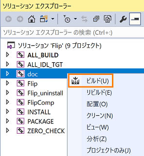</a></div>
<br>
1. 「doc」でビルド完了後、「PACKAGE」を右クリックして、「ビルド」を選択します。<br>
<br>

<div align="center"><a href="doxygenon1-2.png">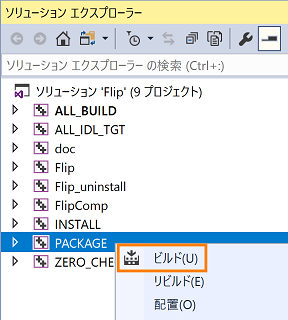</a></div>
<br>

【注意事項】
- CMake の configure で「BUILD_DOCUMENTATION」にチェックが入っているのを確認すること。
- 先に「doc」のビルドをしてから、「PACKAGE」のビルドを行うこと。「doc」のビルドをせずに「PACKAGE」のビルドを行うとエラーになります 。

## msi インストーラーの保存場所、ファイル名
正常に作成できた場合は、プロジェクトディレクトリーの [build] 内に保存されます。 <br>
ファイル名は、「RTCプロジェクト名＋RTCのバージョン番号_OpenRTM-aist のバージョン番号_アーキテクチャ」となります。<br><br>
(例) Flip100_rtm120_win64.msi<br>
※アーキテクチャは、[win32] または [win64] となります。<br>
　バージョン番号は、ドットを省いた形式で、[1.0.0] は [100] となります。

## msi のインストール・アンインストール
### インストール
1. 作成した msi インストーラーをダブルクリックします。<br>
<br>
1. [次へ] をクリックします。<br>
<br>
<div align="center"><a href="msi_install1-1.png">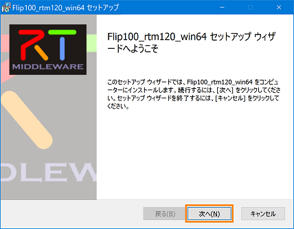</a></div>
<br>
1. [使用許諾契約書に同意します] にチェックを入れ、[次へ] をクリックします。<br>
<br>
<div align="center"><a href="msi_install2-1.png">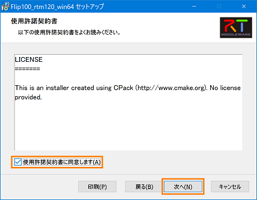</a></div>
<br>
1. [次へ] をクリックします。<br>
デフォルトのインストールパスは以下になります。<br>
(例) C:\Program Files\OpenRTM-aist\1.2.0\Components\c++\ImageProcessing\<br>
※ImageProcessing は、RTCBuilderの「モジュールカテゴリ」で指定した名前<br>
<br>
<div align="center"><a href="msi_install3-1.png">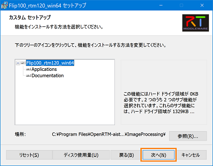</a></div>
<br>
1. [インストール] をクリックすると、インストールが開始されます。<br>
<br>
<div align="center"><a href="msi_install4-1.png">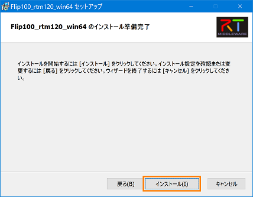</a></div>
<br>
<div align="center"><a href="msi_install4-2.png">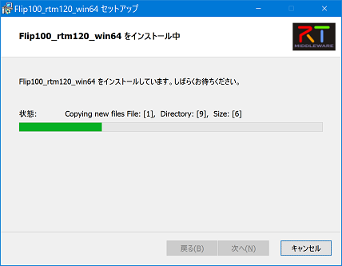</a></div>
<br>
1. [完了] をクリックし、インストーラーを終了します。インストール後、スタートメニューに登録されます。<br>
<br>
<div align="center"><a href="msi_install5-1.png"></a></div>
<br>

### アップグレードの GUID 設定
アップグレードをするときに、すでにインストールされているバージョンを確認するため GUID を設定する必要があります。
GUID は、デフォルトで設定されていないため、Visual Studio で PACKAGE をビルドをする度に新しい GUID が割り当てられてしまいます。
事前に GUID を設定しておくことで、アップグレードなのか、新規インストールなのかを判断することができます。<br>
以下に、GUID の設定手順を示します。<br><br>
1. Visual Studio のソリューション エクスプローラーから「PACKAGE」を右クリックし、「ビルド」を選択し実行します。<br>
<br>
<div align="center"><a href="msi_upgrade1-1.png.png"></a></div>
<br>
1. ビルドが完了すると、以下の出力画面に GUID が表示されるので、選択してコピーします。<br>
<br>
<div align="center"><a href="msi_upgrade2-1.png">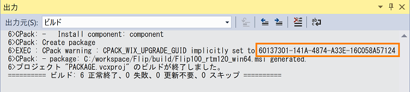</a></div>
<br>
1. ソリューション エクスプローラーから「ALL_BILD」を展開し、CMakeLists.txt をクリックします。<br>
<br>
<div align="center"><a href="msi_upgrade3-1.png">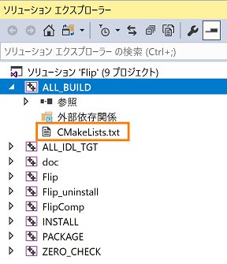</a></div>
<br>
1. 手順２でコピーした GUID を以下の画面のように貼り付け、CMakeLists.txt を上書き保存します。<br>
<br>
<div align="center"><a href="msi_upgrade4-1.png">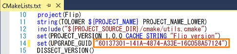</a></div>
<br>
1. 再度、ソリューション エクスプローラーから「PACKAGE」を右クリックし、「ビルド」を選択し実行します。<br>
<br>
<div align="center"><a href="msi_upgrade5-1.png">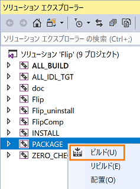</a></div>
<br>

[補足]<br>
GUID の作成には上記のほかに、GUID を新規に作成する方法もあります。<br>
Visual Studio のメニューから [ツール] > [GUID の作成] を選択し、「GUID の作成」ダイアログを表示させます。<br>
<br>
1. [GUID 形式] で、[4. レジストリ形式・・・] を選択します。<br>
1. [新規 GUID] ボタンをクリックします。<br>
1. [コピー] ボタンをクリックします。<br>
1. [終了] ボタンをクリックして、ダイアログを閉じます。<br>
<br>
<div align="center"><a href="msi_upgrade6-1.png">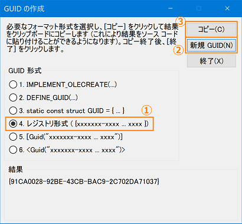</a></div>
<br>
1. 以下の画面のように、CMakeLists.txt に貼り付けて、上書き保存します。※数字のみを貼り付けます。<br>
<br>
<div align="center"><a href="msi_upgrade4-1.png"></a></div>
<br>

### アンインストール
以下、アンインストール手順です。
#### コントロールパネルから削除する方法
1. [コントロールパネル] を開き、[プログラムのアンインストール] をクリックします。<br>
<br>
<div align="center"><a href="msi_uninstall0-1.png">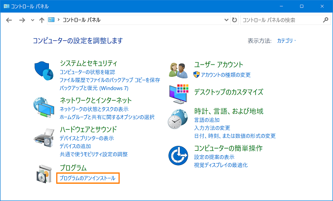</a></div>
<br>
1. インストールしたパッケージ名を選択し、[アンインストール] をクリックします。<br>
<br>
<div align="center"><a href="msi_uninstall0-2.png">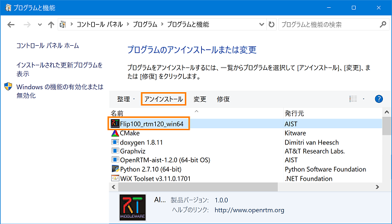</a></div>
<br>
1. コントロールパネルの一覧から表示が消えていればアンインストール完了です。<br><br>
#### インストーラーから削除する方法
1. 作成した msi インストーラーをダブルクリックします。<br><br>
1. [削除] をクリックします。<br>
<br>
<div align="center"><a href="msi_uninstall1-1.png">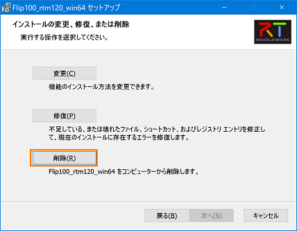</a></div>
<br>
1. [削除]をクリックします。<br>
<br>
<div align="center"><a href="msi_uninstall2-1.png">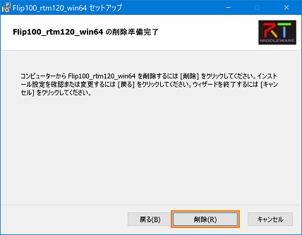</a></div>
<br>
<div align="center"><a href="msi_uninstall2-2.png">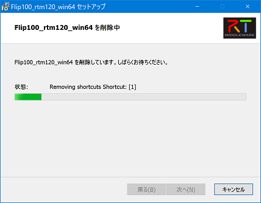</a></div>
<br>
1. [完了] をクリックし、インストーラーを終了します。<br>
<br>
<div align="center"><a href="msi_uninstall3-1.png">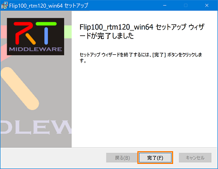</a></div>
<br>

## サービスポートを持つ Python RTC の IDLコンパイル処理
サービスポートを持つ Python RTC は、パッケージインストール時に IDL コンパイルを実行します。
IDL コンパイル実行時にプロジェクトフォルダー内にある idlcompile.bat、delete.bat でこの動作を実現させているため、これらのファイルを削除してしまうと機能しなくなってしまうので注意が必要です。 <br>
コントロールパネルからアンインストールすることで、IDL コンパイル実行後に生成したファイルも削除されます。

以下、msi インストーラーによりインストールされるファイル一覧です。★マークが IDL コンパイルで生成されるファイルです。

```
 tree /f インストールディレクトリー\OpenRTM-aist\1.2.0\Components\Python\Category\FlipGUI
 C:\インストールディレクトリー\OpenRTM-aist\1.2.0\Components\Python\Category\FlipGUI
 │  BasicDataType_idl.py ★
 │  CalibrationService_idl.py ★
 │  delete.bat
 │  ExtendedDataTypes_idl.py ★
 │  idlcompile.bat
 │  InterfaceDataTypes_idl.py ★
 │  RTC.xml
 │  rtutil.py
 │  setup.py
 │  flipgui.py
 │  FlipGUIComp.py
 │
 ├─idl
 │   BasicDataType.idl
 │   CalibrationService.idl
 │   CMakeLists.txt
 │   ExtendedDataTypes.idl
 │   InterfaceDataTypes.idl
 │
 ├─ImageCalibService ★
 │   __init__.py ★
 │
 ├─ImageCalibService__POA ★
 │   __init__.py ★
 │
 ├─RTC ★
 │   __init__.py ★
 │
 └─RTC__POA ★
       __init__.py ★
```


-------jp page!!-------
