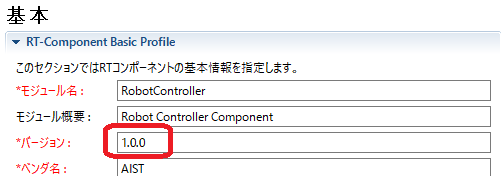

<!-- Title: CPack を使ったパッケージ作成（Windows/Linux での共通設定） -->
#contents(4)

## Introduction

CMake has a function for creating installer packages with CPack.
RT components generated using OpenRTP 1.2.0 or later can be made into installer packages without changing the CMake settings generated by RTCBuilder.
In a Windows environment, you can create an msi-format installer; in a Linux Ubuntu or Debian environment, you can create a deb package; and in a Fedora environment, you can create an rpm package.

(Note) However, with OpenRTP 1.2.0, packages can be created only for C++ or Python RTCs, and Java RTCs are not supported.

Installation of OpenRTP 1.2.0 is introduced on the download page for OpenRTM-aist 1.2.0.

## Preparation

Install the software required for creating installers and packages.

### Windows Environment

In addition to the software shown when installing OpenRTM-aist, the following software must be installed.

<table class="table-alt">
  <tr>
    <td><a href="http://wixtoolset.org/releases/">WiX Toolset</a></td>
    <td>Required to create msi installers.</td>
  </tr>
  <tr>
    <td><a href="http://www.graphviz.org/Download_windows.php">Graphviz</a></td>
    <td>Allows flowcharts, system diagrams, and similar diagrams to be included in documentation.</td>
  </tr>
</table>

#### Installing WiX Toolset
1. Start the installer and click the [install] button to begin installation.
<br><br>
#ref(WiX Toolset 1-1.png,70%,center)
<br>
1. When "Complete" is displayed on the [install] button, installation is complete. Click the [Exit] button.
<br><br>
#ref(WiX Toolset 2-1.png,80%,center)

#### Installing Graphviz
1. Start the installer and click the [Next] button.<br><br>
#ref(Graphviz 1-1.png,60%,center) <br>
1. Change the installation folder as desired, and click the [Next] button.<br><br>
#ref(Graphviz 2-1.png,60%,center) <br>
1. Click the [Next] button to start installation.<br><br>
#ref(Graphviz 3-1.png,60%,center) <br>
#ref(Graphviz 4-1.png,60%,center) <br>
1. After installation is complete, click the [Close] button.<br><br>
#ref(Graphviz 5-1.png,60%,center) <br><br>
1. When installing from the msi, the path is not set automatically, so you need to add the path to the environment variables manually. Right-click Command Prompt and select [Run as administrator].<br><br>
1. Enter and execute the following command in Command Prompt.<br><br>＞setx /M PATH "%PATH%;[installation folder path]" <br><br>
#ref(Graphviz 6-1.png,80%,center)<br>
If it succeeds, "SUCCESS: Specified value was saved." will be displayed.<br><br>
1. Close Command Prompt once, and then open it again. <br><br>
1. To confirm that each Graphviz command can be used, enter the following command. <br><br>＞dot -V
#ref(Graphviz 7-1.png,80%,center) <br>
If the version is displayed, setup is complete.<br><br>

### Linux Environment

The packages required can be installed using the script used when installing OpenRTM-aist.

<table class="table-alt">
  <tr>
    <th><a href="http://svn.openrtm.org/OpenRTM-aist/trunk/OpenRTM-aist/build/pkg_install_ubuntu.sh">pkg_install_ubuntu.sh</a><br><a href="http://svn.openrtm.org/OpenRTM-aist/trunk/OpenRTM-aist/build/pkg_install_debian.sh">pkg_install_debian.sh</a><br><a href="http://svn.openrtm.org/OpenRTM-aist/trunk/OpenRTM-aist/build/pkg_install_fedora.sh">pkg_install_fedora.sh</a><br><a href="http://svn.openrtm.org/OpenRTM-aist/trunk/OpenRTM-aist/build/pkg_install_raspbian.sh">pkg_install_raspbian.sh</a></th>
    <th><br>$ sudo sh pkg_install_***.sh -l c++ -l python -c --yes</th>
  </tr>
</table>

#### Batch Installation
For Ubuntu, Debian, Fedora, and Raspbian, see the [batch installation procedure here](/en/content/about_installscript).

## Common Settings for Windows/Linux

### Installer Package Name

For Windows, the package name consists of "RTC project name + RTC version number_OpenRTM-aist version number_architecture".
The version number uses a format with dots removed; [1.0.0] becomes [100].<br>
For Linux, it consists of "RTC project name_RTC version number_architecture".

Example: package names when a package is created with the following settings
- Project name: RobotController
- Version number: 1.0.0
- OpenRTM-aist version: 1.2.0

- For Windows
  - 32-bit: RobotController100_rtm120_win32.msi
  - 64-bit: RobotController100_rtm120_win64.msi

- For Ubuntu and Debian
  - 32-bit: robotcontroller_1.0.0_i386.deb
  - 64-bit: robotcontroller_1.0.0_amd64.deb

- For Fedora
  - 32-bit: RobotController-1.0.0-i686.rpm
  - 64-bit: RobotController-1.0.0-x86_64.rpm

The "RTC version number" is the value specified on the "Basic" tab in RTCBuilder.

<div align="center"><a href="version.png"></a></div>
<div align="center"><strong>RTC Version Number</strong></div>

### Specifying the Installation Destination Directory

The location where the created installer package is installed when executed is, by default, the OpenRTM-aist installation destination.
Only in the Windows environment can the installation destination be changed as desired on the GUI screen when installing OpenRTM-aist.

The default installation destination path is determined by the following conditions.
- The path of OpenRTM-aist installed in the environment where the installer package was created
- RTC language
- The module category specified on the Basic tab when generating the RTC (default: Category)

Any string can be entered for the module category.

<div align="center"><a href="category.png"></a></div>
<div align="center"><strong>Setting the Module Category Name to "Controller"</strong></div>

If this RTC is "C++" and the installer is created in an environment where the 32-bit version of OpenRTM-aist 1.2.0 is installed on Windows, the default installation destination is as follows.

```
 C:\Program Files (x86)\OpenRTM-aist\1.2.0\Components\C++\Category\RobotController
```

If a package is created in a Linux environment, the installation destination is as follows. This example uses "Controller" as the module category.

```
 /usr/share/openrtm-1.2/components/c++/Controller/RobotController
```


### Package Maintainer Information

The package maintainer information reflects the content entered in "Author / Contact" on the "Documentation Generation" tab in RTCBuilder.
The format must be entered as "name <mail address>". The name must be written in Roman letters, and the email address must be enclosed in < >.
If left blank, it becomes "unknown". (The default is blank.)
<br>
#ref(Maintener 1-1.png,80%,center) <br>

