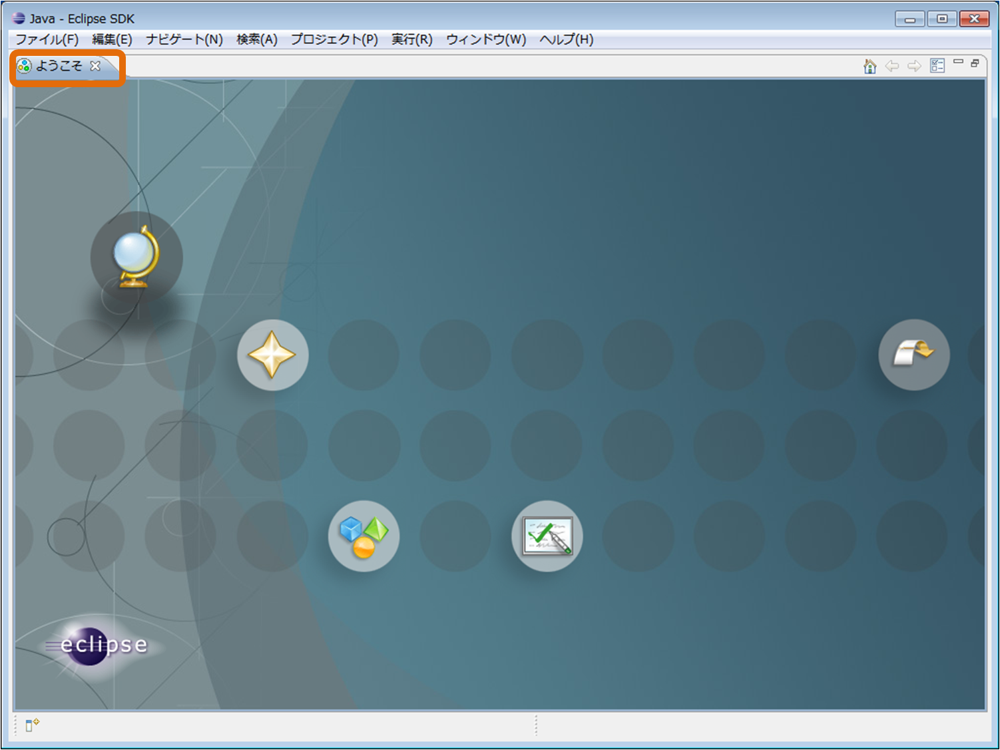
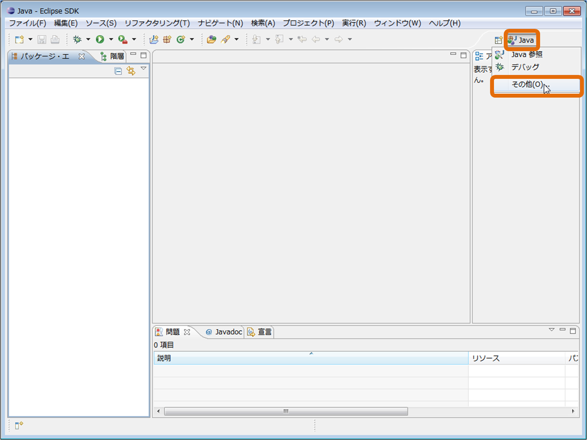
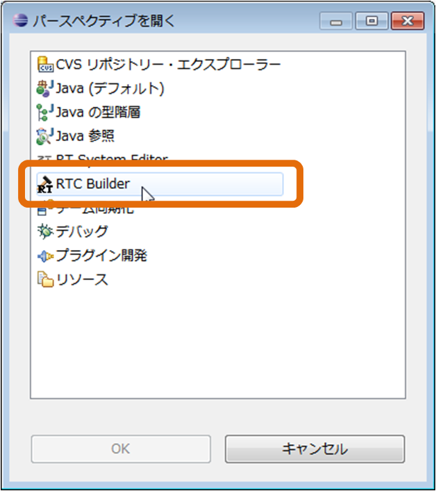
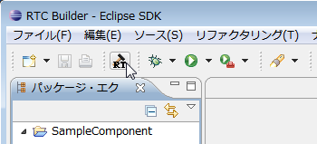
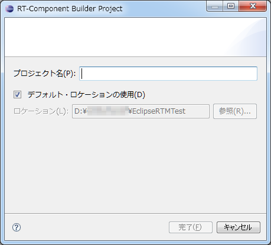
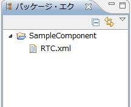

-------jp page!!-------
<!-- Title: インストールおよび起動 -->
#contents(4)
ここでは、RTCBuilder のインストールおよび起動方法について説明します。
### RTCBuilder のインストール
RTCBuilder は Eclipse プラグインであるため、 Eclipse 本体および依存している他の Eclipse プラグインをまずインストールする必要があります。
<!-- [[動作環境:RTCBuilder]]を参照の上、これらをダウンロードします。 -->
<!-- Eclipse のインストールは解凍するだけです。また、 Eclipse のプラグインは解凍後、Eclipse フォルダ内に上書きするだけです。 -->
<!-- RTCBuilder のインストールは RTCBuilder のプラグイン jar ファイル（jp.go.aist.rtm.rtcbuilder_X.X.X.jar）を eclipse/plugins フォルダーに配置するだけで完了です。 -->
インストールに関しては、[OpenRTM Eclipse tools のインストール]({{ site.baseurl }}/ja/doc/installation/install_1_2/openrtp_1_2/)<!--/node/6655--> を参照願います。
### RTCBuilder の起動
インストール後、Eclipse を初めて起動すると、以下のような「ようこそ」画面が表示されます。
 

<strong>Eclipseの初期起動時の画面</strong>

 
この「ようこそ」画面左上の「X」ボタンをクリックすると、以下のページが表示されます。
右上の [Open Perspective] ボタンをクリックし、プルダウンから「その他」を選択します。
 

<strong>パースペクティブの切り替え</strong>

 
「RTC Builder」を選択し、[OK] ボタンをクリックします。
 

<strong>パースペクティブの選択</strong>

 
RTCBuilder が起動します。
 

<strong>RTCBuilderの初期起動時画面</strong>

 

#### RTC プロファイルエディタの起動
RTC プロファイルエディタを開くには、ツールバーの [Open New RtcBuilder Editor] ボタンをクリックするか、メニューバーの [ファイル] > [Open New Builder Editor] を選択します。

<table class="table-alt">
  <tr>
    <td>

</td>
    <td>

</td>
  </tr>
  <tr>
    <td style="text-align: center;"><strong>ツールバーから Open New RtcBuilder Editor</strong></td>
    <td style="text-align: center;"><strong>ファイル メニューから Open New Builder Editor</strong></td>
  </tr>
</table>

表示された新規プロジェクト作成ダイアログにて、プロジェクト名を入力します｡

<strong>RTCBuilder 用プロジェクトの作成　１</strong>

 
ここで作成したプロジェクト配下に RTCBuilder を用いて生成したコード､ RTCProfile などが保存されます｡
プロジェクトは､デフォルトでは使用しているワークスペース配下に(｢ロケーション｣に設定されたディレクトリー内)作成されます｡
任意の場所にプロジェクトを作成したい場合には､｢デフォルト・ロケーションの使用｣チェックボックスを OFF にし､｢ロケーション｣にて場所を指定してください｡

 
指定した名称のプロジェクトが生成され、パッケージエクスプローラー内に追加されます。
 

<strong>RTCBuilder 用プロジェクトの作成　２</strong>

 
生成したプロジェクト内には、デフォルト値が設定された RTC プロファイル XML(RTC.xml) が自動的に生成されます。

-------jp page!!-------
