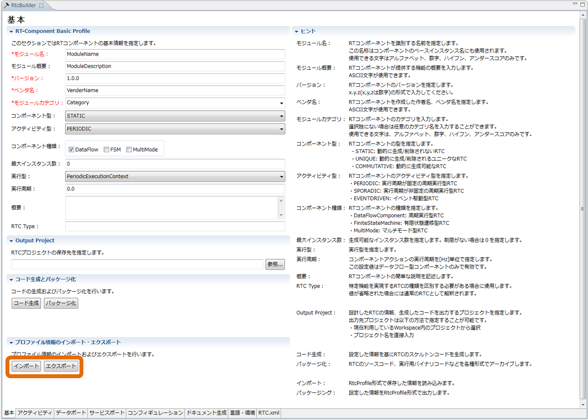
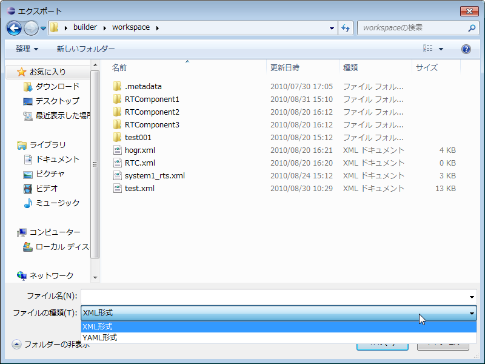

<!-- Title: プロファイルのエクスポート/インポート -->
<!-- #contents -->
<!--  -->
<!-- ** プロファイルのエクスポート/インポート -->
This function exports the content entered and configured in the RTC Profile Editor to an external file in XML or YAML format, and imports the exported file.
When you click the [Export] button on the Basic Profile input page, a file dialog for selecting the destination to export the profile information is displayed. When you click the [Import] button, a file dialog for selecting the profile information to import is displayed.
 

<strong>Profile Export/Import Function</strong>

 
 

<strong>Profile Export Dialog</strong>

 
　<strong>*</strong> The format used during export processing can be selected by "File type" in the "Export" dialog.
