<!-- Title: 画面構成と機能（RTプロファイルエディタ 編） -->
#contents
<!-- *** RTプロファイルエディタ -->
This section explains the RT Profile Editor.
 

<a href="fig3-2RTProfileEditor_ja.png">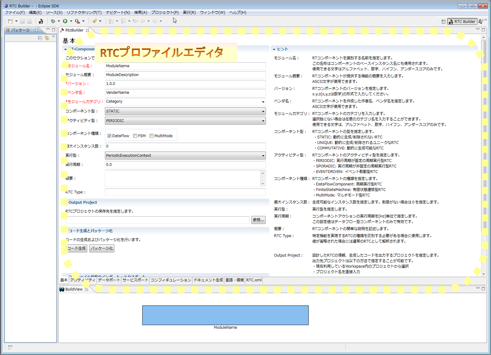</a>

<strong>RT Profile Editor</strong>

 
　The RT Profile Editor consists of the following pages.

<strong>RT Profile Editor Configuration</strong>

<table class="table-alt">
  <tr>
    <th>No.</th>
    <th>Screen Component Name</th>
    <th>Description</th>
  </tr>
  <tr>
    <td>1</td>
    <td>Basic Profile Input Page</td>
    <td>Enter basic component information, such as profile information for the RT component.</td>
  </tr>
  <tr>
    <td>2</td>
    <td>Activity Profile</td>
    <td>Specify information such as the activities supported by the RT component.</td>
  </tr>
  <tr>
    <td>3</td>
    <td>Data Port Profile</td>
    <td>Enter profiles for the data ports attached to the RT component.</td>
  </tr>
  <tr>
    <td>4</td>
    <td>Service Port Profile</td>
    <td>Enter profiles for the service ports attached to the RT component and the service interfaces attached to the service ports.</td>
  </tr>
  <tr>
    <td>5</td>
    <td>Configuration</td>
    <td>Enter user-defined configuration parameter information and system configuration information to be set for the RT component.</td>
  </tr>
  <tr>
    <td>6</td>
    <td>Documentation Generation</td>
    <td>Enter various documentation information to be added to the RT component to be generated.</td>
  </tr>
  <tr>
    <td>7</td>
    <td>Language/Environment</td>
    <td>Enter information about the code selection to be generated and the execution environment, such as the OS.</td>
  </tr>
  <tr>
    <td>8</td>
    <td>RTC.xml</td>
    <td>Displays and edits the RtcProfile generated based on the configured information in XML format.</td>
  </tr>
</table>

You can switch between pages by selecting the tabs at the bottom of the editor screen.
 

### Basic Profile Input Page 
This page is used to enter basic component information, such as profile information for the RT component.
 

<a href="editor-basic.png">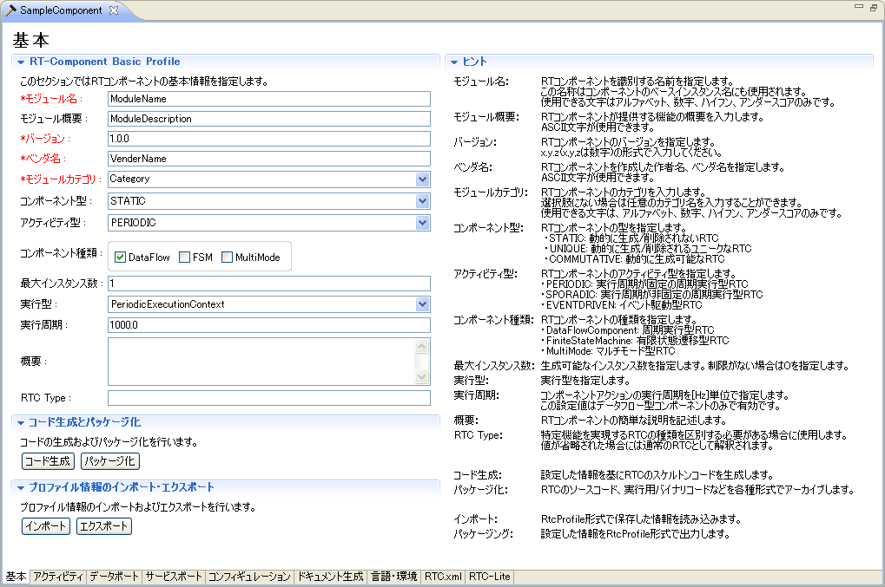</a>

<strong>Basic Profile Input Page</strong>

 
Each input item is described below.

<strong>Basic Profile Input Page Item Descriptions</strong>

<table class="table-alt">
  <tr>
    <th>Item</th>
    <th>Description</th>
    <th>Required</th>
  </tr>
  <tr>
    <td colspan="3" style="text-align: center;" >RT-Component Basic Profile</td>
  </tr>
  <tr>
    <td>Module Name</td>
    <td>This is the name that identifies the RT component. This is a required input item. This name is used as the component name in the generated source code. Only alphanumeric characters can be entered.</td>
    <td>○</td>
  </tr>
  <tr>
    <td>Module Description</td>
    <td>A brief overview of the RT component.</td>
    <td>-</td>
  </tr>
  <tr>
    <td>Version</td>
    <td>The version of the RT component. In principle, enter the version number in a format such as x.y.z.</td>
    <td>-</td>
  </tr>
  <tr>
    <td>Vendor Name</td>
    <td>The name of the vendor that developed the RT component.</td>
    <td>○</td>
  </tr>
  <tr>
    <td>Module Category</td>
    <td>The category of the RT component.</td>
    <td>○</td>
  </tr>
  <tr>
    <td>Component Type</td>
    <td>The type of the RT component. It can be specified from the following options. ・STATIC: A type of RTC that exists statically. Dynamic creation and deletion are not performed. ・UNIQUE: A type of RTC that can be dynamically created and deleted, but each component has an internal unique state and is not necessarily interchangeable. ・COMMUTATIVE: A type of RTC that can be dynamically created and deleted, and because it has no internal state, generated components are interchangeable.</td>
    <td>○</td>
  </tr>
  <tr>
    <td>Activity Type</td>
    <td>The activity type of the RT component. It can be specified from the following options. ・PERIODIC: An activity type that executes RTC actions at regular intervals ・SPORADIC: An activity type that executes RTC actions irregularly ・EVENT_DRIVEN: An activity type in which RTC actions are event-driven</td>
    <td>○</td>
  </tr>
  <tr>
    <td>Component Kind</td>
    <td>The type of execution form of the RT component. It can be selected from the following options. (Multiple options can be combined) ・DataFlow: An execution form that executes actions periodically ・FSM: An execution form that executes actions according to external events ・MultiMode: An execution form that has multiple operation modes</td>
    <td>○</td>
  </tr>
  <tr>
    <td>Maximum Number of Instances</td>
    <td>The maximum number of RT component instances. Enter a natural number.</td>
    <td>-</td>
  </tr>
  <tr>
    <td>Execution Type</td>
    <td>The type of ExecutionContext. It can be selected from the following. ・PeriodicExecutionContext: ExecutionContext that performs periodic execution ・ExtTrigExecutionContext: ExecutionContext that performs execution by an external trigger</td>
    <td>○</td>
  </tr>
  <tr>
    <td>Execution Rate</td>
    <td>The execution rate of the ExecutionContext. A positive double value can be entered (unit: Hz).</td>
    <td>-</td>
  </tr>
  <tr>
    <td>Description</td>
    <td>A description of the RT component.</td>
    <td>－</td>
  </tr>
  <tr>
    <td>RTC Type</td>
    <td>Specify this when it is necessary to distinguish RT components that implement specific functions.</td>
    <td>－</td>
  </tr>
</table>

 

### Activity Profile Input Page
This page is used to enter information about the activities supported by the RT component to be generated.
 

<a href="fig3-4ActivityProfile_ja.png">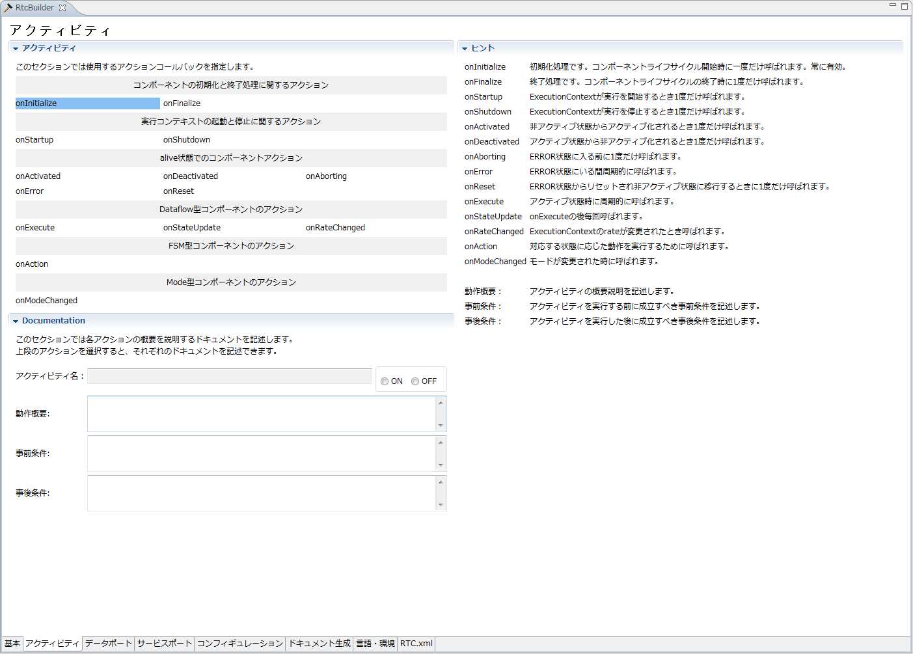</a>

<!-- CENTER:''図 3-4 データポート・プロファイル入力ページ'' -->

<strong>Activity Profile Input Page</strong>

 
The contents of the Documentation section are set for each activity. The Documentation section displays the content corresponding to the currently selected activity.
 
Each input item is described below.
 

<strong>Activity Profile Input Page Item Descriptions</strong>

<table class="table-alt">
  <tr>
    <th>Item</th>
    <th>Description</th>
    <th>Required</th>
  </tr>
  <tr>
    <td colspan="3" style="text-align: center;">Activity Profile</td>
  </tr>
  <tr>
    <td>onInitialize</td>
    <td>Initialization processing. It is called only once at the start of the component lifecycle.</td>
    <td>-</td>
  </tr>
  <tr>
    <td>onFinalize</td>
    <td>Finalization processing. It is called only once at the end of the component lifecycle.</td>
    <td>－</td>
  </tr>
  <tr>
    <td>onStartup</td>
    <td>Called only once when the ExecutionContext starts execution.</td>
    <td>－</td>
  </tr>
  <tr>
    <td>onShutdown</td>
    <td>Called only once when the ExecutionContext stops execution.</td>
    <td>－</td>
  </tr>
  <tr>
    <td>onActivated</td>
    <td>Called only once when transitioning from the inactive state to the active state.</td>
    <td>－</td>
  </tr>
  <tr>
    <td>onDeactivated</td>
    <td>Called only once when transitioning from the active state to the inactive state.</td>
    <td>－</td>
  </tr>
  <tr>
    <td>onAborting</td>
    <td>Called only once before entering the ERROR state.</td>
    <td>－</td>
  </tr>
  <tr>
    <td>onError</td>
    <td>Called while in the ERROR state.</td>
    <td>－</td>
  </tr>
  <tr>
    <td>onReset</td>
    <td>Called only once when resetting from the ERROR state and transitioning to the inactive state.</td>
    <td>－</td>
  </tr>
  <tr>
    <td>onExecute</td>
    <td>Called periodically while in the active state.</td>
    <td>－</td>
  </tr>
  <tr>
    <td>onStateUpdate</td>
    <td>Called every time after on_execute.</td>
    <td>－</td>
  </tr>
  <tr>
    <td>onRateChanged</td>
    <td>Called when the rate of the ExecutionContext is changed.</td>
    <td>－</td>
  </tr>
  <tr>
    <td>onAction</td>
    <td>Called to execute an operation according to the corresponding state.</td>
    <td>－</td>
  </tr>
  <tr>
    <td>onModeChanged</td>
    <td>Called when the mode is changed.</td>
    <td>－</td>
  </tr>
  <tr>
    <td style="text-align: center;" colspan="3">Documentation</td>
  </tr>
  <tr>
    <td>Activity Name</td>
    <td>Displays the name of the currently selected activity.</td>
    <td>－</td>
  </tr>
  <tr>
    <td>Operation Overview</td>
    <td>Describe an overview of the operation executed by the target activity.</td>
    <td>－</td>
  </tr>
  <tr>
    <td>Preconditions</td>
    <td>Describe the preconditions that must be satisfied before executing the target activity.</td>
    <td>－</td>
  </tr>
  <tr>
    <td>Postconditions</td>
    <td>Describe the postconditions that are satisfied after executing the target activity. However, if the target activity is executed when the preconditions are not satisfied, satisfaction of the postconditions is not guaranteed.</td>
    <td>－</td>
  </tr>
</table>

 

### Data Port Profile Input Page 
This page is used to enter information about the data ports attached to the RT component.
 

<a href="fig3-4InputDataPort_ja.png">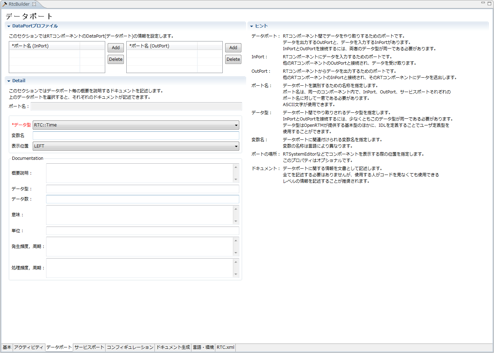</a>

<strong>Data Port Profile Input Page</strong>

 
To add a new port (InPort/OutPort), click the [Add] button in each section.
You can also delete the selected port by clicking the [Delete] button in each section.
The contents of the documentation section can be set for each port. The documentation section displays the content corresponding to the selected port.
Each input item is described below.
 

<strong>Data Port Profile Input Page Item Descriptions</strong>

<table class="table-alt">
  <tr>
    <th>Item</th>
    <th>Description</th>
    <th>Required</th>
  </tr>
  <tr>
    <td colspan="3" style="text-align: center;">DataPort Profile</td>
  </tr>
  <tr>
    <td>Port Name</td>
    <td>The name of the DataPort. Only half-width alphanumeric characters can be entered. Port names cannot overlap with Data OutPort or Service Port names.</td>
    <td>○</td>
  </tr>
  <tr>
    <td colspan="3" style="text-align: center;">Detail</td>
  </tr>
  <tr>
    <td>Port Name</td>
    <td>Displays the currently selected Data Port in the format "port name (InPort/OutPort)".</td>
    <td>－</td>
  </tr>
  <tr>
    <td>Data Type</td>
    <td>The data type handled by the DataPort. Data types defined in the IDL specified on the settings screen can be used.</td>
    <td>○</td>
  </tr>
  <tr>
    <td>Variable Name</td>
    <td>The variable name corresponding to the DataPort.</td>
    <td>－</td>
  </tr>
  <tr>
    <td>Display Position</td>
    <td>The display position of the Data InPort in the Build View.</td>
    <td>○</td>
  </tr>
<!-- |Constraint|Data InPort で扱うデータに対する制約条件です。制約条件の記述方法については、3.2.9を参照してください。|－| -->
<!-- |Unit|Data InPort で扱うデータの単位です。|－| -->
<!-- |>|>|RT-Component Data OutPort Profile| -->
<!-- |Port name|Data OutPort の名称です。半角英数字のみ入力可能です。&br;Data InPort、Service Port と併せてポート名称は重複することができません。|○| -->
<!-- |Data Type|Data OutPort が扱うデータ型です。&br;設定画面にて指定したIDL内で定義されているデータ型が利用可能です。|○| -->
<!-- |Var Name|Data OutPort に対応する変数名です。|－| -->
<!-- |Disp. Position|ビルドビュー内での Data OutPort の表示位置です。|○| -->
<!-- |>|>|Documentation| -->
<!-- |ポート名|現在選択されている Data Port を｢ポート名(InPort/OutPort)｣の形式で表示します。|－| -->
  <tr>
    <td>Overview Description</td>
    <td>Describe an overview of the data port.</td>
    <td>－</td>
  </tr>
  <tr>
    <td>Data Type</td>
    <td>Describe the type handled by the data port.</td>
    <td>－</td>
  </tr>
  <tr>
    <td>Number of Data</td>
    <td>Describe the number of data items, such as when the data is an array.</td>
    <td>－</td>
  </tr>
  <tr>
    <td>Meaning</td>
    <td>Describe the meaning of the data.</td>
    <td>－</td>
  </tr>
  <tr>
    <td>Unit</td>
    <td>Describe the unit of the data.</td>
    <td>－</td>
  </tr>
  <tr>
    <td>Occurrence Frequency/Cycle</td>
    <td>Describe the occurrence frequency and cycle of the data.</td>
    <td>－</td>
  </tr>
  <tr>
    <td>Processing Speed/Cycle</td>
    <td>Describe the processing speed and processing cycle of the data.</td>
    <td>－</td>
  </tr>
</table>
 

### Service Port Profile Input Page 
This page is used to enter information about the service ports attached to the RT component.
 

<a href="fig3-5InputServicePort_ja.png">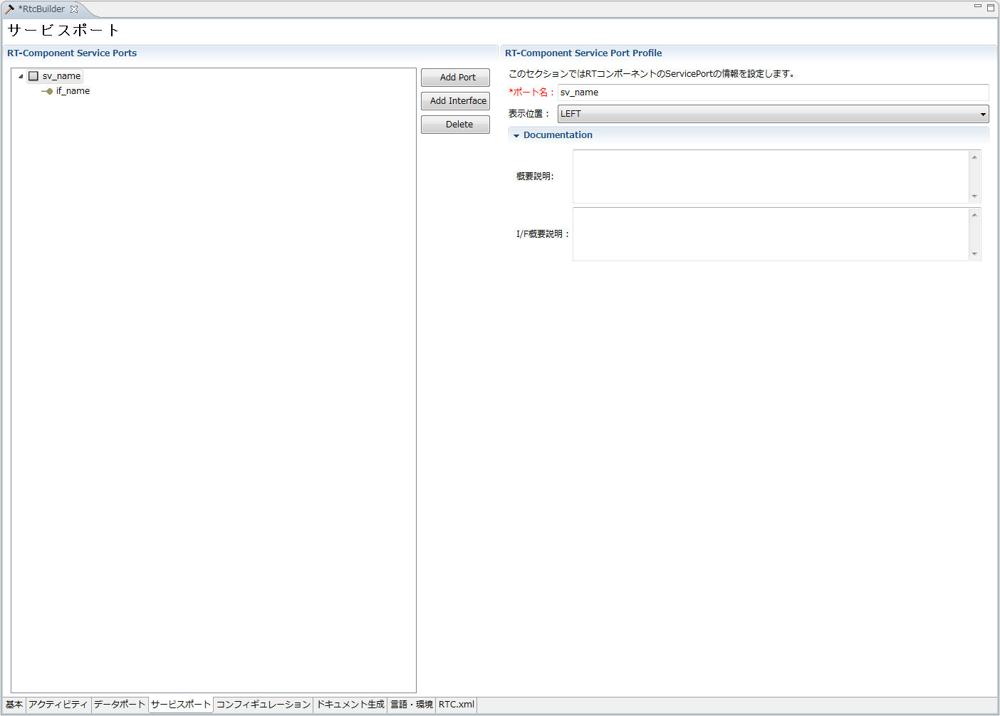</a>

<strong>Service Port Profile Input Page (Service Port Information Input)</strong>

 
 

<a href="fig3-6InputServicePort2_ja.png">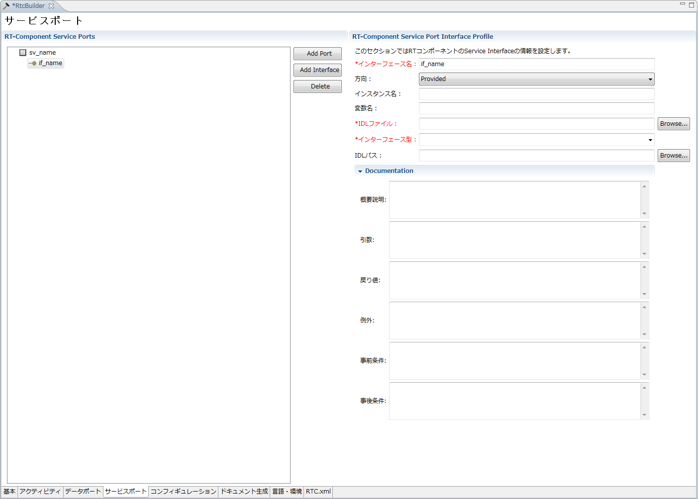</a>

<!-- CENTER:''図 3-6 サービスポート・プロファイル入力ページ(サービスインターフェース情報入)'' -->

<strong>Service Port Profile Input Page (Service Interface Information Input)</strong>

 

A new service port can be added by selecting "Add Port" in the "RT-Component Service Ports" field on the left side of the screen.
With a service port selected in "RT-Component Service Ports" on the left side of the screen, you can add a new service interface by selecting "Add Interface".
With a service port or service interface selected in "RT-Component Service Ports" on the left side of the screen, you can delete the selected port/interface by selecting [Delete].
Each input item is described below.

 

<strong>Service Port Profile Input Page Item Descriptions (Service Port)</strong>

 
<table class="table-alt">
  <tr>
    <th>Item</th>
    <th>Description</th>
    <th>Required</th>
  </tr>
  <tr>
    <td colspan="3" style="text-align: center;">RT-Component Service Port Profile</td>
  </tr>
  <tr>
    <td>Port Name</td>
    <td>The name of the service port. Only half-width alphanumeric characters can be entered. Data InPort, Data OutPort, and Service Port names cannot overlap.</td>
    <td>○</td>
  </tr>
  <tr>
    <td>Display Position</td>
    <td>The display position of the service port in the Build View.</td>
    <td>○</td>
  </tr>
  <tr>
    <td colspan="3" style="text-align: center;">Documentation</td>
  </tr>
  <tr>
    <td>Overview Description</td>
    <td>Describe an overview of the service port.</td>
    <td>－</td>
  </tr>
  <tr>
    <td>I/F Overview Description</td>
    <td>Describe an overview of the service interfaces attached to the service port.</td>
    <td>－</td>
  </tr>
</table>

 

<strong>Service Port Profile Input Page Item Descriptions (Service Port)</strong>

 
<table class="table-alt">
  <tr>
    <th>Item</th>
    <th>Description</th>
    <th>Required</th>
  </tr>
  <tr>
    <td colspan="3" style="text-align: center;">RT-Component Service Port Interface Profile</td>
  </tr>
  <tr>
    <td>Interface Name</td>
    <td>The name of the service interface. Only half-width alphanumeric characters can be entered. Service interface names cannot overlap.</td>
    <td>○</td>
  </tr>
  <tr>
    <td>Direction</td>
    <td>The type of service interface. It can be selected from the following options. ・Provided: Provided interface (for Service Provider) ・Required: Required interface (for Service Consumer)</td>
    <td>○</td>
  </tr>
  <tr>
    <td>Instance Name</td>
    <td>The instance name of the service interface. Only half-width alphanumeric characters can be entered.</td>
    <td>○</td>
  </tr>
  <tr>
    <td>Variable Name</td>
    <td>The variable name of the service interface. If omitted, the instance name is used.</td>
    <td>－</td>
  </tr>
  <tr>
    <td>IDL File</td>
    <td>Specifies the IDL file name used for the service interface. Clicking the [Browse...] button displays a file selection dialog.</td>
    <td>○</td>
  </tr>
  <tr>
    <td>Interface Type</td>
    <td>The service type used for the service interface. When an IDL file is specified, type information defined in the IDL is displayed. Only half-width alphanumeric characters can be entered.</td>
    <td>○</td>
  </tr>
  <tr>
    <td>IDL Path</td>
    <td>The IDL search path. Clicking the [Browse...] button displays a directory selection dialog.</td>
    <td>－</td>
  </tr>
  <tr>
    <td colspan="3" style="text-align: center;">Documentation</td>
  </tr>
  <tr>
    <td>Overview Description</td>
    <td>Describe an overview of the service interface.</td>
    <td>－</td>
  </tr>
  <tr>
    <td>Arguments</td>
    <td>Describe the arguments of the service interface.</td>
    <td>－</td>
  </tr>
  <tr>
    <td>Return Value</td>
    <td>Describe the return value of the service interface.</td>
    <td>－</td>
  </tr>
  <tr>
    <td>Exceptions</td>
    <td>Describe the exceptions of the service interface.</td>
    <td>－</td>
  </tr>
  <tr>
    <td>Preconditions</td>
    <td>Describe the preconditions that must be satisfied before executing the operation of the service interface.</td>
    <td>－</td>
  </tr>
  <tr>
    <td>Postconditions</td>
    <td>Describe the postconditions that are satisfied after executing the operation of the service interface.</td>
    <td>－</td>
  </tr>
</table>

 
### Configuration Profile Input Page
This page is used to enter user-defined configuration parameter information and other system configuration information to be set for the RT component.

 

<a href="fig3-7InputConfigProfile_ja.png">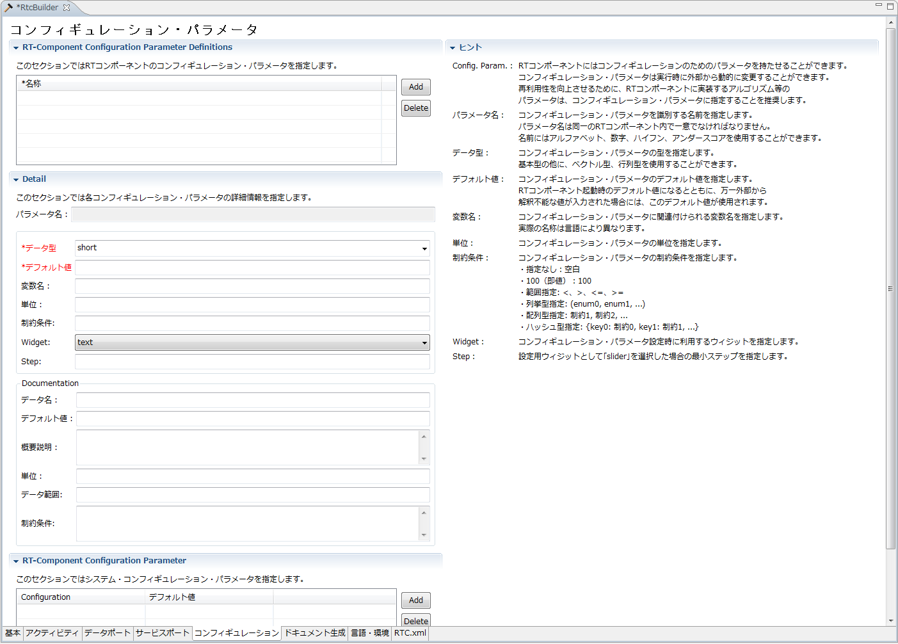</a>

<!-- CENTER:''図 3-7 コンフィギュレーション・プロファイル入力ページ'' -->

<strong>Configuration Profile Input Page</strong>

 
To add new user-defined configuration parameter information and system configuration information, click the [Add] button in each section.
You can also delete the selected configuration information by clicking the [Delete] button in each section.
 
The contents of the Detail section and Documentation section can be set for each user-defined configuration parameter.
Each section displays the content configured for the selected user-defined configuration parameter.
 
Each input item is described below.

<strong>Configuration Profile Input Page Item Descriptions</strong>

<table class="table-alt">
  <tr>
    <th>Item</th>
    <th>Description</th>
    <th>Required</th>
  </tr>
  <tr>
    <td colspan="3" style="text-align: center;">RT-Component Configuration Parameter Definitions</td>
  </tr>
  <tr>
    <td>Name</td>
    <td>The name of the user-defined configuration parameter. Only half-width alphanumeric characters can be entered. User-defined configuration parameter names cannot overlap.</td>
    <td>○</td>
  </tr>
  <tr>
    <td colspan="3" style="text-align: center;">Detail</td>
  </tr>
  <tr>
    <td>Parameter Name</td>
    <td>Displays the currently selected user-defined configuration parameter.</td>
    <td>－</td>
  </tr>
  <tr>
    <td>Data Type</td>
    <td>The data type of the user-defined configuration parameter. Data types defined in the IDL specified on the settings screen can be used.</td>
    <td>○</td>
  </tr>
  <tr>
    <td>Default Value</td>
    <td>The default value of the user-defined configuration parameter. Any value, including two-byte characters, can be set.</td>
    <td>○</td>
  </tr>
  <tr>
    <td>Variable Name</td>
    <td>The variable name of the user-defined configuration parameter. Only half-width alphanumeric characters can be entered.</td>
    <td>－</td>
  </tr>
  <tr>
    <td>Unit</td>
    <td>The unit of the user-defined configuration parameter.</td>
    <td>－</td>
  </tr>
  <tr>
    <td>Constraint</td>
    <td>Describe the constraint conditions for the user-defined configuration parameter. For how to describe constraint conditions, see [[Constraint Information Description Format>#seiyaku]].</td>
    <td>－</td>
  </tr>
  <tr>
    <td>Widget</td>
    <td>Specifies the control used when setting configuration parameters in the ConfigurationView of RTSystemEditor. It can be selected from the following values. ・text: Text box (default setting) ・slider: Slider ・spin: Spin button ・radio: Radio button ・check: Checkbox ・ordered_list: Ordered list</td>
    <td>○</td>
  </tr>
  <tr>
    <td>Step</td>
    <td>When "slider" is selected as the input control, specifies the step width of the slider.</td>
    <td>－</td>
  </tr>
  <tr>
    <td>Parameter Name</td>
    <td>Displays the currently selected user-defined configuration parameter.</td>
    <td>－</td>
  </tr>
  <tr>
    <td>Data Name</td>
    <td>Describe the name of the user-defined configuration parameter.</td>
    <td>－</td>
  </tr>
  <tr>
    <td>Default Value</td>
    <td>Describe the default value of the user-defined configuration parameter.</td>
    <td>－</td>
  </tr>
  <tr>
    <td>Overview Description</td>
    <td>Describe an overview of the user-defined configuration parameter.</td>
    <td>－</td>
  </tr>
  <tr>
    <td>Unit</td>
    <td>Describe the unit of the user-defined configuration parameter.</td>
    <td>－</td>
  </tr>
  <tr>
    <td>Data Range</td>
    <td>Describe the data range of the user-defined configuration parameter.</td>
    <td>－</td>
  </tr>
  <tr>
    <td>Constraint</td>
    <td>Describe the constraint conditions of the user-defined configuration parameter.</td>
    <td>－</td>
  </tr>
  <tr>
    <td colspan="3" style="text-align: center;">RT-Component Configuration Parameter</td>
  </tr>
  <tr>
    <td>Configuration</td>
    <td>The configuration name to be set. Select it from the list.</td>
    <td>○</td>
  </tr>
  <tr>
    <td>Default Value</td>
    <td>The default value of the configuration to be set. For items that already have default values set, the default value is set when the name is selected.</td>
    <td>－</td>
  </tr>
</table>

 

### Documentation Information Settings Page
Enter various documentation information related to the RT component to be generated. 

 

<a href="fig3-8Documentinfo.png">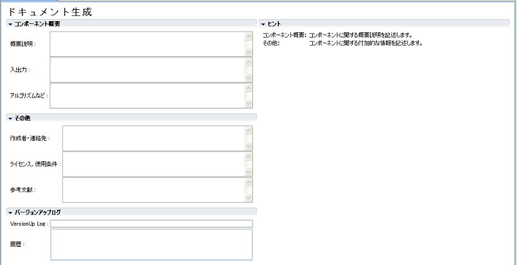</a>

<!-- CENTER:''図 3-8 言語・環境情報入力ページ'' -->

<strong>Documentation Information Input Page</strong>

 
The information entered on this page is embedded in the generated code in doxygen format.
 
Each input item is described below.

<strong>Documentation Information Settings Page Item Descriptions</strong>

<table class="table-alt">
  <tr>
    <td>Item</td>
    <td>Description</td>
    <td>Required</td>
  </tr>
  <tr>
    <td colspan="3" style="text-align: center;">Component Overview</td>
  </tr>
  <tr>
    <td>Overview Description</td>
    <td>Describe an overview of the RT component to be generated.</td>
    <td>－</td>
  </tr>
  <tr>
    <td>Input/Output</td>
    <td>Describe an overview of the input/output of the RT component.</td>
    <td>－</td>
  </tr>
  <tr>
    <td>Algorithms, etc.</td>
    <td>Describe the algorithms and other items used by the RT component.</td>
    <td>－</td>
  </tr>
  <tr>
    <td colspan="3" style="text-align: center;">Other</td>
  </tr>
  <tr>
    <td>Author/Contact</td>
    <td>Describe information about the author and contact of the RT component.</td>
    <td>－</td>
  </tr>
  <tr>
    <td>License/Terms of Use</td>
    <td>Describe information about the license and terms of use of the RT component.</td>
    <td>－</td>
  </tr>
  <tr>
    <td>References</td>
    <td>Describe reference information.</td>
    <td>－</td>
  </tr>
  <tr>
    <td colspan="3" style="text-align: center;">Version Upgrade Log</td>
  </tr>
  <tr>
    <td>VersionUp Log</td>
    <td>Describe log information related to the changes made this time.</td>
    <td>－</td>
  </tr>
  <tr>
    <td>License/Terms of Use</td>
    <td>Displays log information from past version upgrades.</td>
    <td>－</td>
  </tr>
</table>

### Language/Environment Information Input Page 
This page is used to enter the language selection for the template source code generated based on the entered RT component specifications, the execution environment such as OS, dependent libraries, and so on.
 

<a href="editor-lang.png">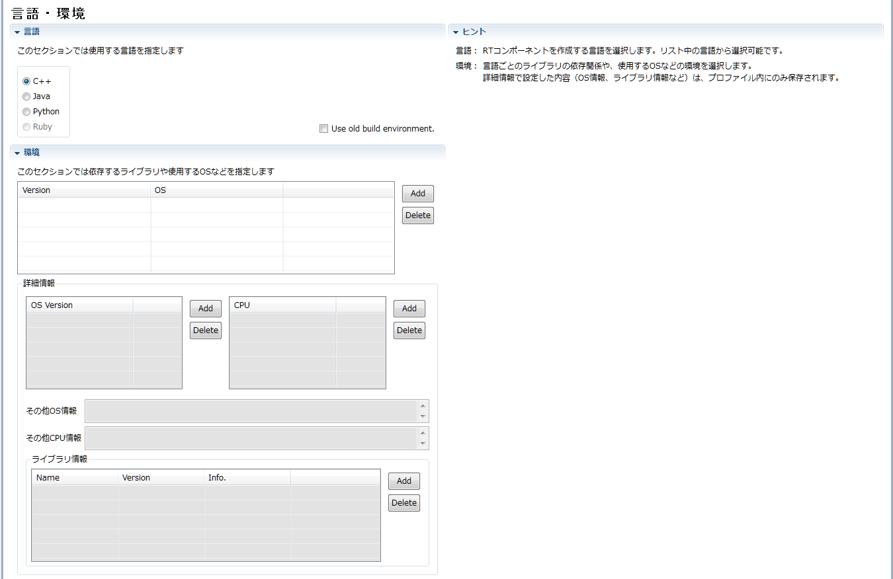</a>

<strong>Language/Environment Information Input Page</strong>

 

Sections are divided by the language to be generated. Select the section for the language you want to generate, and enter the setting information specific to each language.
When one section is selected, all other sections are closed.
When code generation is executed (when the [Generate Code] button on the Basic Profile input page is clicked), template code for the language of the selected section is generated.
Each input item is described below.

<strong>Language/Environment Information Input Page Item Descriptions</strong>

<table class="table-alt">
  <tr>
    <td>Item</td>
    <td>Description</td>
    <td>Required</td>
  </tr>
  <tr>
    <td>Language</td>
    <td>Specifies the language to be generated.</td>
    <td>○</td>
  </tr>
  <tr>
    <td>Use old build environment.</td>
    <td>When this checkbox is turned ON, code similar to the old version (a format that does not use Cmake) is generated.</td>
    <td>－</td>
  </tr>
  <tr>
    <td colspan="3" style="text-align: center;">Environment</td>
  </tr>
  <tr>
    <td>Version</td>
    <td>Sets the version information of the language in which the RTC to be generated is implemented.</td>
    <td>－</td>
  </tr>
  <tr>
    <td>OS</td>
    <td>Sets OS information on which the RTC to be generated runs.</td>
    <td>－</td>
  </tr>
  <tr>
    <td>OS Version</td>
    <td>Sets version information for the OS on which the RTC to be generated runs.</td>
    <td>－</td>
  </tr>
  <tr>
    <td>CPU</td>
    <td>Sets CPU architecture information on which the RTC to be generated runs.</td>
    <td>－</td>
  </tr>
  <tr>
    <td>Other OS Information</td>
    <td>Sets supplementary information other than version information for the OS on which the RTC to be generated runs.</td>
    <td>－</td>
  </tr>
  <tr>
    <td>Other CPU Information</td>
    <td>Sets supplementary information other than architecture information for the CPU on which the RTC to be generated runs.</td>
    <td>－</td>
  </tr>
  <tr>
    <td colspan="3" style="text-align: center;">Library Information</td>
  </tr>
  <tr>
    <td>Name</td>
    <td>Specifies the name of the external library used by the RTC to be generated.</td>
    <td>○</td>
  </tr>
  <tr>
    <td>Version</td>
    <td>Specifies version information for the external library used by the RTC to be generated.</td>
    <td>－</td>
  </tr>
  <tr>
    <td>Info.</td>
    <td>Specifies supplementary information for the external library used by the RTC to be generated.</td>
    <td>－</td>
  </tr>
</table>

<!-- Java セクションの Jar File の追加/削除は、セクション横の [Add]、[Delete] ボタンにて行うことができます。 -->
When you click the [Add] button, an item row is added to the list. Then, when you click the added row, a file selection dialog is displayed, so select the target file.
<!-- ~''※'' Ruby および C# については、現状では未対応です。 -->
 

### RTC Profile XML Editing Page
This page is used to check and edit the contents of the XML file (RTC.xml) that describes the entered RT component specifications.
It is used to check the settings configured on other pages and to directly edit items that cannot be entered from the GUI screen.
 

<a href="fig3-9InputLangEnv2_ja.png">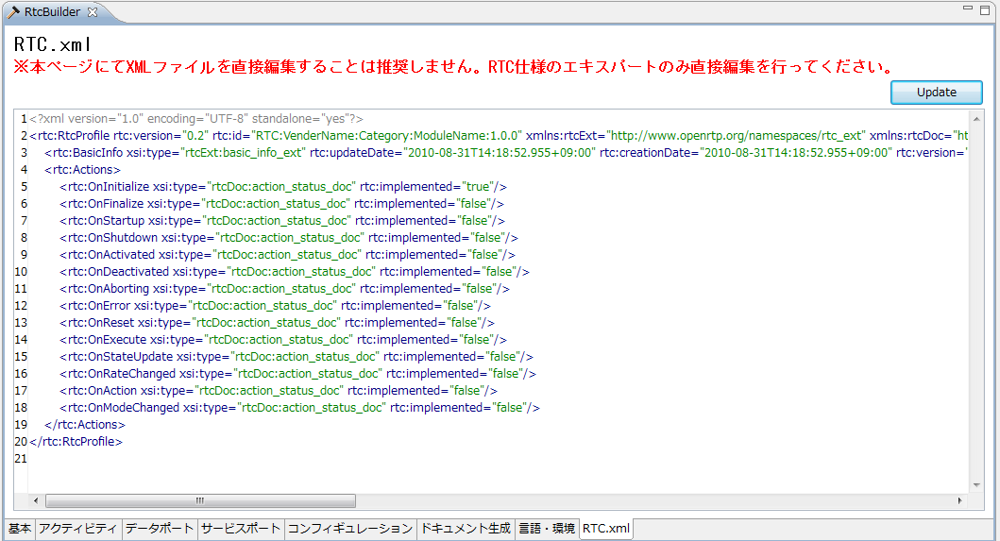</a>

<strong>Language/Environment Information Input Page</strong>

 

The content of the displayed RT component specifications is created based on the content configured on other pages when switching to this page.
 
Clicking the [Update] button at the upper right of the screen reflects the content set or changed on this page in the other pages (it only reflects the content in the other pages and does not write to the file).
A screen like the following is also displayed, allowing you to check the changes. To reflect the changes in the other pages, click [OK].
 

<a href="fig3-9InputLangEnv3_ja.png">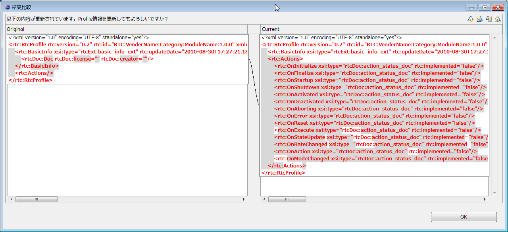</a>

<strong>XML Edit Content Comparison Screen</strong>

 

The content entered directly on this page is saved only when it is saved while this page is displayed.
If you edit the content on this page and then save while another page is open, the items entered on the other page take precedence.
When saving the content of this page, validation is performed according to the schema definition of RTC.xml.
If an error is found during validation, an error message like the following is displayed, so correct the relevant location by referring to the displayed content.
 

<a href="fig3-10ErrorXML_ja.png">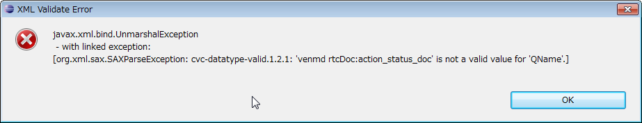</a>

<strong>Example of an XML Validation Error</strong>

 

&aname(seiyaku);
### Constraint Information Description Format
Constraint conditions for data ports and user-defined configuration parameters are set in the following format.

<strong>Constraint Condition Description Format</strong>

<table class="table-alt">
  <tr>
    <th>Setting Content</th>
    <th>Setting Format</th>
  </tr>
  <tr>
    <td>None</td>
    <td>Blank</td>
  </tr>
  <tr>
    <td>100 (literal value)</td>
    <td>100</td>
  </tr>
  <tr>
    <td>100 or more</td>
    <td>x >= 100</td>
  </tr>
  <tr>
    <td>100 or less</td>
    <td>x<=100</td>
  </tr>
  <tr>
    <td>Greater than 100</td>
    <td>x>100</td>
  </tr>
  <tr>
    <td>Less than 100</td>
    <td>x<100</td>
  </tr>
  <tr>
    <td>100 or more and 200 or less</td>
    <td>100<=x<=200</td>
  </tr>
  <tr>
    <td>Greater than 100 and less than 200</td>
    <td>100<x<200</td>
  </tr>
  <tr>
    <td>Enumeration Type</td>
    <td>(9600,19200,115200)</td>
  </tr>
  <tr>
    <td>Array Type</td>
    <td>x>100, x>200, x>300</td>
  </tr>
  <tr>
    <td>Hash Type</td>
    <td>{key0: 100<x<200, key1: x>=100}</td>
  </tr>
</table>

