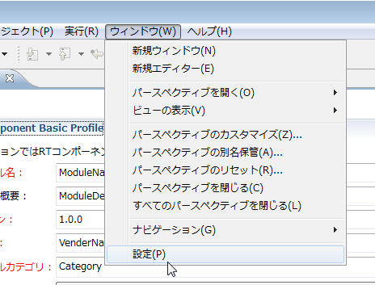
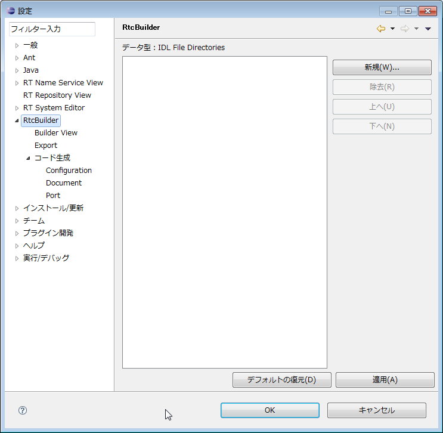
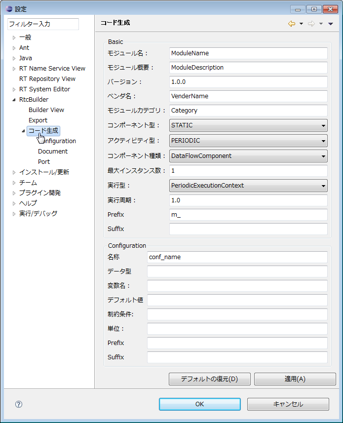
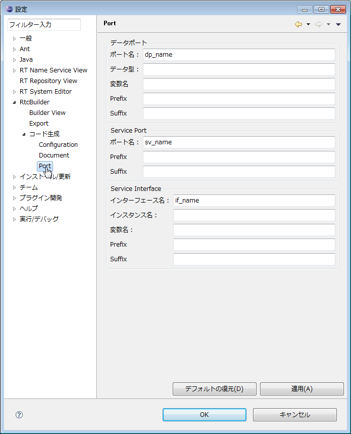
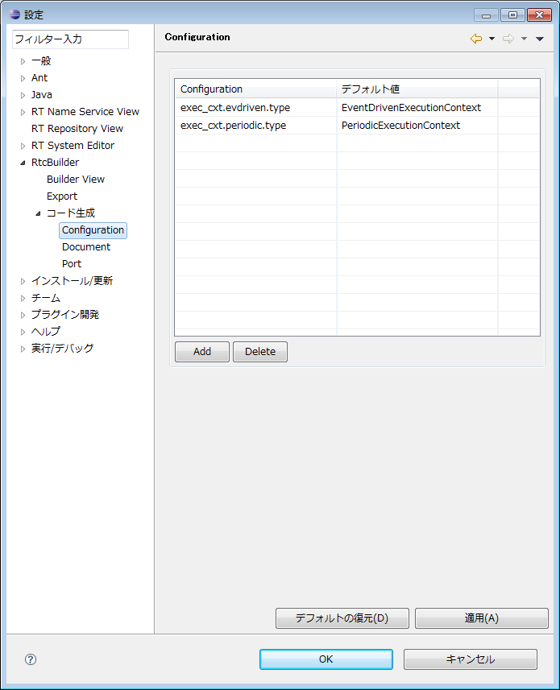
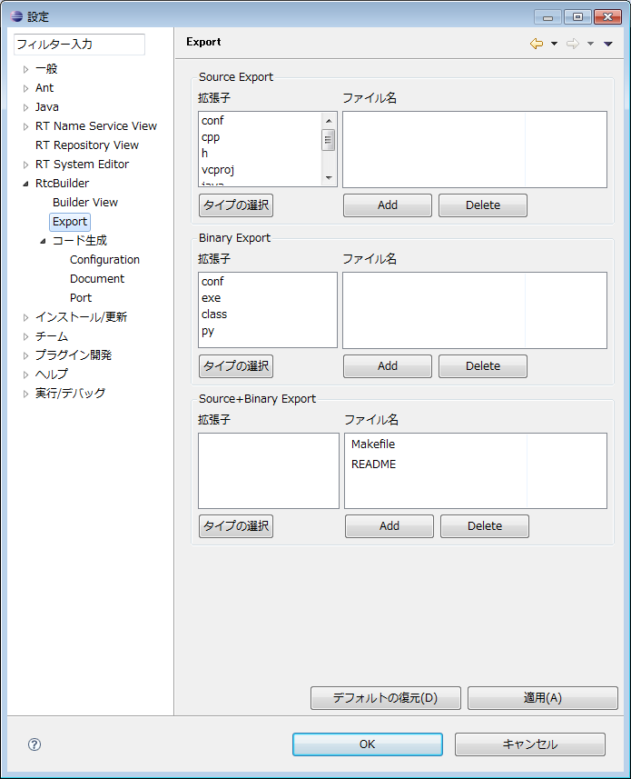
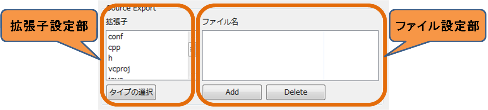
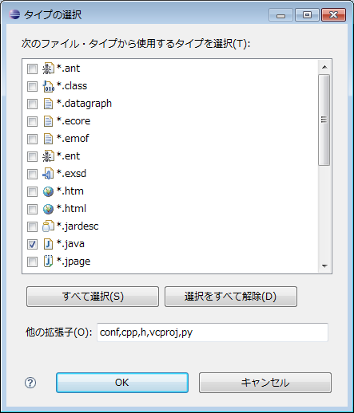
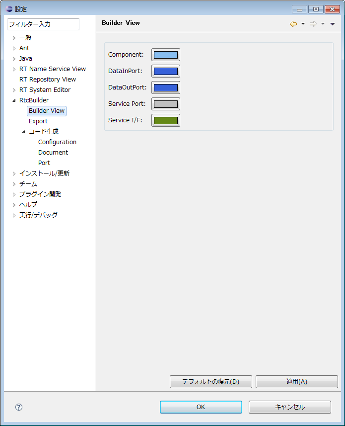
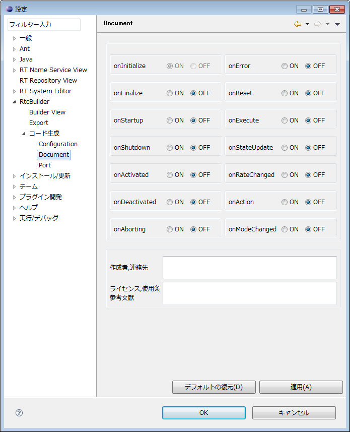

<!-- Title: 各種設定 -->
#contents

ここでは RTCBuilder の各種設定について説明します。
RTCBuilder の設定画面は、画面上部メニューの [ウィンドウ] > [設定....] を選択して表示される「設定」画面から ｢RTCBuilder｣ を選択すると表示されます。
 

## データ型
Data Port および Configuration パラメーターで設定するデータ型を定義した IDL ファイルの位置を設定することができます。
IDL 格納ディレクトリーを新規に追加する場合は、[新規] ボタンをクリックしてください。また、[除去] ボタンをクリックすると、選択中の IDL 格納ディレクトリーを削除することができます。
IDL 格納ディレクトリーの実際の位置は、｢IDL File Directories｣ 欄内をクリックして表示されるディレクトリー選択画面にて選択してください。

<strong>RTCBuilder 設定画面</strong>

 

## コード生成
RTC プロファイルエディタの基本プロファイル入力ページおよびコンフィギュレーション・プロファイル入力ページにて新規エディタ表示時、新規項目追加時にデフォルトで設定される内容を設定することができます。
 

<strong>コード生成設定画面</strong>

 
なお、この設定画面中のデフォルト設定([デフォルトの復元] ボタンをクリックした際に設定される内容)は以下のとおりです。

<strong>コード生成設定画面　デフォルト値</strong>

<table class="table-alt">
  <tr>
    <th>項目</th>
    <th>デフォルト値</th>
  </tr>
  <tr>
    <td>></td>
    <td>Basic</td>
  </tr>
  <tr>
    <td>Component name</td>
    <td>ModuleName</td>
  </tr>
  <tr>
    <td>Description</td>
    <td>ModuleDescription</td>
  </tr>
  <tr>
    <td>Version</td>
    <td>1.0.0</td>
  </tr>
  <tr>
    <td>Vendor</td>
    <td>VendorName</td>
  </tr>
  <tr>
    <td>Category</td>
    <td>Category</td>
  </tr>
  <tr>
    <td>Component Type</td>
    <td>STATIC</td>
  </tr>
  <tr>
    <td>Component’s activity type</td>
    <td>PERIODIC</td>
  </tr>
  <tr>
    <td>Max. Instances</td>
    <td>1</td>
  </tr>
  <tr>
    <td>Component kind</td>
    <td>DataFlowComponent</td>
  </tr>
  <tr>
    <td>Execution type</td>
    <td>PeriodicExecutionContext</td>
  </tr>
  <tr>
    <td>Execution rate</td>
    <td>1.0</td>
  </tr>
  <tr>
    <td>></td>
    <td>Configuration</td>
  </tr>
  <tr>
    <td>Name</td>
    <td>conf_name</td>
  </tr>
  <tr>
    <td>Type</td>
    <td>conf_type</td>
  </tr>
  <tr>
    <td>Variable Name</td>
    <td>conf_varname</td>
  </tr>
  <tr>
    <td>Default Value</td>
    <td>conf_default</td>
  </tr>
  <tr>
    <td>Constraint</td>
    <td>conf_constraint</td>
  </tr>
  <tr>
    <td>Unit</td>
  </tr>
</table>
 

## Port
RTC プロファイルエディタのデータポート・プロファイル入力ページおよびサービスポート・プロファイル入力ページにて新規項目を追加した際にデフォルトで設定される内容を設定することができます。
 

<strong>Port設定画面</strong>

 
なお、この設定画面中のデフォルト設定([デフォルトの復元] ボタンをクリックした際に設定される内容)は以下のとおりです。

<strong>Port設定画面　デフォルト値</strong>

<table class="table-alt">
  <tr>
    <th>項目</th>
    <th>デフォルト値</th>
  </tr>
  <tr>
    <td colspan="2">Data Port</td>
  </tr>
  <tr>
    <td>DataPort Name</td>
    <td>dp_name</td>
  </tr>
  <tr>
    <td>DataPort Type</td>
    <td>dp_type</td>
  </tr>
  <tr>
    <td>DataPort Variable Name</td>
    <td>dp_vname</td>
  </tr>
  <tr>
    <td>DataPort Constraint</td>
    <td>dp_constraint</td>
  </tr>
  <tr>
    <td >DataPort Unit</td>
    <td ></td>
  </tr>
  <tr>
    <td colspan="2">Service Port</td>
  </tr>
  <tr>
    <td>ServicePort Name</td>
    <td>sv_name</td>
  </tr>
  <tr>
    <td colspan="2">Service Interface</td>
  </tr>
  <tr>
    <td>Interface Name</td>
    <td>if_name</td>
  </tr>
  <tr>
    <td>Instance Name</td>
    <td>if_instance</td>
  </tr>
  <tr>
    <td>Variable Name</td>
    <td>if_varname</td>
  </tr>
</table>
 

## Configuration
RTC プロファイルエディタのコンフィギュレーション・プロファイル入力ページのシステム・コンフィギュレーション情報に表示される項目を設定することができます。
 

<strong>Configuration設定画面</strong>

 
なお、この設定画面中のデフォルト設定([デフォルトの復元] ボタンをクリックした際に設定される内容)は以下のとおりです。

<strong>Configuration 設定画面　デフォルト値</strong>

<!-- |項目|デフォルト値||項目|デフォルト値| -->

<table class="table-alt">
  <tr>
    <th>項目</th>
    <th>デフォルト値</th>
  </tr>
  <tr>
    <td>exec_cxt.periodic.type</td>
    <td>PeriodicExecutionContext</td>
  </tr>
  <tr>
    <td>exec_cxt.periodic.rate</td>
    <td>1000</td>
  </tr>
  <tr>
    <td>exec_cxt.evdriven.type</td>
    <td>EventDrivenExecutionContext</td>
  </tr>
</table>

 

## Export
RT コンポーネントのパッケージング機能の各アーカイブ形式に含めるファイルを設定することができます。
 

<strong>Export設定画面</strong>

 
設定画面はアーカイブ形式ごとのセクション（Source Export，Binary Export，Source+Binary Export）に分かれています。また、各セクションは拡張子指定部と、ファイル名指定部から構成されています。
 

<strong>Export設定画面(セクション)</strong>

 
拡張子指定部では、各アーカイブ形式に含めるファイルの拡張子を設定することができます。[タイプの選択] ボタンをクリックすると、以下のようなタイプ選択画面が表示されますので、アーカイブに含めたいファイルタイプを選択してください。
 
 
<table class="table-alt">
  <tr>
    <!-- th>BGCOLOR(white):</th-->
    <td>

</td>
    <td>※ファイル拡張子リストには登録済みの拡張子のみ表示されます。リスト
内に存在しないファイルを選択したい場合は、画面下部の｢他の拡張子｣欄に該当する拡張子を「，」区切りで
入力してください。</td>
  </tr>
</table>

<strong>拡張子選択画面</strong>

 
ファイル設定部ではアーカイブに含めるファイル名を設定することができます。「ファイル名」リスト下部の [Add] ボタンをクリックすると新しい行が追加されますので、アーカイブに含めたいファイル名を直接入力してください。また、[Delete] ボタンをクリックすると、選択している行を削除することができます。
**上図の  Export 設定画面(セクション)**の例では、アーカイブ方式として ｢Source+Binary｣ を選択した際に、拡張子が ｢cpp｣ ｢h」であるファイルと、ファイル名が ｢Makefile｣ ｢README｣ であるファイルをアーカイブに含める設定となります。
なお、この設定画面中のデフォルト設定([デフォルトの復元] ボタンをクリックした際に設定される内容)は以下のとおりです。

<strong>Export 設定画面　デフォルト値</strong>

<table class="table-alt">
  <tr>
    <th>項目</th>
    <th>デフォルト値</th>
  </tr>
  <tr>
    <td colspan="2">Source Export</td>
  </tr>
  <tr>
    <td>拡張子</td>
    <td>conf，cpp，h，vcproj，java，xml，py</td>
  </tr>
  <tr>
    <td>ファイル名</td>
    <td>Makefile，README</td>
  </tr>
  <tr>
    <td colspan="2">Binary Export</td>
  </tr>
  <tr>
    <td>拡張子</td>
    <td>conf，exe，class，py</td>
  </tr>
  <tr>
    <td>ファイル名</td>
    <td>README</td>
  </tr>
  <tr>
    <td colspan="2">Source+Binary Export</td>
  </tr>
  <tr>
    <td>拡張子</td>
    <td>conf，cpp，h，vcproj，java，xml，py，exe，class</td>
  </tr>
  <tr>
    <td>ファイル名</td>
    <td>Makefile，README</td>
  </tr>
</table>
 

## Build View 
Build View 内に表示されるアイコンの色情報を設定することができます。
 

<strong>Build View 設定画面</strong>

 
それぞれの色設定ボタンにより、コンポーネント本体、DataInPort、DataOutPort、ServicePort、ServiceInterface の色設定を変更することが可能です。
 

<!-- *Data Type -->
<!-- Data Port および Configuration パラメーターで設定するデータ型を定義した IDL ファイルの位置を設定することができます。 -->
<!-- #br -->
<!--  -->
<!-- #ref(fig7-6Datatype.png,nolink,center) -->
<!-- CENTER:''Data Type設定画面'' -->
<!--  -->
<!-- IDL格納ディレクトリを新規に追加する場合は、｢Add｣ボタンをクリックしてください。また、「Delete」ボタンをクリックすると、選択中のIDL格納ディレクトリを削除することができます。 -->
<!-- #br -->
<!-- IDL格納ディレクトリの実際の位置は、｢IDL File Directories｣欄内をクリックして表示されるディレクトリ選択画面にて選択してください。 -->
<!-- #br -->

## Document
<!-- 各アクティビティの概要を説明するドキュメントの入力を設定することができます。 -->
各アクティビティの有効無効属性（ON/OFF）を設定することができます。

<strong>Document 設定画面</strong>

