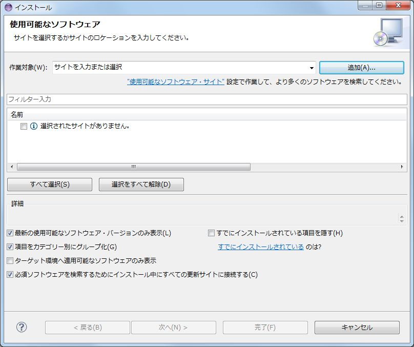
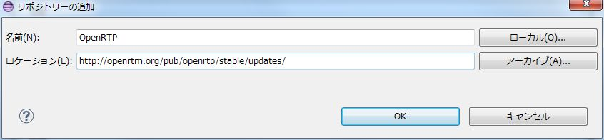
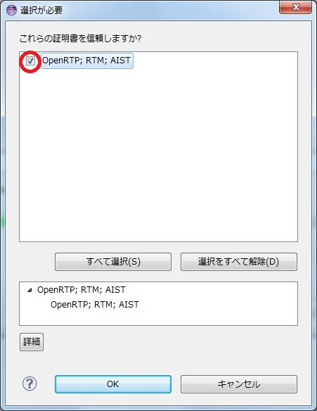

<!-- Title: 更新方法 -->
#contents
This section explains the procedure for updating OpenRTP (the collective name for RTCBuilder and RTSystemEditor). Since OpenRTP is provided as an Eclipse plugin, the operation is performed on Eclipse.

### Updating OpenRTP
From the Eclipse menu, select [Help] > [Install New Software].

<div align="center"><a href="openrtp_01.jpg"></a></div>

Click the [Add] button in the "Install" dialog and add the repository. Specify the name and location as follows.
- **Name** : OpenRTP
- **Location** : http://openrtm.org/pub/openrtp/stable/updates/

<div align="center"><a href="openrtp_02.jpg"></a></div>

Check OpenRTP 1.1.0 and click the [Next] or [Finish] button.
<br>
During installation, a screen asking whether to trust the certificate will open. Check the checkbox and click the [OK] button.

<div align="center"><a href="openrtp_03.jpg"></a></div>

After installation, restart as instructed, and the update will be applied.

### How to Apply the Update to Existing Components

For projects of components that have already been generated, handle them using the following procedure, for example.

- Load them into eclipse again and regenerate the code (delete the project once on eclipse, then import it again)
- In the eclipse Package Explorer screen, double-click RTC.xml in the project and click the [Generate Code] button
- At this time, a diff screen will be displayed, so update only idl/CMakeLists.txt

On Linux or Mac, simply replace it with sed.

```
 $ sed -ie 's/\"\${ALL_IDL_SRCS}\"/ALL_IDL_SRCS/' idl/CMakeLists.txt
```

