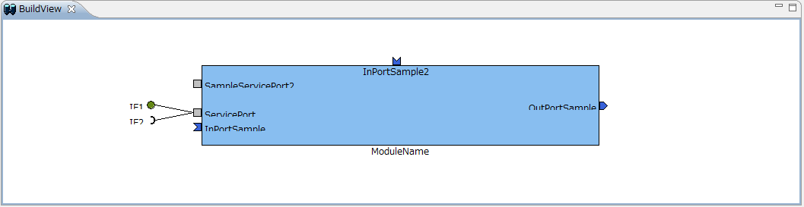
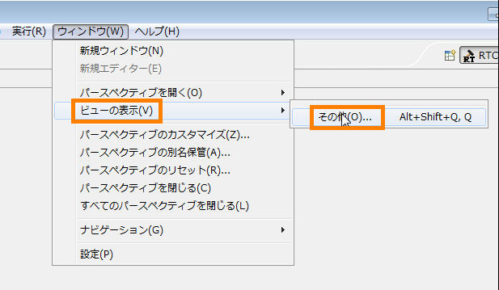
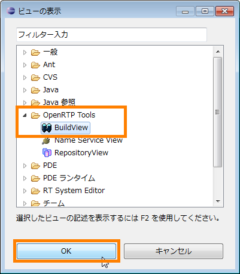

-------jp page!!-------

<!-- Title: 画面構成と機能（ビルドビュー 編） -->
#contents
<!-- ***ビルドビュー  -->
ビルドビューは作成中の RTコンポーネントの設定内容をグラフィカルに表示するためのビューです。
ビルドビューの表示例を以下に示します。
 

<strong>ビルドビュー</strong>

 

ビルドビュー内には、設定した RTコンポーネントの名称、データポート (InPort/OutPort) の数・名称、サービスポートの数・名称、サービスインターフェースの数・名称が表示されます。
また各ポートは、各設定画面で設定した表示位置に表示されます。
 

### ビルドビューの表示 
｢RTCBuilder｣ パースペクティブ切り替え時にビルドビューが表示されていない場合、以下の手順にて表示することができます。
画面上部のメニューから [ウィンドウ] > [ビューの表示] > [その他] を選択。表示された ｢ビューの表示｣ 画面にて、[OpenRTP Tools] > [BuildView] を選択。
 

<table class="table-alt">
  <tr style="text-align: center;">
    <td></td>
    <td></td>
  </tr>
  <tr>
    <th colspan="2" style="text-align: center;">ビルドビューの表示</th>
  </tr>
</table>
 

-------jp page!!-------
