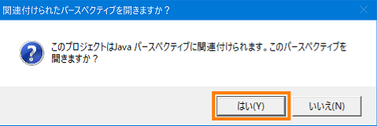
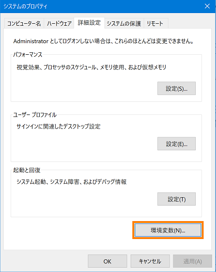
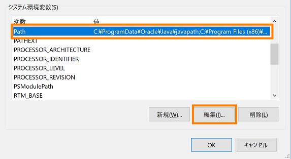
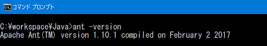

<!-- Title: コンパイル方法 (Windows、Java 編 ) -->
#contents
Java でのビルド方法を説明します。
## 準備
事前に Java Development Kit 6 をインストールする必要があります。(注意：Java1.5(5.0)では動作しません。) 

## RTC Builder からのビルド手順
1. RTCプロファイルエディタ画面で、[言語・環境] タブを開き、 [Java] を選択します。<br><br>
<div align="center"><a href="Python-lang_01.png"></a></div>
<br><br>
1. [基本タブ] を開き、[コードの生成] ボタンをクリックしてコードを生成します。<br><br>
<div align="center"><a href="Python-lang_02.png"></a></div>
<br><br>
1. コード生成対象言語の開発環境用プラグインがインストールされている場合、以下の確認メッセージが表示されるので [はい] をクリックします。その後、表示されたダイアログで [Java(デフォルト)] を選択し [OK] ボタンをクリックします。<br>
Java 言語の場合は、JDT(Java Development Tools) があらかじめ Eclipse に含まれています。<br><br>
<div align="center"><a href="Python-lang_03.png"></a></div>
<br>
<div align="center"><a href="Python-lang_04.png"></a></div>
<br><br>
1. パッケージエクスプローラー内に、プロジェクトの情報が表示されますが、一部表示されていないため、メニューから [ファイル] > [更新] を選択するか、パッケージエクスプローラー内で [F5] キーをクリックして情報を更新します。<br><br>
1. [build_モジュール名.xml] のファイルを右クリックし、[実行] > [1 Ant ビルド] を選択します。<br><br>
<div align="center"><a href="Python-lang_05.png"></a></div>
<br><br>
1. ビルドが実行され、コンソール画面にビルド結果が表示されます。<br><br>
<div align="center"><a href="Python-lang_06.png"></a></div>
<br><br>

- もしコンソール画面にエラーが表示された場合は、JDK が正常にインストールされているか確認します。メニューから [ウィンドウ] > [設定] > [インストール済の JRE] を選択します。
インストール済みの JDK が選択されているかを確認します。もし表示されていなければ、[追加] または [検索] ボタンからインストールした JDK を追加します。 <br><br>
<div align="center"><a href="Python-lang_07.png"></a></div>
<br><br>
**参照**
- [新規 Java プロジェクトが JDK6(1.6)準拠として作成できない](https://openrtm.org/openrtm/ja/node/6426#errorjavaJDK)
- [任意のフォルダーにクラスパスを設定して Ant ビルドを行う方法は？](https://openrtm.org/openrtm/ja/node/6426#Antbuild)
- [Java で Ant を使ってコマンドラインからビルドするときに例外が表示される](https://openrtm.org/openrtm/ja/node/6426#Antbuilderror)

## コマンドプロンプトからのビルド手順
1. Apache Ant を以下のサイトからダウンロードします。Apache Ant とはビルドを実行するためのソフトウェアです。Eclipse には Ant プラグインが標準で内蔵されていますが、コマンドプロンプトからビルドを実行するためにはダウンロードする必要があります。<br><br>
[ダウンロード：the Apache Ant Website](http://ant.apache.org/bindownload.cgi)<br><br>
1. Zipファイルを解凍して、フォルダー名を任意に変更します。(例：apache-ant-x.xx.x → ant )<br><br>
1. 任意のフォルダーに移動します。(例：C:\Program Files\ant )<br><br>
1. 環境変数を設定します。(画面は Windows10 のものです)<br>
  1. システムのプロパティ画面を開き、[環境変数] ボタンをクリックします。<br><br>
<div align="center"><a href="system-property_01.png"></a></div>
<br><br>
  1. 「システム環境変数」で [新規] ボタンをクリックします。<br><br>
<div align="center"><a href="system-property_02.png"></a></div>
<br><br>
  1. 変数名に「ANT_HOME」、変数値に「C:\Program Files\ant」を入力し [OK] ボタンをクリックします。 ※変数値は ant フォルダーのパスを指定します。<br><br>
<div align="center"><a href="system-property_03.png"></a></div>
<br><br>
  1. 「システム環境変数」一覧から、変数名「Path」を選択し、[編集] ボタンをクリックします。<br><br>
<div align="center"><a href="system-property_04.png"></a></div>
<br><br>
  1. [新規] ボタンをクリックして、「%ANT_HOME%\bin」と入力し [OK] ボタンをクリックします。<br><br>
<div align="center"><a href="system-property_05.png"></a></div>
<br><br>
  1. JAVA_HOME を設定します。すでに設定されている場合は不要です。<br>
「システム環境変数」で [新規] ボタンをクリックします。<br><br>
<div align="center"><a href="system-property_02.png"></a></div>
<br><br>
  1. 変数名に「JAVA_HOME」、変数値に「C:\Program Files\Java\jdkx.x.x.x_xxx」を入力し [OK] ボタンをクリックします。<br>
※変数値は Java のインストール先フォルダーのパスを指定します。<br><br>
<div align="center"><a href="system-property_06.png"></a></div>
<br><br>
  1. システムのプロパティ画面に戻り、[OK] ボタンをクリックして画面を閉じます。<br><br>
1. PC を再起動します。<br><br>
1. 再起動後、コマンドプロンプトを起動し、「ant -version」と入力して Apache Ant のバージョンを確認してください。<br><br>
<div align="center"><a href="system-property_07.png"></a></div>
<br><br>
1. 同様に「java -version」と入力し、Java のバージョンを確認してください。<br><br>
<div align="center"><a href="system-property_08.png"></a></div>
<br><br>
1. コマンドプロンプトからビルドします。<br>
指定した RTCプロジェクトのフォルダーで、以下のコマンドを入力するとビルドが開始されます。
```
 ant -f  build_*****.xml  (***** はモジュール名)
```
ビルドに成功すると、以下の表示となります。<br><br>
<div align="center"><a href="system-property_09.png"></a></div>
<br><br>
