<!-- Title: CPack を使ったパッケージ作成（Windows/Linux での共通設定） -->
#contents(4)

## はじめに

CMake には CPack によるインストーラーパッケージを作成する機能があります。
OpenRTP 1.2.0版 以降を使って生成した RTコンポーネントは、RTCBuilder で生成された CMake の設定を変更することなく、インストーラーパッケージを作成することができます。
Windows 環境なら msi 形式のインストーラーを、Linux の Ubuntu、または Debian 環境なら deb パッケージを、Fedora 環境なら rpm パッケージを作成することができます。

（注）ただし、OpenRTP 1.2.0版 でこのパッケージを作成することができるのは C++ または Python の RTC のみで、Java の RTC では対応しておりません。

OpenRTP 1.2.0版 のインストールは、OpenRTM-aist 1.2.0版 のダウンロードページで紹介しています。

## 事前準備

インストーラー、パッケージ作成に必要なソフトウエアをインストールします。

### Windows 環境

OpenRTM-aist のインストール時に表示しているソフトウエア以外に、下記のソフトウエアをインストールする必要があります。

<table class="table-alt">
  <tr>
    <td><a href="http://wixtoolset.org/releases/">WiX Toolset</a></td>
    <td>msi インストーラーを作成するために必要です。</td>
  </tr>
  <tr>
    <td><a href="http://www.graphviz.org/Download_windows.php">Graphviz</a></td>
    <td>ドキュメントにフローチャート、系統図などを含めることができます。</td>
  </tr>
</table>

#### WiX Toolset のインストール
1. インストーラーを起動し、[install] ボタンをクリックしてインストールを開始します。
<br><br>
<div align="center"><a href="WiX_Toolset_1-1.png">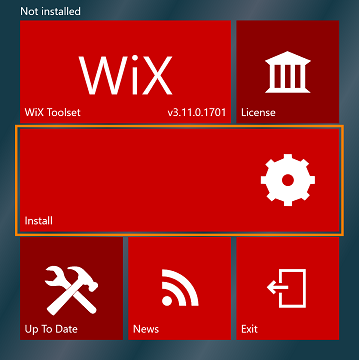</a></div>
<br>
1. [install] ボタンに「Complete」と表示されるとインストール完了です。[Exit] ボタンをクリックします。
<br><br>
<div align="center"><a href="WiX_Toolset_2-1.png">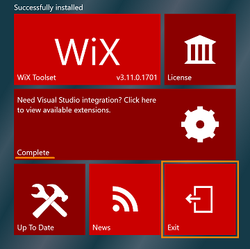</a></div>

#### Graphviz のインストール
1. インストーラーを起動し、[Next] ボタンをクリックします。<br><br>
<div align="center"><a href="Graphviz_1-1.png">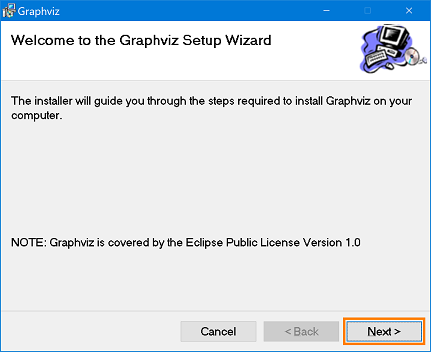</a></div>


1. インストールフォルダーを任意に変更して、[Next] ボタンをクリックします。<br><br>
<div align="center"><a href="Graphviz_2-1.png">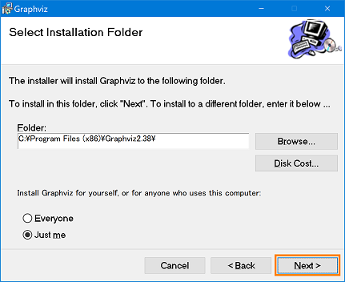</a></div>
1. [Next] ボタンをクリックし、インストールを開始します。<br><br>
<div align="center"><a href="Graphviz_3-1.png">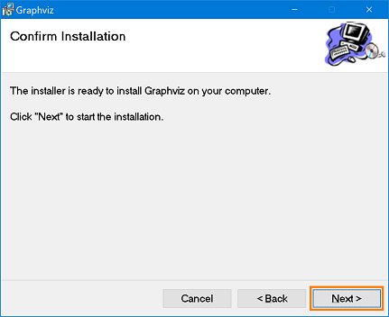</a></div>
<div align="center"><a href="Graphviz_4-1.png">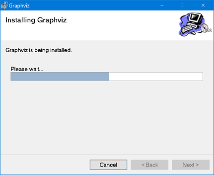</a></div>
1. インストール完了後、[Close] ボタンをクリックします。<br><br>
<div align="center"><a href="Graphviz_5-1.png">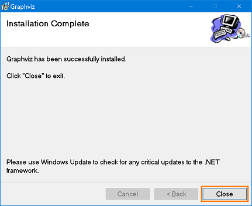</a></div>
1. msi からインストールするとパスを通してくれないため、手動で環境変数にパスを追加する必要があります。コマンドプロンプトを右クリックし、[管理者として実行] を選択します。<br><br>
1. コマンドプロンプトに以下のコマンドを入力して実行します。<br><br>＞setx /M PATH "%PATH%;[インストールフォルダーのパス]" <br><br>
<div align="center"><a href="Graphviz_6-1.png">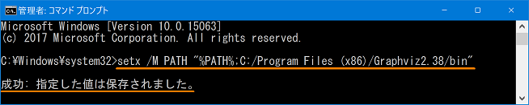</a></div>
成功すると「成功：指定した値は保存されました」と表示されます。<br><br>
1. 一度、コマンドプロンプトを閉じて、再度、開き直します。 <br><br>
1. Graphviz の各コマンドが使用できるか確認するため、以下のコマンドを入力します。 <br><br>＞dot -V
<div align="center"><a href="Graphviz_7-1.png">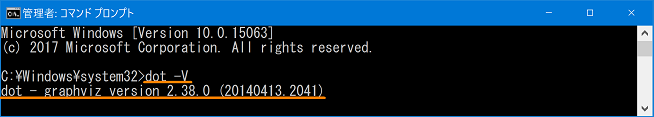</a></div>
バージョンが表示されれば完了となります。<br><br>

### Linux 環境

OpenRTM-aist を インストールする際に使ったスクリプトで必要なパッケージをインストールできます。

<table class="table-alt">
  <tr>
    <th><a href="http://svn.openrtm.org/OpenRTM-aist/trunk/OpenRTM-aist/build/pkg_install_ubuntu.sh">pkg_install_ubuntu.sh</a><br><a href="http://svn.openrtm.org/OpenRTM-aist/trunk/OpenRTM-aist/build/pkg_install_debian.sh">pkg_install_debian.sh</a><br><a href="http://svn.openrtm.org/OpenRTM-aist/trunk/OpenRTM-aist/build/pkg_install_fedora.sh">pkg_install_fedora.sh</a><br><a href="http://svn.openrtm.org/OpenRTM-aist/trunk/OpenRTM-aist/build/pkg_install_raspbian.sh">pkg_install_raspbian.sh</a></th>
    <th><br>$ sudo sh pkg_install_***.sh -l c++ -l python -c --yes</th>
  </tr>
</table>

#### 一括インストール
Ubuntu、Debian、Fedora、Raspbian の [一括インストール手順はこちら](/ja/content/about_installscript) をご覧ください。

## Windows/Linux での共通設定

### インストーラーパッケージ名

Windows の場合、「RTCプロジェクト名＋RTCのバージョン番号_OpenRTM-aist のバージョン番号_アーキテクチャ」で構成されます。
バージョン番号はドットを省いた形式で、[1.0.0] は [100] となります。<br>
Linux の場合、「RTCプロジェクト名_RTCのバージョン番号_アーキテクチャ」で構成されます。

例）以下の設定でパッケージを作成した場合のパッケージ名
- プロジェクト名：RobotController
- バージョン番号：1.0.0
- OpenRTM-aist のバージョン：1.2.0

- Windows の場合
  - 32bit：RobotController100_rtm120_win32.msi
  - 64bit：RobotController100_rtm120_win64.msi

- Ubuntu、Debian の場合
  - 32bit：robotcontroller_1.0.0_i386.deb
  - 64bit：robotcontroller_1.0.0_amd64.deb

- Fedora の場合
  - 32bit：RobotController-1.0.0-i686.rpm
  - 64bit：RobotController-1.0.0-x86_64.rpm

「RTCのバージョン番号」は、RTCBuilder の「基本」タブで指定した値になります。

<div align="center"><a href="version.png"></a></div>
<div align="center"><strong>RTC のバージョン番号</strong></div>

### インストール先ディレクトリーの指定

作成したインストーラーパッケージを実行してインストールされる場所は、デフォルトで OpenRTM-aist のインストール先となります。
Windows 環境のみ、OpenRTM-aist をインストールする時のGUI画面で、任意にインストール先に変更することができます。

デフォルトのインストール先パスは、下記の条件で決まります。
- インストーラーパッケージを作成した環境にインストールされている OpenRTM-aist のパス
- RTC の言語
- RTC 生成時、基本タブで指定したモジュールカテゴリ（デフォルトは Category）

モジュールカテゴリは任意の文字列入力が可能です。

<div align="center"><a href="category.png">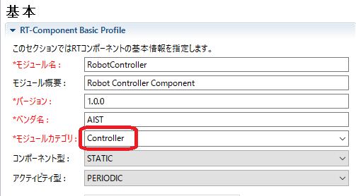</a></div>
<div align="center"><strong>モジュールカテゴリー名を「Controller」に</strong></div>

このRTCが「C++」の場合、Windows で OpenRTM-aist 1.2.0 の 32bit 版がインストールされている環境でインストーラーを作成すると、デフォルトのインストール先は以下となります。

```
 C:\Program Files (x86)\OpenRTM-aist\1.2.0\Components\C++\Category\RobotController
```

Linux 環境でパッケージを作成すると、インストール先は以下となります。この例はモジュールカテゴリを「Controller」とした場合です。

```
 /usr/share/openrtm-1.2/components/c++/Controller/RobotController
```


### パッケージメンテナー情報

パッケージのメンテナー情報は、RTCBuilderの「ドキュメント生成」タブの「作成者・連絡先」で入力された内容が反映されます。
書式は`name <mail address`で入力する必要があります。名前はローマ字表記、メールアドレスは ＜ ＞ で括る必要があります。
空欄の場合は「unknown」となります。(デフォルトは空欄です)
<br>

<div align="center"><a href="Maintener_1-1.png">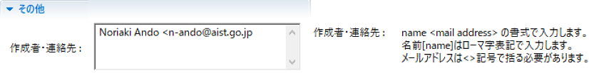</a></div>
