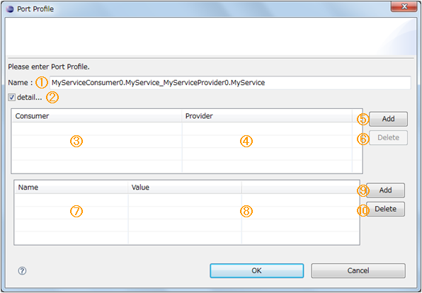

<!-- Title: システムエディタ（ポート間の接続 編） -->
#contents

データポート間、サービスポート間の接続について説明します。

### データポート間接続
データポートの接続で、「InPort」と「OutPort」を接続します。これらの間をドラッグ＆ドロップでつなぐと以下のダイアログが表示されます。なお、初期表示時には「Buffer」の設定項目は隠れています。
 

<strong>データポートのコネクタプロファイルダイアログ</strong>

 

ダイアログの項目と条件は以下のとおりです。
 

<strong>データポート接続のダイアログ項目と必要条件</strong>

<table class="table-alt">
  <tr>
    <th>№</th>
    <th>ダイアログ項目名</th>
    <th>ConnectorProfile</th>
    <th>必要条件</th>
  </tr>
  <tr>
    <td>①</td>
    <td>Name</td>
    <td>name</td>
    <td>特になし</td>
  </tr>
  <tr>
    <td>②</td>
    <td>Data Type</td>
    <td>&lt;&lt;properties&gt;&gt; dataport.data_type</td>
    <td>このコネクタで接続されているデータポート間で送受信するデータ型を指定します。 それぞれのポートで互いに送受信可能なデータ型から選択します。ただし、Any を含む場合は相手ポートのどのような値も許容します。</td>
  </tr>
  <tr>
    <td>③</td>
    <td>Instance Type</td>
    <td>&lt;&lt;properties&gt;&gt; dataport.interface_type</td>
    <td>RTシステム設計者が想定する、もしくは RTC が動作する RTミドルウェア上でサポートされているインターフェース種別を指定します。 それぞれのポートで互いにサポートしているインターフェース種別から選択します。ただし、Any を含む場合は相手ポートのどのようなインターフェースも許容します。</td>
  </tr>
  <tr>
    <td>④</td>
    <td>Dataflow Type</td>
    <td>&lt;&lt;properties&gt;&gt; dataport.dataflow_type</td>
    <td>RTシステム設計者が想定する、もしくは RTC が動作する RTミドルウェア上でサポートされているデータフロー型を指定します。 それぞれのポートで互いにサポートしているデータフロー型から選択します。ただし、Any を含む場合は相手ポートのどのようなデータフローも許容します。</td>
  </tr>
  <tr>
    <td>⑤</td>
    <td>Subscription Type</td>
    <td>&lt;&lt;properties&gt;&gt; dataport.subscription_type</td>
    <td>[Dataflow Typeの値がPushの時に必要な条件] RTシステム設計者が想定する、もしくはRTCが動作するRTミドルウェア上でサポートされているサブスクリプション種別を指定します。 それぞれのポートで互いにサポートしているサブスクリプション種別から選択します。ただし、Anyを含む場合は相手のどのようなサブスクリプション種別も許容します。</td>
  </tr>
  <tr>
    <td>⑥</td>
    <td>Push Rate(Hz)</td>
    <td>&lt;&lt;properties&gt;&gt; dataport.push_interval</td>
    <td>[Dataflow Typeの値が”Push”でかつSubscription Typeが”Periodic”の時に必要な条件] サブスクリプション種別が「Periodic」な場合にデータの送信周期を指定します。送信周期は正数値（小数可）で指定します。</td>
  </tr>
  <tr>
    <td>⑦</td>
    <td>Push Policy</td>
    <td>&lt;&lt;properties&gt;&gt; dataport.publisher.push_policy</td>
    <td>データ送信ポリシー。[Dataflow Typeの値が”Push”でかつSubscription Typeが”Periodic”の時に必要な条件]all、fifo、skip、new から選択します。 **all**:バッファ内のデータを一括送信 **fifo**:バッファ内のデータをFIFOで１個ずつ送信 **skip**:バッファ内のデータを間引いて送信 **new**:バッファ内のデータの最新値を送信（古い値は捨てられます。）</td>
  </tr>
  <tr>
    <td>⑧</td>
    <td>Skip Count</td>
    <td>&lt;&lt;properties&gt;&gt; dataport.publisher.skip_count</td>
    <td>送信データスキップ数。[Push Policy の値が”skip”の時に必要な条件]バッファ内のデータがこの設定値で間引されて送信されます。</td>
  </tr>
  <tr>
    <td>⑨</td>
    <td>詳細</td>
    <td>―</td>
    <td>チェックボックスをチェックすると、入出力ポートのバッファの詳細設定項目が表示されます。 ダイアログの初期表示時は隠れています。</td>
  </tr>
  <tr>
    <td>⑩ ⑮</td>
    <td>Buffer length (OutPort/InPort)</td>
    <td>&lt;&lt;properties&gt;&gt; buffer.length</td>
    <td>バッファの長さ</td>
  </tr>
  <tr>
    <td>⑪ ⑯</td>
    <td>Buffer full policy (OutPort/InPort)</td>
    <td>&lt;&lt;properties&gt;&gt; buffer.write.full_policy</td>
    <td>バッファへのデータ書き込み時に、バッファフルだった場合の挙動。overwrite、do_nothing、block から選択します。 **overwrite**:データを上書きします。 **do_nothing**:何もしません。 **block**:ブロックします。 block を指定した場合、次の timeout 値を指定すれば、指定時間後書き込み不可能であればタイムアウトします。 デフォルトは  overwrite (上書き)です。</td>
  </tr>
  <tr>
    <td>⑫ ⑰</td>
    <td>Buffer write timeout (OutPort/InPort)</td>
    <td>&lt;&lt;properties&gt;&gt; buffer.write.timeout</td>
    <td>バッファへのデータ書き込み時に、タイムアウトアウトイベントを発生させるまでの時間（単位:秒） デフォルトは 1.0 [sec]です。0.0を設定した場合はタイムアウトしません。</td>
  </tr>
  <tr>
    <td>⑬ ⑱</td>
    <td>Buffer empty policy (OutPort/InPort)</td>
    <td>&lt;&lt;properties&gt;&gt; buffer.read.empty_policy</td>
    <td>バッファからのデータ読み出し時に、バッファが空だった場合の挙動。readblock、do_nothing、block から選択します。 **readblock**:最後の要素を再読み出します。 **do_nothing**:何もしません。 **block**:ブロックします。 block を指定した場合、次の timeout 値を指定すれば、指定時間後読み出し不可能であればタイムアウトします。 デフォルトは readbackです。</td>
  </tr>
  <tr>
    <td>⑭ ⑲</td>
    <td>Buffer read timeout (OutPort/InPort)</td>
    <td>&lt;&lt;properties&gt;&gt; buffer.read.timeout</td>
    <td>バッファからのデータ読み出し時に、タイムアウトイベントを発生させるための時間（単位:秒） デフォルトは 1.0 [sec]です。0.0 を設定した場合はタイムアウトしません。</td>
  </tr>
  <tr>
    <td>⑳ ㉑</td>
    <td>Name/Value</td>
    <td>&lt;&lt;properties&gt;&gt; Name</td>
    <td>任意のプロパティを設定 [追加] ボタンで項目の追加、[削除] ボタンで項目の削除が可能です。 入力された項目は NVList の形式で ConnectorProfileのProperties に設定されます。 同一 Key の Property は設定する事はできません。</td>
  </tr>
</table>

②～⑤までの項目について、RT System Editor は指定可能な値を、それぞれのポートの値リストから文字列のマッチングを行って作成します。
双方のポートに対して ANY しか指定されていないような場合には、入力可能な値を判断することができません。
このため、双方のポートに ANY が含まれている場合に、RT System Editor は任意の文字列を入力できるようにしています。任意の文字列が入力可能な項目には、「任意入力可」と表示されます。
 

<strong>任意入力可のときの表示</strong>

 

### サービスポート間接続
サービスポート間の接続では、「ServicePort」と「ServicePort」を接続します。これらの間をドラッグ＆ドロップでつなぐと以下のダイアログが表示されます。
 

<strong>サービスポートのコネクタプロファイルダイアログ</strong>

 

ダイアログの項目と条件は以下のとおりです。
 

<strong>サービスポート接続のダイアログ項目と必要条件</strong>

<table class="table-alt">
  <tr>
    <td>№</td>
    <td>ダイアログ項目名</td>
    <td>ConnectorProfile</td>
    <td>必要条件</td>
  </tr>
  <tr>
    <td>①</td>
    <td>Name</td>
    <td>Name</td>
    <td>特になし</td>
  </tr>
  <tr>
    <td>②</td>
    <td>詳細</td>
    <td>―</td>
    <td>チェックボックスをチェックすると、Consumer/Provider の詳細設定項目が表示されます。 ダイアログの初期表示時は隠れています。</td>
  </tr>
  <tr>
    <td>③</td>
    <td>Consumer</td>
    <td>―</td>
    <td>接続するサービスポートに設定されたインターフェースの Consumer のリストから選択します。 ComboBox の選択リストには<コンポーネント名>:<インターフェース名>:<インスタンス名>の形式で表示されます。 追加された Consumer/Provider のペアは、ConsumerのIDをプロパティのキー、Provider の ID をプロパティの値として、ConnectorProfile に格納されます。 なお、Consumer/Provider の ID は以下の形式で表現します。 &lt;rtc_name&gt;.port.&lt;port_name&gt;.&lt;if_polality&gt;.&lt;if_tname&gt;.&lt;if_iname&gt; - rtc_nameはコンポーネント名 - port_name はポート名 - if_polalityは Consumer は「required」、Provider は「provided」 - if_tnameはインターフェースのタイプ名 - if_inameはインターフェースのインスタンス名</td>
  </tr>
  <tr>
    <td>④</td>
    <td>Provider</td>
    <td>&lt;&lt;properties&gt;&gt; Consumer の ID をキーとして設定</td>
    <td>Consumerと同様、接続するサービスポートに設定されたインターフェースの Provider のリストから選択します。</td>
  </tr>
  <tr>
    <td>⑤</td>
    <td>Add</td>
    <td>―</td>
    <td>Consumer/Provider の新規エントリを追加します。</td>
  </tr>
  <tr>
    <td>⑥</td>
    <td>Delete</td>
    <td>―</td>
    <td>選択中の Consumer/Provider のエントリを削除します。</td>
  </tr>
  <tr>
    <td>⑦ ⑧</td>
    <td>Name/Value</td>
    <td>&lt;&lt;properties&gt;&gt; Name</td>
    <td>任意のプロパティを設定 [追加] ボタンで項目の追加、[削除] ボタンで項目の削除が可能です。 入力された項目は NVList の形式で ConnectorProfile の Properties に設定されます。 同一 Key の Property は設定する事はできません。</td>
  </tr>
</table>

サービスポートの場合、必須となる接続の条件はありません。しかし、 ServicePort 間での PortInterfaceProfile が完全にマッチング（※１）しない場合、接続ダイアログにて警告を表示します。
 

<strong>サービスポートの接続ダイアログの警告表示</strong>

 

**※１**
ここでいう完全なマッチングとは、PortInterfaceProfile の「type」が同じで、「polarity」がお互いに PROVIDED と REQUIred になっていること。
また余りなく（PortInterfaceProfile はそれぞれのポートに複数存在する）すべての PortInterfaceProfile がマッチングすることを指しています。
 

