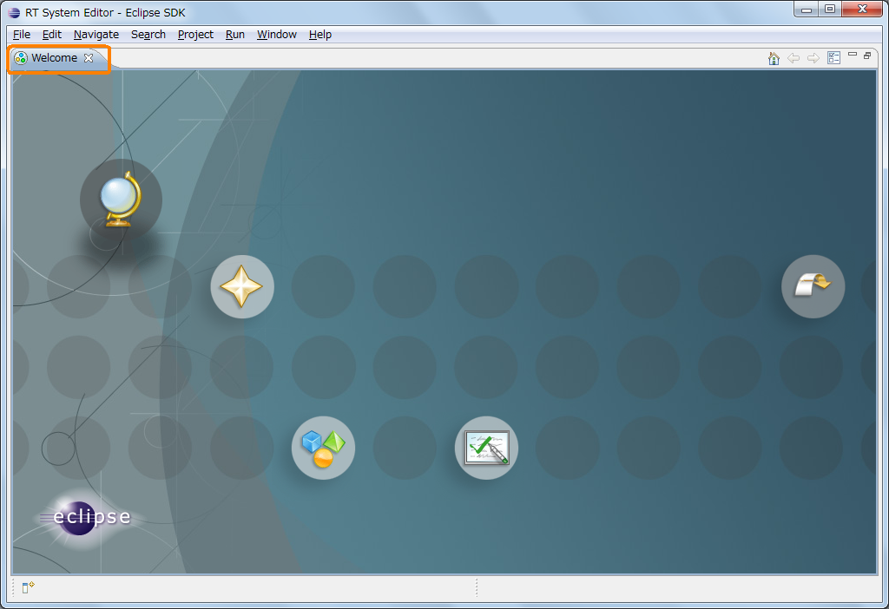
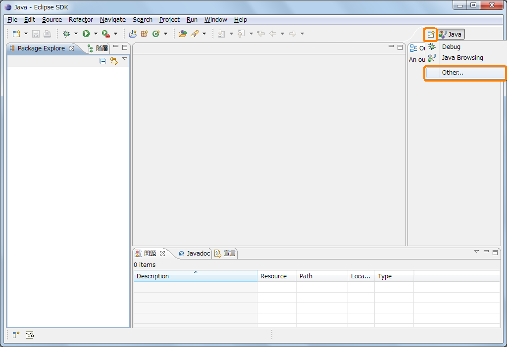
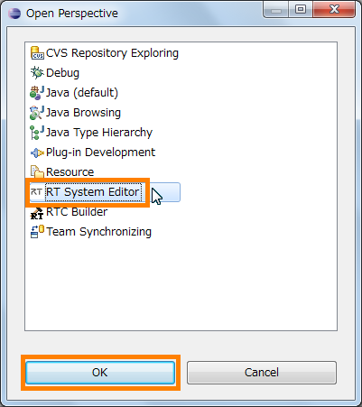

<!-- Title: インストールおよび起動 -->
#contents

<!-- ** RT System Editor のインストールおよび起動 -->
ここでは、RTSystemEditor のインストールおよび起動について説明します。

### RTSystemEditor のインストール
RTSystemEditor は Eclipse プラグインであるため、 Eclipse 本体および依存している他の Eclipse プラグインをまずインストールする必要があります。
インストールに関しては、[OpenRTM Eclipse tools のインストール](/node/676) を参照願います。

### RTSystemEditor の起動
インストール後、 Eclipse を初めて起動すると、以下のようなページが表示されます。 
画面左上の「x」をクリックし、「ようこそ」画面を閉じます。
 

<strong>Eclipse の初期起動時の画面</strong>

 
以下の画面で、右上の [Open Perspective] ボタンをクリックし、プルダウンの「Other…」を選択します。

<strong>パースペクティブの切り替え</strong>

 
[RT System Editor] を選択し、[OK] ボタンをクリックします。 

<strong>パースペクティブの選択</strong>

 
RT System Editor が起動します。

<strong>RT System Editor の初期起動時画面</strong>

 

