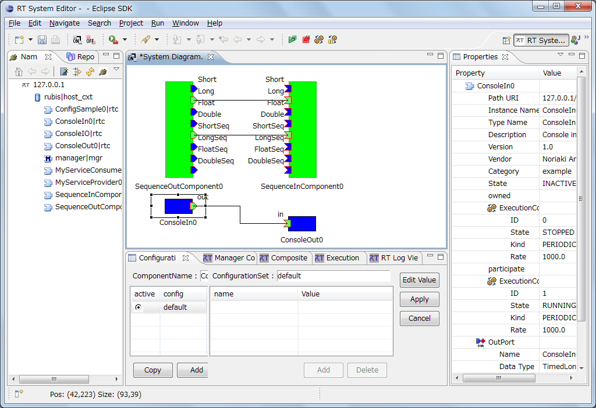

-------jp page!!-------

<!-- Title: 概要・システム構築の流れ -->
#contents

<!-- **概要 -->
### OpenRTM-aist RT System Editor 概要
現在[ OMG ](http://www.omg.org)にて、ロボット開発の効率を高める Robot Technology Component（以下RTC）の仕様策定が行われています。この RTC 仕様を実装および適用した共通プラットフォームとして、独立行政法人産業技術総合研究所・知能システム研究部門・統合知能研究グループでは[ OpenRTM-aist ](/en/node/850)を提供しています。 
RTSystemEditor は、この OpenRTM-aist に含まれる開発ツールの１つであり、RTC をリアルタイムにグラフィカル操作する機能を持っています。また、その名前のとおり Eclipse 統合開発環境のプラグインとして作成されており、Eclipse 上にて既存のプラグインとシームレスに操作を行うことができます。

&aname(target);
### 対象
本ドキュメントは、RTC についての基本知識を既に持っている方を対象としています。RTC の内容については、[OMG](http://www.omg.org) のドキュメントや [こちら](/node/835)を参照してください。

&aname(screen);
### 画面例
ここでは、OpenRTM-aist RT System Editor (以下 RTSystemEditor) の画面例を示します。

<strong>RTSystemEditor の画面例</strong>

 

&aname(kinou);
### 機能概要
RTSystemEditor は、 RTC をリアルタイムにグラフィカル操作する機能を持っています。提供される機能の一覧は以下のとおりです。
#clear

<strong>機能概要一覧</strong>

<table class="table-alt">
  <tr>
    <th>№</th>
    <th>機能名称</th>
    <th>機能概要</th>
  </tr>
  <tr>
    <td>１</td>
    <td>コンポーネントコンフィグレーション表示/編集機能</td>
    <td>選択したコンポーネントのコンフィギュレーションプロファイル情報をコンフィグレーションビューに表示し編集する。</td>
  </tr>
  <tr>
    <td>２</td>
    <td>コンポーネント動作変更機能</td>
    <td>選択したコンポーネントの動作を変更する。</td>
  </tr>
  <tr>
    <td>３</td>
    <td>RTシステム組み立て機能</td>
    <td>システムエディタ上でシステムの組み立てを行う。</td>
  </tr>
  <tr>
    <td>４</td>
    <td>システムセーブ/オープン機能</td>
    <td>システムエディタの内容をRTSプロファイルとしてセーブする。RTSプロファイルをシステムエディタでオープンする。システムのポート接続、コンフィグレーションを変更しない）</td>
  </tr>
  <tr>
    <td>５</td>
    <td>システム復元機能</td>
    <td>RTS プロファイルをシステムエディタでオープンし、プロファイルの内容を元にシステムを復元する。（プロファイルの内容でシステムのポート接続、コンフィグレーションを再構築する）</td>
  </tr>
</table>

&aname(kankyou);
### 動作環境
RTSystemEditor の動作に必要な環境は以下のとおりです。

<strong>動作環境</strong>

<table class="table-alt">
  <tr>
    <th>№</th>
    <th>環境</th>
    <th>備考</th>
  </tr>
  <tr>
    <td>１</td>
    <td><a href="http://java.sun.com/javase/ja/6/download.html">Java Development Kit 6</a></td>
    <td>注意：Java1.5(5.0)では動作しません。;</td>
  </tr>
  <tr>
    <td>２</td>
    <td><a href="http://www.eclipse.org/downloads/index.php">Eclipse 3.4以上</a></td>
    <td>Eclipse 本体</td>
  </tr>
  <tr>
    <td>３</td>
    <td><a href="http://www.eclipse.org/modeling/emf/downloads/">Eclipse EMF 2.4以上(SDO,XSD含む)</a></td>
    <td>RTSystemEditor が依存する Eclipse プラグイン  ※ご使用になられる Eclipse のバージョンに合ったものをご使用ください。</td>
  </tr>
  <tr>
    <td>４</td>
    <td><a href="http://www.eclipse.org/gef/downloads/">Eclipse GEF 3.4以上</a></td>
    <td>RTSystemEditor が依存する Eclipse プラグイン  ※ご使用になられる Eclipse のバージョンに合ったものをご使用ください。</td>
  </tr>
  <tr>
    <td>５</td>
    <td>RT Name Service View</td>
    <td>RTSystemEditorが依存するOpenRTM-aist に含まれる開発ツール</td>
  </tr>
  <tr>
    <td>６</td>
    <td>RT Repository View</td>
    <td>RTSystemEditorが依存するOpenRTM-aist に含まれる開発ツール</td>
  </tr>
</table>

### 制限
RTSystemEditor は、 OpenRTM-aist を対象に開発されたものです。その他の RTC プラットフォームに対する操作は想定しておりません。

-------jp page!!-------
