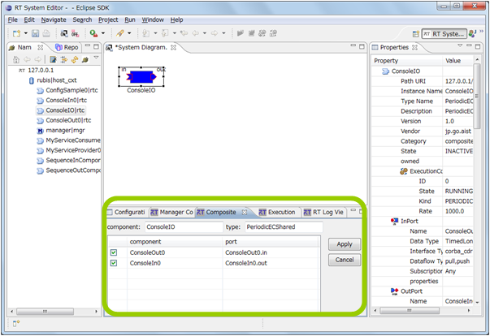
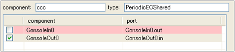
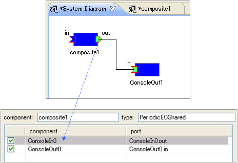

-------jp page!!-------

<!-- Title: ビュー（複合コンポーネントビュー編） -->
<!-- #contents -->

ここでは複合コンポーネントビューについて説明します。
 

<strong>複合コンポーネントビューの位置</strong>

 

複合コンポーネントビューでは、選択された複合 RTC のポート公開情報が表示され、ポートの公開/非公開を設定することができます。
 

<strong>複合コンポーネントビュー</strong>

 

<strong>複合コンポーネントビューの画面構成</strong>

<table class="table-alt">
  <tr>
    <th>No.</th>
    <th>説明</th>
  </tr>
  <tr>
    <td>①</td>
    <td>複合 RTC のインスタンス名。</td>
  </tr>
  <tr>
    <td>②</td>
    <td>複合 RTC のタイプ名。</td>
  </tr>
  <tr>
    <td>③</td>
    <td>ポートの公開/非公開の状態。</td>
  </tr>
  <tr>
    <td>④</td>
    <td>複合 RTC に含まれる子 RTC のインスタンス名。</td>
  </tr>
  <tr>
    <td>⑤</td>
    <td>複合 RTC に含まれる子 RTC のポート名。</td>
  </tr>
  <tr>
    <td>⑥</td>
    <td>ポートの公開/非公開の変更を反映させます。</td>
  </tr>
  <tr>
    <td>⑦</td>
    <td>ポートの公開/非公開の変更をキャンセルします。</td>
  </tr>
</table>

複合コンポーネントビューで編集中の情報は、⑥の [Apply] ボタンがクリックされるまで適用されません。また、修正中(未適用)の情報は薄い赤色で表示されます。また、システムエディタ上で選択したポートは薄い黄色で表示されます。
 

<strong>ポート公開/非公開の編集中</strong>

 

<strong>システムエディタ上で選択中のポート</strong>

 

複合コンポーネントのポートが、別のコンポーネントのポートと接続されている場合は、複合コンポーネントビューで該当のポートがグレイで表示され、編集不可となります。
 

<strong>他のポートと接続中の場合</strong>

 

-------jp page!!-------
