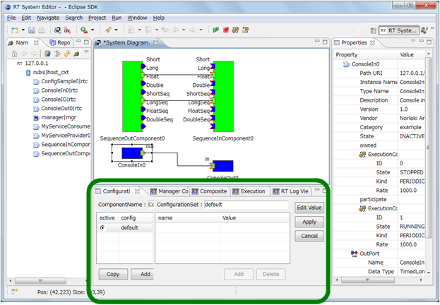
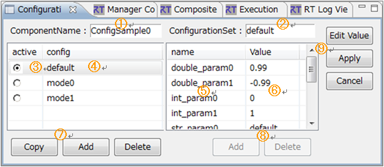
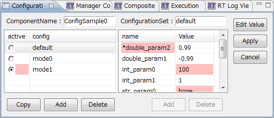
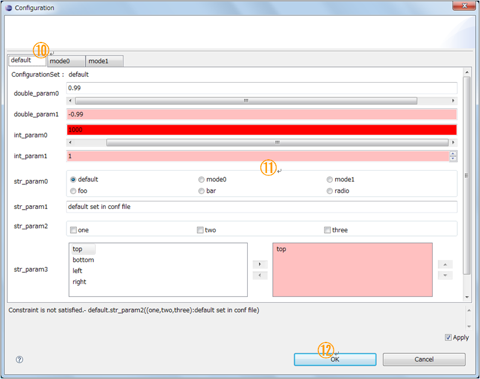
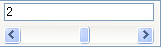
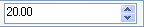
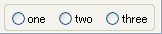
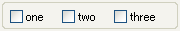
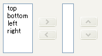

<!-- Title: ビュー（コンフィギュレーションビュー編） -->
<!-- #contents -->

ここでは、コンフィグレーションビューについて説明します。
 

<strong>コンフィグレーションビューの位置</strong>

 

コンフィグレーションビューでは、選択された RTC のコンフィグレーションを表示/編集することができます。左側に CofigurationSet のリストが表示され、右側に ConfigurationSet 内のプロパティが表示されます。
 

<strong>コンフィグレーションビュー</strong>

 

<strong>コンフィグレーションビューの画面構成</strong>

<table class="table-alt">
  <tr>
    <th>No.</th>
    <th>説明</th>
  </tr>
  <tr>
    <td>①</td>
    <td>選択されているコンポーネント名。</td>
  </tr>
  <tr>
    <td>②</td>
    <td>選択されている ConfigurationSet 名。</td>
  </tr>
  <tr>
    <td>③</td>
    <td>アクティブになっている ConfigurationSet。また、アクティブな ConfigurationSet を変更することができる。</td>
  </tr>
  <tr>
    <td>④</td>
    <td>ConfigurationSet のリスト。</td>
  </tr>
  <tr>
    <td>⑤</td>
    <td>左側で選択されている ConfigurationSet のプロパティの名前。</td>
  </tr>
  <tr>
    <td>⑥</td>
    <td>左側で選択されている ConfigurationSet のプロパティの値。</td>
  </tr>
  <tr>
    <td>⑦</td>
    <td>ConfigurationSet を追加/削除するボタン。</td>
  </tr>
  <tr>
    <td>⑧</td>
    <td>プロパティを追加/削除するボタン。</td>
  </tr>
  <tr>
    <td>⑨</td>
    <td>設定値の編集ダイアログを開くボタン、および変更内容を適用/キャンセルするボタン。</td>
  </tr>
</table>

コンフィグレーションビューで編集中の情報は、⑨の [Apply] ボタンがクリックされるまで適用されません。また、修正中(未適用)の情報は赤く表示されます。
 

<strong>修正中のコンフィグレーションビュー</strong>

 

コンフィグレーションの設定値を編集するには⑨の [Edit Value] ボタンをクリックし、編集用のダイアログを開いて編集を行います。
 

<strong>コンフィグレーション編集ダイアログ</strong>

 

複数の ConfigurationSet がある場合は、ダイアログ上部のタブ（⑩）で編集対象を切替えることができます。 
コンフィグレーションの各パラメーターには、編集用の widget を指定することができ、ConfigurationSet に widget 種別が定義されていれば、指定の widget でパラメーターを編集できます（⑪）。widget 種別にはスライダー、スピナ、ラジオボタン、チェックボックス、および順序付きリストがあり、widget 種別の指定がない場合はデフォルトでテキストボックスを使用します。 
また、各パラメーターには制約条件を指定することができ、widget 種別がスライダー、スピンの場合は制約条件の指定が必須となります。該当の widget 種別が定義されていて、制約条件が指定されていない場合はデフォルトのテキストボックスとなります。
 

<strong>widget種別一覧</strong>

<table class="table-alt">
  <tr>
    <td>widget種別</td>
    <td>イメージ</td>
    <td>説明</td>
  </tr>
  <tr>
    <td>スライダ</td>
<td></td>
<td>制約条件で指定された最小値、最大値の範囲をスライダーで選択します。テキストボックスへの入力も可能です。</td>
  </tr>
  <tr>
    <td>スピナ</td>
<td></td>
<td>制約条件で指定された最小値、最大値の範囲をスピナで選択します。小数の精度は制約条件の最小値、最大値の記述に準拠します。ただし、負数の指定はできません。 例) 最大値が「10.00」の場合は小数２桁</td>
  </tr>
  <tr>
    <td>ラジオボタン</td>
<td></td>
<td>ラジオボタンで値を選択します。</td>
  </tr>
  <tr>
    <td>チェックボックス</td>
<td></td>
<td>チェックボックスで値を選択します。複数の値を選択でき、カンマ区切りで設定されます。</td>
  </tr>
  <tr>
    <td>順序付きリスト</td>
<td></td>
<td>左の選択リストから値を選択します。複数の値を選択でき、順序を保持し、また、重複を許可します。選択した値はチェックボックス同様、カンマ区切りで設定されます。</td>
  </tr>
  <tr>
    <td>テキストボックス</td>
<td></td>
<td>通常のテキスト入力で設定します。</td>
  </tr>

各パラメーターに制約条件が指定されていると入力値に対して制約条件のチェックが行われ、条件を満たさない場合はフォームを赤で示します。また、[OK] ボタンで編集確定時に変更のあった ConfigurationSet の全パラメーターに対して制約条件チェックを行い、制約条件を満たさないパラメーターがあったときにはエラーダイアログを表示します。
 

<strong>制約条件チェックエラーの表示</strong>

 

コンフィグレーション編集ダイアログの [Apply] チェックボックス（⑫）をチェック中は、RTC に対してリアルタイムで設定値の変更が反映されます。 

コンフィグレーションビューに表示される情報は、RTC 選択時に最新の情報をキャッシュして表示しています（コンフィグレーションの編集に備えるため）。このため、いつまでも同じ RTC を選択し続けると、システムとの情報差が発生します。RT System Editor は編集の適用時に、この差を意識することなく編集中の情報を正として完全に上書きしますのでご注意ください。 
また、RTC の仕様上では、プロパティの Value にはあらゆるオブジェクトを登録可能ですが、RT System Editor から登録/編集できるのは文字列のみとなります。
 

