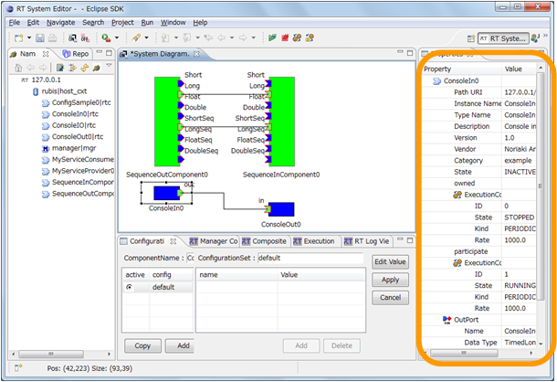
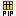

<!-- Title: ビュー（プロパティビュー編） -->
<!-- #contents -->

ここではプロパティビューについて説明します。
 

<strong>プロパティビューの位置</strong>

 

プロパティビューでは、 System Dialog で選択された RTC やコネクタのプロファイル情報をリアルタイムに表示します。（ RTC の選択中であっても変更が検出されれば即座に反映されます）
 

<table class="table-alt">
  <tr>
    <th>RTCの場合</th>
    <th>複合RTCの場合</th>
    <th>マネージャの場合</th>
  </tr>
  <tr>
<td></td>
<td></td>
<td></td>
  </tr>
</table>

<strong>プロパティビュー</strong>

 

表示されるアイコンの意味は以下のとおりです。
 

<strong>プロパティアイコンの一覧</strong>

<table class="table-alt">
  <tr>
    <th>No.</th>
    <th>アイコン</th>
    <th>名前</th>
    <th>表示内容</th>
  </tr>
  <tr>
    <td>1</td>
<td></td>
<td>RTC</td>
<td>InstanceName、TypeName、Description、Vender、Category、State(※1番目の ExecutionContext の LifeCycleState を基にして表示される)</td>
  </tr>
  <tr>
    <th>2</th>
<td>
<td>ExecutionContext</td>
<td>State、Kind、Rate</td>
  </tr>
  <tr>
    <th>3</th>
<td></td>
<td>ServicePort</td>
<td>Name、プロパティ情報のリスト</td>
  </tr>
  <tr>
    <th>4</th>
<td></td>
<td>Outport</td>
<td>Name、プロパティ情報のリスト</td>
  </tr>
  <tr>
    <th>5</th>
<td></td>
<td>Inport</td>
<td>Name、プロパティ情報のリスト</td>
  </tr>
  <tr>
    <th>6</th>
<td></td>
<td>PortInterfaceProfile</td>
<td>InterfaceName、TypeName、PortInterfacePolarity</td>
  </tr>
  <tr>
    <th>7</th>
<td></td>
<td>マネージャー</td>
<td>Components (生成したコンポーネント名のリスト) Loadable Modules (ロード可能なモジュール名のリスト) Loaded Modules (ロード済みのモジュール名のリスト)</td>
  </tr>
</table>

なお、RTC の仕様では、RTC  のLifeCycleState は ExecutionContext ごとに存在します。したがって、状態は複数存在しますが、RT System Editorでは1番目の ExecutionContext のみを使用して STATE を 表示します。
 

<!-- Title: ビュー（プロパティビュー編） -->
<!-- #contents -->

ここではプロパティビューについて説明します。
 

<strong>プロパティビューの位置</strong>

 

プロパティビューでは、 System Dialog で選択された RTC やコネクタのプロファイル情報をリアルタイムに表示します。（ RTC の選択中であっても変更が検出されれば即座に反映されます）
 

<table class="table-alt">
  <tr>
    <th>RTCの場合</th>
    <th>複合RTCの場合</th>
    <th>マネージャの場合</th>
  </tr>
  <tr>
<td></td>
<td></td>
<td></td>
  </tr>
</table>

<strong>プロパティビュー</strong>

 

表示されるアイコンの意味は以下のとおりです。
 

<strong>プロパティアイコンの一覧</strong>

<table class="table-alt">
  <tr>
    <th>No.</th>
    <th>アイコン</th>
    <th>名前</th>
    <th>表示内容</th>
  </tr>
  <tr>
    <td>1</td>
<td></td>
<td>RTC</td>
<td>InstanceName、TypeName、Description、Vender、Category、State(※1番目の ExecutionContext の LifeCycleState を基にして表示される)</td>
  </tr>
  <tr>
    <th>2</th>
<td></td>
<td>ExecutionContext</td>
<td>State、Kind、Rate</td>
  </tr>
  <tr>
    <th>3</th>
<td></td>
<td>ServicePort</td>
<td>Name、プロパティ情報のリスト</td>
  </tr>
  <tr>
    <th>4</th>
<td></td>
<td>Outport</td>
<td>Name、プロパティ情報のリスト</td>
  </tr>
  <tr>
    <th>5</th>
<td></td>
<td>Inport</td>
<td>Name、プロパティ情報のリスト</td>
  </tr>
  <tr>
    <th>6</th>
<td></td>
<td>PortInterfaceProfile</td>
<td>InterfaceName、TypeName、PortInterfacePolarity</td>
  </tr>
  <tr>
    <th>7</th>
<td></td>
<td>マネージャー</td>
<td>Components (生成したコンポーネント名のリスト) Loadable Modules (ロード可能なモジュール名のリスト) Loaded Modules (ロード済みのモジュール名のリスト)</td>
  </tr>

なお、RTC の仕様では、RTC  のLifeCycleState は ExecutionContext ごとに存在します。したがって、状態は複数存在しますが、RT System Editorでは1番目の ExecutionContext のみを使用して STATE を 表示します。
 

