<!-- Title: システムエディタ（基本操作編） -->
#contents

ここでは、システムエディタの概要と基本操作について説明します。

## 概要
システムエディタでは、RTC の状態がリアルタイムで表示されます。またポート間の接続や、RTC の状態を変更することでシステム構築、動作検証を行うことができます。
#clear

<table class="table-alt">
  <tr>
    <th>
<a href="SystemEditor_011.jpg">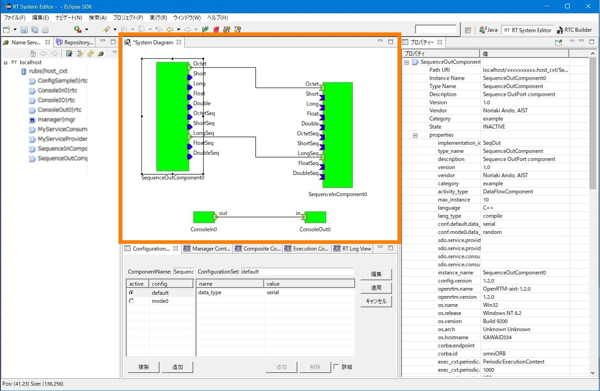</a>
</th>
    <th>
<a href="SystemEditor_012.jpg">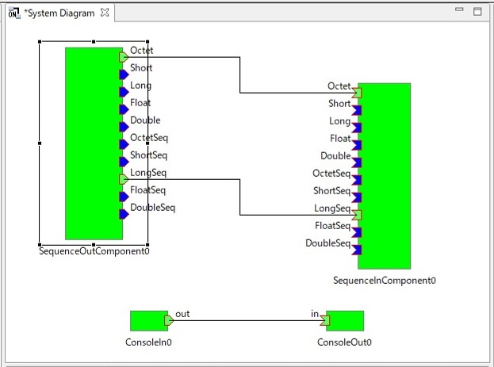</a>
</th>
  </tr>
  <tr>
    <th style="text-align: center;">システムエディタの位置</th>
    <th style="text-align: center;">システムエディタ</th>
  </tr>
</table>
 

## 基本操作
RTC のポート間の接続方法と RTC を実行する方法を説明します。

### システムエディタを開く
新しいシステムエディタを開くには、ツールバーの [Open New System Editor] ボタンをクリックするか、メニューバーの [File] > [Open New System Editor] を選択します。
 

<a href="SystemEditor_013.jpg">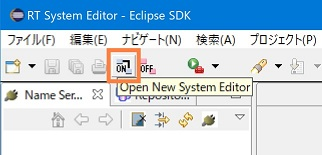</a>

<strong>ツールバーから Open New System Editor</strong>

 

<a href="SystemEditor_014.jpg">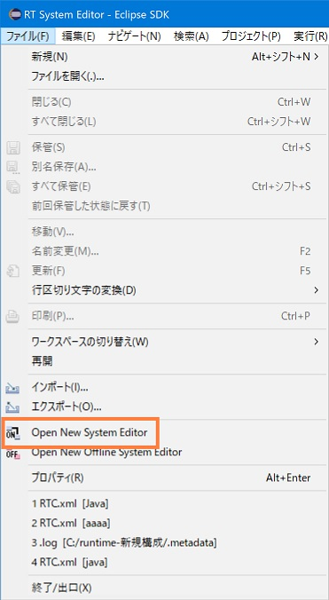</a>

<strong>Fileメニューから Open New System Editor</strong>

 

### RTC をシステムエディタに配置する
RTC をシステムエディタに配置するには、ネームサービスビューから RTC をドラッグ＆ドロップします。
 

<a href="fig40EditorComponentDnD.png">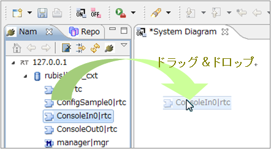</a>

<strong>RTC をシステムエディタに配置する</strong>

 

ネームサービス上で [Ctrl] キーを押しながらクリックし、複数RTC を選択すれば、まとめてシステムエディタ上へ配置することができます。
 

<a href="fig41EditorComponentMultiDnD.png">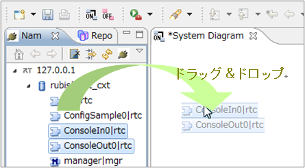</a>

<strong>複数の RTC をまとめてシステムエディタに配置する</strong>

 

なお、すでにシステムエディタ上に配置された RTC、もしくは複合RTC の親RTC、子RTCを重複して追加することはできません。
複数 RTC の配置では重複する RTC はスルーされ、単体RTC の配置ではエラーダイアログが表示されます。
 

<a href="fig42DeployComponentError.png">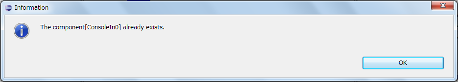</a>

<strong>RTC 配置の重複エラーダイアログ</strong>

 

### RTC の状態を変更する
ここでは、 RTC の状態を変更する方法を説明します。 
システムダイアグラムでは、RTCを選択し、「Activate」、「Deactivate」、「Reset」、「Finalize」、「Exit」、「Start」、「Stop」を実行することができます。
また、ネームサービスビューでも同様に実行することができます。
 

<table class="table-alt">
  <tr>
    <th>
<a href="fig51RTCStatusChangeNS.png">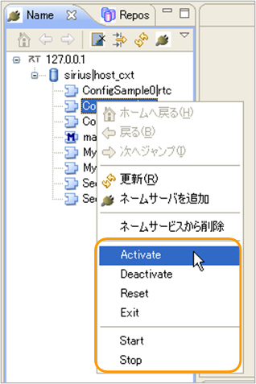</a>
</th>
    <th>
<a href="fig51RTCStatusChangeEditor.png">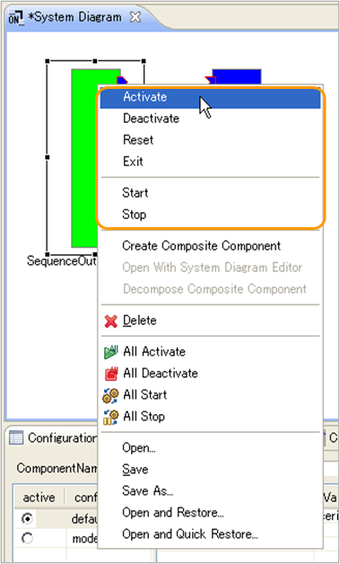</a>
</th>
  </tr>
</table>

<strong>ネームサービスビュー（左）とシステムエディタ（右）から RTC 状態を変更する</strong>

 

これらのアクションの意味は以下のとおりです。実行先にご注意ください。
 

<strong>RTCの状態を変更するアクション</strong>

<table class="table-alt">
  <tr>
    <th>No.</th>
    <th>アクション名</th>
    <th>実行先</th>
    <th>意味</th>
  </tr>
  <tr>
    <td>1</td>
    <td>Activate</td>
    <td>選択された RTC とその1番目の ExecutionContext に対して実行</td>
    <td>Activate を要求する</td>
  </tr>
  <tr>
    <td>2</td>
    <td>Deactivate</td>
    <td>〃</td>
    <td>Deactivate を要求する</td>
  </tr>
  <tr>
    <td>3</td>
    <td>Reset</td>
    <td>〃</td>
    <td>Reset を要求する</td>
  </tr>
  <tr>
    <td>4</td>
    <td>Exit</td>
    <td>選択された RTC に対して実行</td>
    <td>Exit を要求する</td>
  </tr>
  <tr>
    <td>5</td>
    <td>Start</td>
    <td>選択された RTC の1番目の ExecutionContext に対して実行</td>
    <td>Start を要求する</td>
  </tr>
  <tr>
    <td>6</td>
    <td>Stop</td>
    <td>〃</td>
    <td>Activate を要求する</td>
  </tr>
</table>

「[設定画面](/ja/node/4885/)」のオンラインエディタの項目で、アクションの実行確認を有効にしている場合は、アクションの実行前に確認のダイアログが表示されます。

<a href="fig52RTCStatusChangeConfirm.png">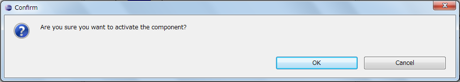</a>

<strong>アクションの実行確認ダイアログ</strong>

 

初期設定では、事前確認を行わないようになっています。 
Activate、Deactivate については、ショートカットキーが割り当てられています。初期設定では以下の設定になっています。 
・Activate → Ctrl + Alt + A  
・Deactivate → Ctrl + Alt + D  
キーバインドを変更するには、Eclipse 標準の設定メニューの「一般」→「キー」で設定することができます。
 

また、簡易にシステムを操作するための機能として、システムエディタに含まれるすべての RTC へ Activate、Deactivate、Start、Stop、変更を要求することがツールバーとコンテキストメニューからできます。
 

<a href="fig53AllExec.png">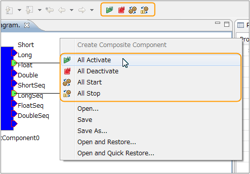</a>

<strong>All 実行（ツールバーは左からAll Activate、All Deactivate、All Start、All Stop）</strong>

 

All 系のアクションは、1番目以外の ExecutionContext についても行われます。 Activate やStart を画面内の RTC に１つずつおこなった場合と結果が異なることにご注意ください。

### ポート間を接続する
システムエディタでは、 RTC のポート間を接続することができます。 
ポート間を接続するには、ポートとポートをドラッグ＆ドロップでつなぎます。
 

<a href="fig54ConnectPort.png">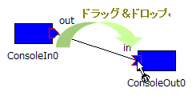</a>

<strong>ポート間接続</strong>

 

ドラッグ＆ドロップ終了後、接続に必要な情報の入力を促すダイアログが表示されます。
 

<a href="SystemEditor_015.jpg">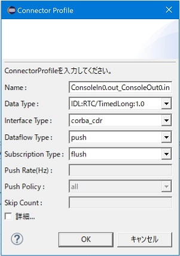</a>

<strong> ConnectorProfileダイアログの例</strong>

 

このダイアログでは、 ConnectorProfile を作成します。 ConnectorProfile は、それぞれのポートが必要とする条件が満たされるように作成される必要がありますが、このダイアログは必要な条件を満たす値のみが入力されるようプルダウンで促します。
必要な条件を満たすことができない接続の場合には、ドラッグ＆ドロップの接続時に禁止マークが表示され、ドラッグ＆ドロップを行うことができません。
 

<a href="fig56ConnectedProhibitionMark.png">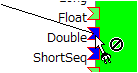</a>

<strong>接続禁止マーク</strong>

 

ポート間の接続は、大きくデータポート間接続とサービスポート間接続に分かれます。詳細については「[システムエディタ（ポート間の接続 編）](/ja/node/4885/)」を参照願います。

### ポート間の接続を切断する
ポート間の接続を切断するには、接続を選択し [Delete] ボタンをクリックするか、コンテキストメニューに表示される [Delete] をクリックします。
 

<a href="fig61Disconnect.png">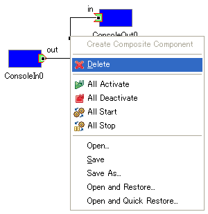</a>

<strong>接続の削除</strong>

 

### ポート間の接続をすべて切断する
ポートの接続をすべて切断するには、ポートを選択して、右クリックし「All Disconnect」を実行します。
 

<a href="fig62AllDisconnect.png">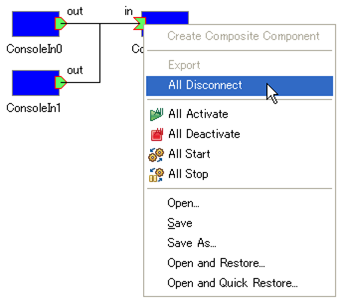</a>

<strong>接続の全切断</strong>

 

### 単独ポートの接続を設定する
単独のポート接続へ ConnectorProfile を設定することができます。 
ポートを右クリックし、コンテクストメニューから「Connect」を選択すると、ポート間接続のときと同様に、ConnectorProfile の設定ダイアログが開きます。
 

<a href="fig63ConnectSinglePort.png">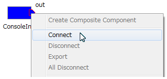</a>

<strong>単独のポート接続</strong>

 

単独のポート接続を削除するには、同じく右クリックのコンテキストメニューから「Disconnect」を選択し、ポート切断ダイアログから操作します。
ダイアログに表示された ConnectorProfile の一覧から対象を削除し、[OK] ボタンをクリックすると切断処理が実施されます。
 

<a href="fig64DisconnectPort.png">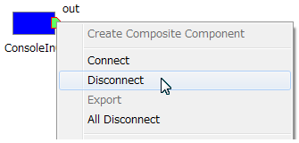</a>

<strong>ポートの切断</strong>

 

<a href="fig65DisconnectPortDialog.png">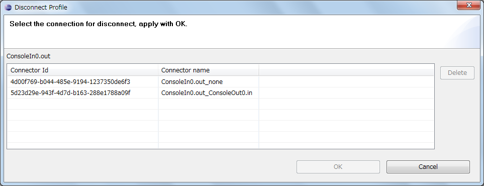</a>

<strong>ポートの切断ダイアログ</strong>

 

なお、ポート切断ダイアログには単独ポート接続や、通常のポート間接続のすべての ConnectorProfile の一覧が表示されるので、ダイアグラムに描画されない単独ポート接続の確認にも利用できます。
 

### ログを収集する
ログ通知オブザーバにより、RTC のログメッセージをツールで収集することができます。（OpenRTM-aist 1.1以降） 
ダイアグラム上の RTC を右クリックし、コンテキストメニューの「Start Logging」を選択するとログ収集を開始します。
すでにログ収集を開始している RTC の場合は、メニュー表示が「Stop Logging」となり、ログ収集を停止します。 
なお、オブザーバに対応していない RTC の場合は、メニューが非活性となります。
 

<table class="table-alt">
  <tr>
    <td style="text-align: center;">ログ収集の開始</td>
    <td style="text-align: center;">ログ収集の停止</td>
  </tr>
  <tr>
<td>
<a href="fig79LoggingStart.png">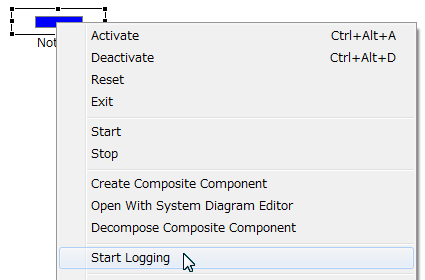</a>
</td>
<td>
<a href="fig79LoggingStop.png">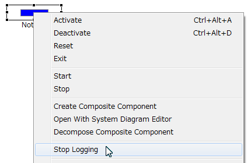</a>
</td>
  </tr>
</table>

<strong>ログ収集の開始/停止</strong>

ログ収集は、状態通知オブザーバと同様、ログ通知のオブザーバの参照を RTC に登録し、通知を受けます。
コンテキストメニューからログ収集開始時にオブザーバを登録し、ログ収集停止時にオブザーバを解除します。
また、状態通知オブザーバと同じく、ダイアグラムから RTC を削除するとオブザーバを解除します。 
ログ通知では、時刻やログレベルを含んだデータ構造（ログレコード）が RTC から送られ、ツールはログのデータを蓄積します。
蓄積されたログは、ログビューを使って参照することができます。
 

<a href="fig80LogObserver.png">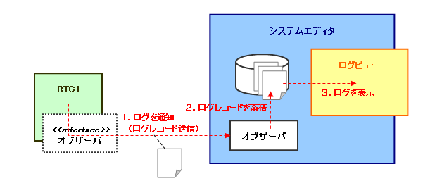</a>

<strong>ログ通知オブザーバ</strong>

 

