<!-- Title: システムエディタ（複合コンポーネント編） -->
#contents

複合コンポーネントの操作を説明します。

### 複合コンポーネントを作成する
複数のコンポーネントをまとめて複合コンポーネントにすることができます。 
複合コンポーネントにしたいコンポーネントを選択して、右クリックして「Create Composite Component」を選択すると、複合コンポーネント生成ダイアログが表示されます。
 

<a href="fig66CreateCompositeComponent.png">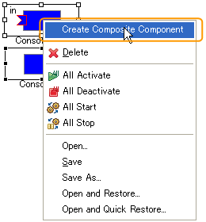</a>

<strong>複合コンポーネントの作成</strong>

 

<a href="SystemEditor_1302.jpg">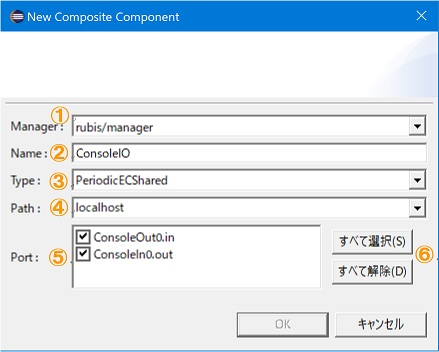</a>

<strong>複合コンポーネント生成ダイアログ</strong>

 

ダイアログの各項目は以下のとおりです。 

<strong>複合コンポーネント生成のダイアログ項目と必要条件</strong>

<table class="table-alt">
  <tr>
    <th>No.</th>
    <th>ダイアログ説明</th>
    <th>説明</th>
  </tr>
  <tr>
    <td>①</td>
    <td>Manager</td>
    <td>ネームサービスビューに表示されているマネージャ一覧からマネージャを選択します。ここで選択されたマネージャが複合コンポーネントを生成します。</td>
  </tr>
  <tr>
    <td>②</td>
    <td>Name</td>
    <td>複合コンポーネントのインスタンス名を指定します。</td>
  </tr>
  <tr>
    <td>③</td>
    <td>Type</td>
    <td>複合コンポーネントの種別を指定します。指定可能な種別は以下のとおり。 [PeriodicECShared] 各RTCが ExecutionContext のみを共有する形で動作します。各RTCの状態は独立しているため、複合コンポーネント内で複数の状態が存在することもあります。 [PeriodicStateShared] 各RTCが同一の ExecutionContext を共有するとともに、状態も共有する形で動作します。 [Grouping] 各RTCが何も共有しない複合コンポーネントで、各RTCがそれぞれ ExecutionContext、状態を保持します。</td>
  </tr>
  <tr>
    <td>④</td>
    <td>Path</td>
    <td>複合コンポーネントに設定するパスを指定します。</td>
  </tr>
  <tr>
    <td>⑤</td>
    <td>Port</td>
    <td>子のコンポーネントのポート一覧から、複合コンポーネントに表示するポートを選択します。 ここで選択されたポートに対して、複合コンポーネントにプロキシ用のポートが作成されます。 </td>
  </tr>
  <tr>
    <td>⑥</td>
    <td>-</td>
    <td>ポートの全選択・全解除ボタン</td>
  </tr>
</table>

複合コンポーネントを作成すると、子のコンポーネントとして選択していたコンポーネントはシステムエディタ上から表示が消え、新しい複合コンポーネントが描画されます。 
複合コンポーネントのダイアグラムをダブルクリックするか、右クリックして「エディタで開く」を選択すると、新しいシステムダイアグラムが開き、複合コンポーネント内部が表示されます。 
 

<a href="fig68CompositeOpenWithSE.png">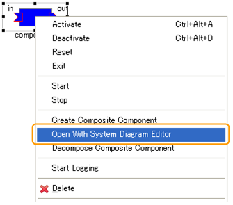</a>

<strong>複合コンポーネントをシステムエディタで開く</strong>

 

<a href="fig69ViewCompositeComponent.png">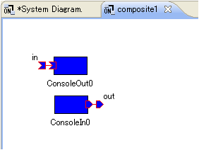</a>

<strong>複合コンポーネント内を表示するシステムエディタ</strong>

 

※ ただし、システム構成の保存時には、コンポーネントの描画情報はコンポーネントに対して１つしか保存できないため、複合コンポーネント内を表示するシステムダイアグラムで変更した描画情報は保存されません。
 

### 複合コンポーネントの子を追加する
複合コンポーネント内を表示するシステムエディタを開いて、ネームサービスビューから RTC をドラッグ＆ドロップすることで、複合コンポーネントの子が追加されます。追加された子RTCのポートはすべて非公開に設定されます。
 

<a href="fig70CompositeComponentAddRTC.png">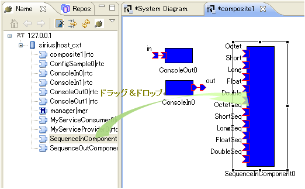</a>

<strong>子RTCの追加</strong>

 

### 複合コンポーネントの子を削除する
複合コンポーネント内を表示するシステムエディタを開いて、そこで子のコンポーネントを削除することで、複合コンポーネントの子が削除されます。 
削除された子のコンポーネントは、複合コンポーネント内から表示が消え、元のシステムダイアグラム（複合コンポーネント自身が表示されているダイアグラム）に表示されます。
 

<a href="fig71DeleteChildComponent.png">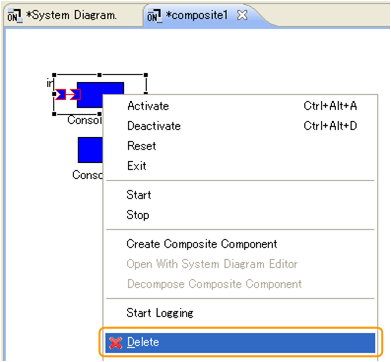</a>

<strong>複合コンポーネント内から子のコンポーネントを削除</strong>

 

<a href="fig72ChildComponent.png">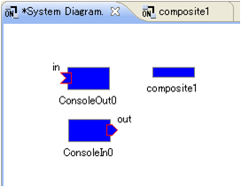</a>

<strong>複合コンポーネントが表示されているシステムエディタ上に子のコンポーネント表示</strong>

 

### 複合コンポーネントを削除する
複合コンポーネント上で右クリックして「Delete」を選択すると、複合コンポーネントがダイアグラムから削除されます。 
削除時に複合コンポーネントを別のシステムダイアグラムで開いていると、エディタの終了確認のダイアログが表示されます。
 

<a href="fig73DeleteCompositeComponent.png">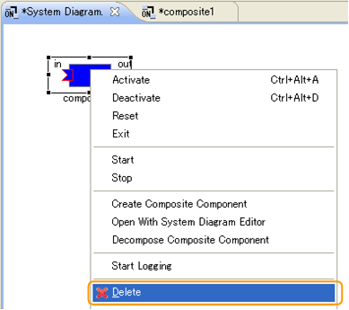</a>

<strong>複合コンポーネントの削除</strong>

 

<a href="fig74CloseCompositeComponentDialog.png">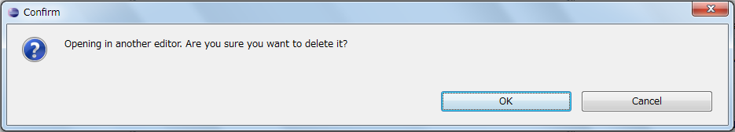</a>

<strong>複合コンポーネントを表示するエディタの終了確認ダイアログ</strong>

 

### 複合コンポーネントを解除する
複合コンポーネント上で右クリックして「Decompose Composite Component」を選択すると、複合コンポーネントへexist()が送られ、コンポーネント自体を終了します。 
解除時に複合コンポーネントを別のシステムダイアグラムで開いていると、エディタの終了確認のダイアログが表示されます。 
複合コンポーネントが解除されると、子のコンポーネントが元のシステムダイアグラム（複合コンポーネントが表示されていたダイアグラム）に表示されます。
 

<a href="fig75DecomposeCompositeComponent.png">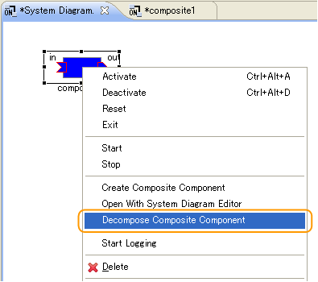</a>

<strong>複合コンポーネントの解除</strong>

 

<strong>複合コンポーネントを表示するエディタの終了確認ダイアログ</strong>

 

### ポートの公開/非公開を切り替える
複合コンポーネント内を表示するシステムエディタにあるコンポーネントのポートが複合コンポーネント上に公開されている場合、下記のように別のアイコンで表示されます。
 

<strong>子RTCの公開されているポートのアイコン</strong>

<table class="table-alt">
  <tr>
    <th>No.</th>
    <th>名前</th>
    <th>形状</th>
  </tr>
  <tr>
    <td>1</td>
    <td>InPort</td>
    <td>

</td>
  </tr>
  <tr>
    <td>2</td>
    <td>OutPort</td>
    <td>

</td>
  </tr>
  <tr>
    <td>3</td>
    <td>ServicePort</td>
    <td>

</td>
  </tr>
</table>

公開されているポートを右クリックして、「Unexport」を選択すると、そのポートが公開されていない状態に変わります。また、公開されていないポートを右クリックして、「Export」を選択すると、そのポートが公開されている状態に変わります。
 

<table class="table-alt">
  <tr>
    <th>
<a href="fig77ExportPort.png">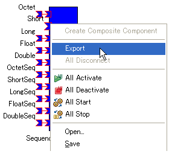</a>
</th>
    <th>
<a href="fig77UnexportPort.png">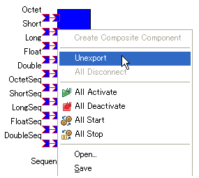</a>
</th>
  </tr>
</table>

<strong>ポートの公開/非公開</strong>

 

ただし、ポートが別のコンポーネントのポートと接続されている場合は、「Unexport」にすることができません。
 

<a href="fig78CantUnexport.png">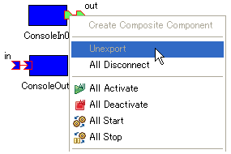</a>

<strong>ポートの接続がある場合</strong>

 

