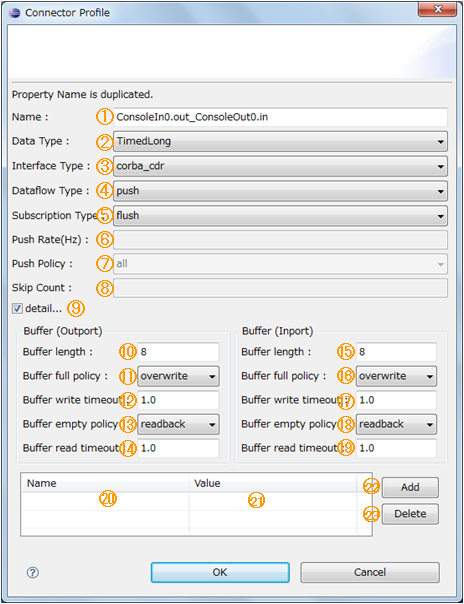
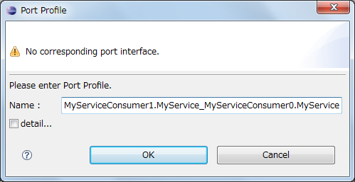

<!-- Title: システムエディタ（ポート間の接続 編） -->
#contents

This section explains connections between data ports and between service ports.

### Data Port Connections
For data port connections, connect an "InPort" and an "OutPort". When you connect them by drag and drop, the following dialog is displayed. Note that the "Buffer" setting items are hidden when the dialog is initially displayed.
 

<strong>Data Port Connector Profile Dialog</strong>

 

The dialog items and conditions are as follows.
 

<strong>Dialog Items and Requirements for Data Port Connections</strong>

<table class="table-alt">
  <tr>
    <th>No.</th>
    <th>Dialog Item Name</th>
    <th>ConnectorProfile</th>
    <th>Requirements</th>
  </tr>
  <tr>
    <td>①</td>
    <td>Name</td>
    <td>name</td>
    <td>None in particular</td>
  </tr>
  <tr>
    <td>②</td>
    <td>Data Type</td>
    <td>&lt;&lt;properties&gt;&gt; dataport.data_type</td>
    <td>Specifies the data type to be sent and received between the data ports connected by this connector. Select from the data types that each port can send and receive to and from the other port. However, if Any is included, any value from the other port is accepted.</td>
  </tr>
  <tr>
    <td>③</td>
    <td>Instance Type</td>
    <td>&lt;&lt;properties&gt;&gt; dataport.interface_type</td>
    <td>Specifies the interface type assumed by the RT system designer or supported by the RT middleware on which the RTC operates. Select from the interface types supported by both ports. However, if Any is included, any interface from the other port is accepted.</td>
  </tr>
  <tr>
    <td>④</td>
    <td>Dataflow Type</td>
    <td>&lt;&lt;properties&gt;&gt; dataport.dataflow_type</td>
    <td>Specifies the dataflow type assumed by the RT system designer or supported by the RT middleware on which the RTC operates. Select from the dataflow types supported by both ports. However, if Any is included, any dataflow from the other port is accepted.</td>
  </tr>
  <tr>
    <td>⑤</td>
    <td>Subscription Type</td>
    <td>&lt;&lt;properties&gt;&gt; dataport.subscription_type</td>
    <td>[Requirement when the value of Dataflow Type is Push] Specifies the subscription type assumed by the RT system designer or supported by the RT middleware on which the RTC operates. Select from the subscription types supported by both ports. However, if Any is included, any subscription type from the other port is accepted.</td>
  </tr>
  <tr>
    <td>⑥</td>
    <td>Push Rate(Hz)</td>
    <td>&lt;&lt;properties&gt;&gt; dataport.push_interval</td>
    <td>[Requirement when the value of Dataflow Type is "Push" and Subscription Type is "Periodic"] Specifies the data transmission cycle when the subscription type is "Periodic". Specify the transmission cycle as a positive numeric value (decimals allowed).</td>
  </tr>
  <tr>
    <td>⑦</td>
    <td>Push Policy</td>
    <td>&lt;&lt;properties&gt;&gt; dataport.publisher.push_policy</td>
    <td>Data transmission policy. [Requirement when the value of Dataflow Type is "Push" and Subscription Type is "Periodic"] Select from all, fifo, skip, and new. <strong>all</strong>: Sends all data in the buffer at once <strong>fifo</strong>: Sends data in the buffer one item at a time in FIFO order <strong>skip</strong>: Sends data while skipping data in the buffer <strong>new</strong>: Sends the latest value in the buffer (old values are discarded).</td>
  </tr>
  <tr>
    <td>⑧</td>
    <td>Skip Count</td>
    <td>&lt;&lt;properties&gt;&gt; dataport.publisher.skip_count</td>
    <td>Number of transmission data items to skip. [Requirement when the value of Push Policy is "skip"] Data in the buffer is thinned out and sent according to this setting value.</td>
  </tr>
  <tr>
    <td>⑨</td>
    <td>Details</td>
    <td>―</td>
    <td>When the checkbox is checked, detailed setting items for the input/output port buffers are displayed. They are hidden when the dialog is initially displayed.</td>
  </tr>
  <tr>
    <td>⑩ ⑮</td>
    <td>Buffer length (OutPort/InPort)</td>
    <td>&lt;&lt;properties&gt;&gt; buffer.length</td>
    <td>Buffer length</td>
  </tr>
  <tr>
    <td>⑪ ⑯</td>
    <td>Buffer full policy (OutPort/InPort)</td>
    <td>&lt;&lt;properties&gt;&gt; buffer.write.full_policy</td>
    <td>Behavior when the buffer is full during data writing to the buffer. Select from overwrite, do_nothing, and block. <strong>overwrite</strong>: Overwrites the data. <strong>do_nothing</strong>: Does nothing. <strong>block</strong>: Blocks. If block is specified, and the following timeout value is specified, a timeout occurs if writing is not possible after the specified time. The default is overwrite.</td>
  </tr>
  <tr>
    <td>⑫ ⑰</td>
    <td>Buffer write timeout (OutPort/InPort)</td>
    <td>&lt;&lt;properties&gt;&gt; buffer.write.timeout</td>
    <td>The time until a timeout event is generated when writing data to the buffer (unit: seconds) The default is 1.0 [sec]. If 0.0 is set, no timeout occurs.</td>
  </tr>
  <tr>
    <td>⑬ ⑱</td>
    <td>Buffer empty policy (OutPort/InPort)</td>
    <td>&lt;&lt;properties&gt;&gt; buffer.read.empty_policy</td>
    <td>Behavior when the buffer is empty during data reading from the buffer. Select from readblock, do_nothing, and block. <strong>readblock</strong>: Re-reads the last element. <strong>do_nothing</strong>: Does nothing. <strong>block</strong>: Blocks. If block is specified, and the following timeout value is specified, a timeout occurs if reading is not possible after the specified time. The default is readback.</td>
  </tr>
  <tr>
    <td>⑭ ⑲</td>
    <td>Buffer read timeout (OutPort/InPort)</td>
    <td>&lt;&lt;properties&gt;&gt; buffer.read.timeout</td>
    <td>The time until a timeout event is generated when reading data from the buffer (unit: seconds) The default is 1.0 [sec]. If 0.0 is set, no timeout occurs.</td>
  </tr>
  <tr>
    <td>⑳ 21</td>
    <td>Name/Value</td>
    <td>&lt;&lt;properties&gt;&gt; Name</td>
    <td>Sets arbitrary properties Items can be added with the [Add] button and deleted with the [Delete] button. The entered items are set in the Properties of the ConnectorProfile in NVList format. Properties with the same Key cannot be set.</td>
  </tr>
</table>

For items ② through ⑤, RT System Editor creates the selectable values by matching strings from the value lists of each port.
If only ANY is specified for both ports, it is not possible to determine the values that can be entered.
For this reason, when ANY is included in both ports, RT System Editor allows arbitrary strings to be entered. Items for which arbitrary strings can be entered display "Arbitrary input allowed".
 

<strong>Display When Arbitrary Input Is Allowed</strong>

 

### Service Port Connections
For service port connections, connect a "ServicePort" and a "ServicePort". When you connect them by drag and drop, the following dialog is displayed.
 

<strong>Service Port Connector Profile Dialog</strong>

 

The dialog items and conditions are as follows.
 

<strong>Dialog Items and Requirements for Service Port Connections</strong>

<table class="table-alt">
  <tr>
    <td>No.</td>
    <td>Dialog Item Name</td>
    <td>ConnectorProfile</td>
    <td>Requirements</td>
  </tr>
  <tr>
    <td>①</td>
    <td>Name</td>
    <td>Name</td>
    <td>None in particular</td>
  </tr>
  <tr>
    <td>②</td>
    <td>Details</td>
    <td>―</td>
    <td>When the checkbox is checked, detailed setting items for Consumer/Provider are displayed. They are hidden when the dialog is initially displayed.</td>
  </tr>
  <tr>
    <td>③</td>
    <td>Consumer</td>
    <td>―</td>
    <td>
Select from the list of Consumers of the interfaces set for the service ports to be connected.
The selection list in the ComboBox is displayed in the format &lt;component name&gt;:&lt;interface name&gt;:&lt;instance name&gt;.
 
The added Consumer/Provider pair is stored in the ConnectorProfile with the Consumer ID as the property key and the Provider ID as the property value.
 
The Consumer/Provider IDs are represented in the following format.
&lt;rtc_name&gt;.port.&lt;port_name&gt;.&lt;if_polality&gt;.&lt;if_tname&gt;.&lt;if_iname&gt;
 
<ul>
<li>rtc_name is the component name</li>
<li>port_name is the port name</li>
<li>if_polality is "required" for Consumer and "provided" for Provider</li>
<li>if_tname is the type name of the interface</li>
<li>if_iname is the instance name of the interface</li>
</ul>
</td>
  </tr>
  <tr>
    <td>④</td>
    <td>Provider</td>
    <td>&lt;&lt;properties&gt;&gt; Set with the Consumer ID as the key</td>
    <td>As with Consumer, select from the list of Providers of the interfaces set for the service ports to be connected.</td>
  </tr>
  <tr>
    <td>⑤</td>
    <td>Add</td>
    <td>―</td>
    <td>Adds a new Consumer/Provider entry.</td>
  </tr>
  <tr>
    <td>⑥</td>
    <td>Delete</td>
    <td>―</td>
    <td>Deletes the selected Consumer/Provider entry.</td>
  </tr>
  <tr>
    <td>⑦ ⑧</td>
    <td>Name/Value</td>
    <td>&lt;&lt;properties&gt;&gt; Name</td>
    <td>Sets arbitrary properties Items can be added with the [Add] button and deleted with the [Delete] button. The entered items are set in the Properties of the ConnectorProfile in NVList format. Properties with the same Key cannot be set.</td>
  </tr>
</table>

For service ports, there are no required connection conditions. However, if the PortInterfaceProfiles between the ServicePorts do not match completely (*1), a warning is displayed in the connection dialog.
 

<strong>Warning Display in the Service Port Connection Dialog</strong>

 

<strong>*1</strong>

A complete match here means that the "type" of the PortInterfaceProfiles is the same and that the "polarity" values are PROVIDED and REQUIred for each other.
It also means that all PortInterfaceProfiles match without any excess (each port can have multiple PortInterfaceProfiles).

