<!-- Title: システムエディタ（RTC の表示 / 描画編集 編） -->
#contents

This section explains operations for displaying RTCs and editing RTC drawings.

&aname(RTCcolor);
### RTC Display
RTCs placed in the System Editor are displayed as rectangles, and ports are displayed around those rectangles. Each state is also represented by color.
 

<a href="fig43RTCDisplayExample.png">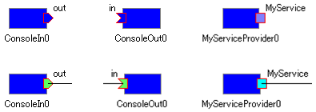</a>

<strong>Example of RTC Display</strong>

 

The list of icons and state colors is as follows.
 

<strong>Component and Port Icons</strong>

<table class="table-alt">
  <tr>
    <th>No.</th>
    <th>Name</th>
    <th>Shape</th>
    <th colspan="2">State</th>
    <th>Default Color (*)</th>
  </tr>
  <tr>
    <td rowspan="5">1</td>
    <td rowspan="5">RTC</td>
    <td rowspan="5">
<a href="IconShape.png">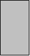</a>
</td>
    <td>CREATED</td>
    <td>
<a href="IconWhite.png">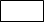</a>
</td>
    <td>White</td>
  </tr>
  <tr>
    <td>INACTIVE</td>
    <td>
<a href="IconBlue.png">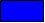</a>
</td>
    <td>Blue</td>
  </tr>
  <tr>
    <td>ACTIVE</td>
    <td>
<a href="IconLightGreen.png">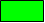</a>
</td>
    <td>Light Green</td>
  </tr>
  <tr>
    <td>ERROR</td>
    <td>
<a href="IconRed.png">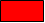</a>
</td><td>Red</td>
  </tr>
  <tr>
    <td>UNKNOWN</td>
    <td>

</td>
    <td>lack</td>
  </tr>
  <tr>
    <td rowspan="2">2</td>
    <td rowspan="2">Execution Context  (first one only)</td>
    <td rowspan="2">(outer border line of the RTC rectangle)</td>
    <td>RUNNING</td>
    <td>

</td>
    <td>Gray</td>
  </tr>
  <tr>
    <td>STOPPED</td>
    <td>

</td><td>Black</td>
  </tr>
  <tr>
    <td rowspan="2">3</td>
    <td rowspan="2">InPort</td>
    <td rowspan="2">

</td>
    <td>Not connected</td>
    <td>

</td>
    <td>Blue</td>
  </tr>
  <tr>
    <td>Connected (one or more)</td>
    <td>

</td>
    <td>Light Green</td>
  </tr>
  <tr>
    <td rowspan="2">4</td>
    <td rowspan="2">OutPort</td>
    <td rowspan="2">

</td>
    <td>Not connected</td>
    <td>

</td>
    <td>Blue</td>
  </tr>
  <tr>
    <td>Connected (one or more)</td>
    <td>

</td>
    <td>Light Green</td>
  </tr>
  <tr>
    <td rowspan="2">5</td>
    <td rowspan="2">ServicePort</td>
    <td rowspan="2">

</td>
    <td>Not connected</td>
    <td>

</td>
    <td>light Blue</td>
  </tr>

  <tr>
    <td>Connected (one or more)</td>
    <td>
<a href="IconCyan.png">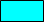</a>
</td>
    <td>Cyan</td>
  </tr>
</table>

**'* The colors of each state can be changed from [Display Color]({{ site.baseurl }}/en/doc/toolmanuals/rtsystemeditor-1_1_0/rtse-1_1_0_setting#color) on the settings screen.**'

You can also attach icon images according to the RTC type and category.
 

<a href="fig44RTCDisplayIconExample.png">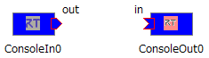</a>

<strong>Example of RTC Icon Image Display</strong>

 

**'* Icon images can be changed from [Icon]({{ site.baseurl }}/en/doc/toolmanuals/rtsystemeditor-1_1_0/rtse-1_1_0_setting#icon) on the settings screen.**'

### RTC Synchronization
The state of RTCs placed in the System Editor is monitored, and the display is updated in real time. 
The monitoring methods include the state notification observer method (OpenRTM-aist 1.1 or later) and periodic checking by polling. Monitoring parameters can be changed in the connection settings screen. 
When placing an RTC in the System Editor, the middleware version is checked, and if observers are supported, an observer is registered with the RTC. If observers are not supported, the state is queried periodically.
 

<a href="fig45StatusObserver.png">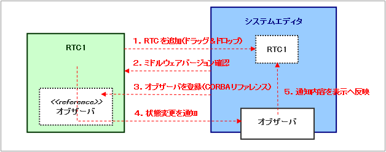</a>

<strong>State Notification Observer</strong>

 

When an RTC is deleted from the System Editor, the observer is also unregistered. 
The contents notified by the state notification observer are as follows.
 

<strong>Notification Contents of the State Notification Observer</strong>

<table class="table-alt">
  <tr>
    <td>Notification</td>
    <td>Description</td>
  </tr>
  <tr>
    <td>COMPONENT_PROFILE</td>
    <td>Notifies when there is a change in the component profile of the RTC</td>
  </tr>
  <tr>
    <td>RTC_STATUS</td>
    <td>RTC state Notifies the new state and the ID of the target EC</td>
  </tr>
  <tr>
    <td>EC_STATUS</td>
    <td>Execution context state Notifies execution rate changes, EC start/stop, and RTC attach/detach</td>
  </tr>
  <tr>
    <td>PORT_PROFILE</td>
    <td>Port state Notifies port addition/deletion and connection/disconnection of connections</td>
  </tr>
  <tr>
    <td>CONFIGURATION</td>
    <td>Configuration state Notifies configuration addition/change/deletion and switching of the active configuration</td>
  </tr>
</table>

 

In addition, a heartbeat is notified at regular intervals to confirm that the RTC is alive. 
If the heartbeat is not notified a certain number of times, the RTC is regarded as having terminated abnormally and is removed from the System Editor.
 

### RTC Drawing Editing
This section explains RTC drawing editing. (The term "drawing editing" is intentionally used instead of "editing" because the work described here edits the drawing and has no effect on the system.)

- Changing the size and moving an RTC (no effect on the system)~
To move an RTC, select the RTC and drag it. To change the size of an RTC, drag the handles that are displayed when the RTC is selected.
 

<a href="fig46RTCMoveResize.png">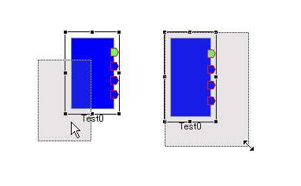</a>

<strong>Moving an RTC (left) and changing the size of an RTC (right)</strong>

 

The position and size of the selected RTC are also displayed in the status bar.
 

<a href="fig47StatusBar.png">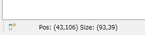</a>

<strong>Status Bar</strong>

 

- Rotating an RTC (no effect on the system)~
Select the target component and click the right mouse button while holding down the Ctrl key to rotate it to a horizontal orientation. Click the right mouse button while holding down the Shift key to rotate it to a vertical orientation. By repeating the same operations, you can change it to the opposite horizontal orientation or the opposite vertical orientation, allowing operation in the up, down, left, and right directions.
 

<a href="fig48RTCRotate.png">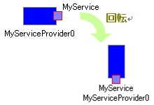</a>

<strong>Rotated RTC</strong>

 

- Deleting an RTC (no effect on the system)~
To delete an RTC, select the RTC and click the [Delete] button, or select [Delete] from the context menu.
 

<a href="fig49DeleteComponent.png">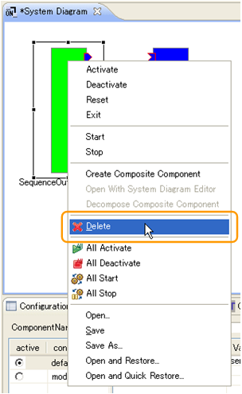</a>

<strong>Deleting an RTC</strong>

 

- Moving a connection line between ports (no effect on the system)~
To move a connection line, select the connection line and move the displayed handler. Vertical lines can be moved left and right, and horizontal lines can be moved up and down.
 

<a href="fig50MoveConnection.png">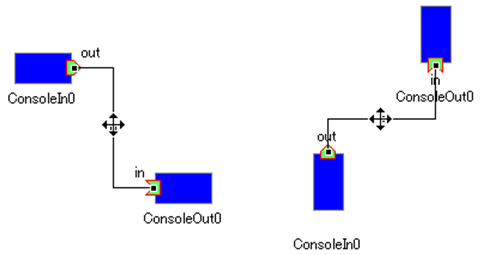</a>

<strong>Moving connection lines: vertical line (left) and horizontal line (right)</strong>

 

