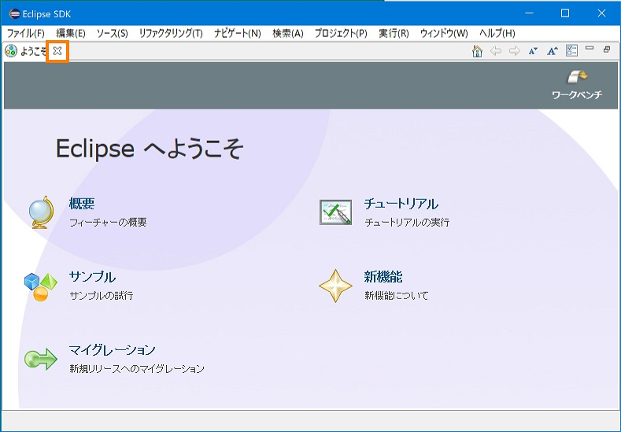
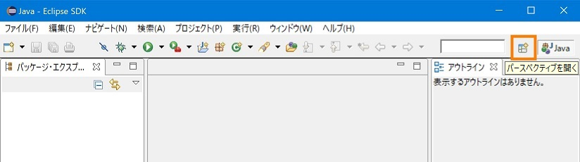
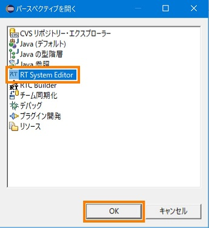
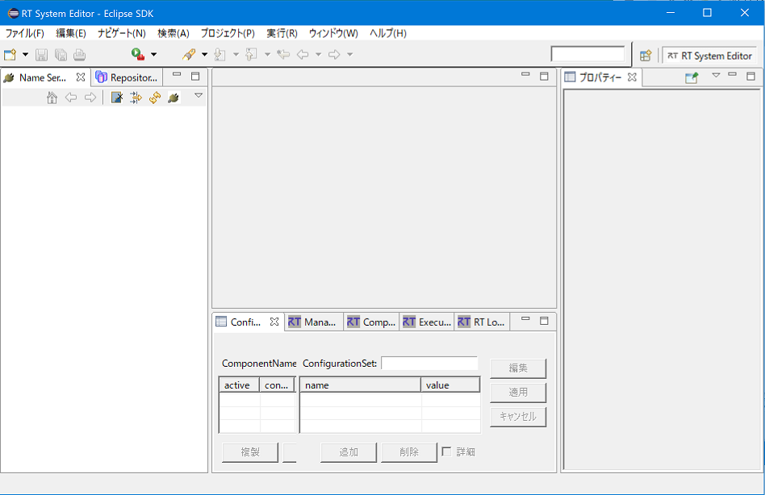

<!-- Title: インストールおよび起動 -->
#contents

ここでは、RTSystemEditor のインストールおよび起動について説明します。

### RTSystemEditor のインストール
RTSystemEditor は Eclipse プラグインであるため、 Eclipse 本体および依存している他の Eclipse プラグインをまずインストールする必要があります。
インストールに関しては、[OpenRTM Eclipse tools のインストール]({{ site.baseurl }}/ja/doc/installation/install_1_1/openrtm_eclipse_tools_1_1) を参照してください。

### RTSystemEditor の起動

1. インストール後、 Eclipse を初めて起動すると、以下のような「ようこそ」画面が表示されます。 
画面左上の「✖」をクリックし、「ようこそ」画面を閉じます。  

  
1. 以下の画面で、右上の [パースペクティブを開く] ボタンをクリックします。  

  
1. [RT System Editor] を選択し、[OK] ボタンをクリックします。  

  
1. RTSystemEditor が起動します。  

  

