<!-- Title: オフラインシステムエディタ -->
#contents
<!-- オフラインシステムエディタ -->

### 概要
ここでは、オフラインシステムエディタの概要について説明します。
 

<a href="fig86OfflineSysetmEditor.png">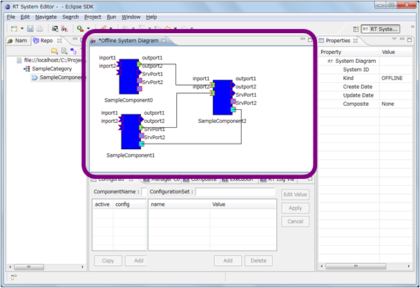</a>

<strong>オフラインシステムエディタの位置</strong>

 

オフラインシステムエディタでは、レポジトリビュー上のコンポーネントをドラッグ＆ドロップでダイアグラムに追加することで、RTシステムの編集を行います。基本的な操作はオンラインのシステムエディタと同じですが、RTC の状態を変更することはできません。また、リアルタイムに RTC の状態が変更される、または更新されることもありません。
 

### 基本機能

#### オフラインシステムエディタを開く
新しいオフラインシステムエディタを開くには、ツールバーの「Open New Offline System Editor」ボタンをクリックするか、メニューバーの [File] > [Open New Offline System Editor] を選択します。
 

<a href="fig87OpenNewOfflineSystemEditorFromToolbar.png">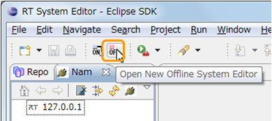</a>

<strong>ツールバーから Open New Offline System Editor</strong>

 

<a href="fig88FileOpenNewOfflineEditor.png">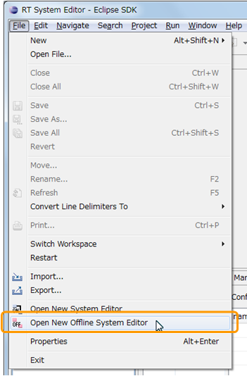</a>

<strong>Fileメニューから Open New Offline System Editor</strong>

 

#### コンポーネント仕様をオフラインシステムエディタに配置する
コンポーネント仕様をオフラインシステムエディタに配置するには、リポジトリビューからコンポーネント仕様をドラッグ＆ドロップします。
 

<a href="fig89OfflineEditorComponentDnD.png">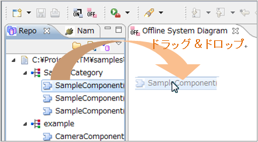</a>

<strong>コンポーネント仕様をオフラインシステムエディタに配置する</strong>

 

リポジトリビュー上で Ctrlキーを押しながらクリックし、複数コンポーネント仕様を選択すれば、まとめてオフラインシステムエディタ上へ配置することができます。
 

<a href="fig90OfflineEditorComponentMultiDnD.png">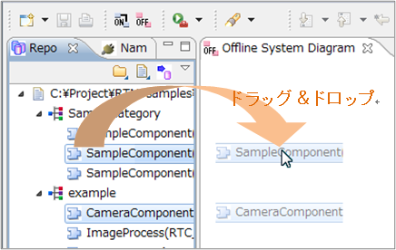</a>

<strong>複数のコンポーネント仕様をまとめてオフラインシステムエディタに配置する</strong>

 

#### コンポーネント仕様をオフラインシステムエディタで編集する
オフラインシステムエディタでは、システムエディタで行えることのうち、実行時コンポーネントの動作に関すること以外のほとんどの操作を、システムエディタと同様の操作で行うことができます。
 

### デプロイ機能

ここでは、オフラインシステムエディタを使用したデプロイ機能の概要について説明します。
 

デプロイ機能を用いることで、オフラインシステムエディタで作成したオフラインプロファイルから実際のシステム構築を行うことが可能となります。

#### デプロイ情報の設定
オフラインエディタ上に配置したコンポーネントを右クリックし、表示されたメニュー中から｢Set Deploy Info.｣を選択すると、デプロイ情報設定画面が表示されます。
 

<a href="fig91DeploySetting.png">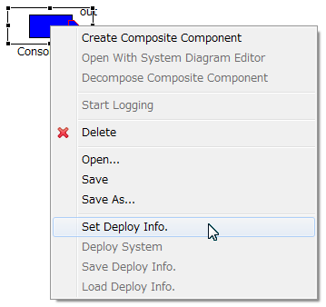</a>

<strong>デプロイ情報の設定</strong>

 

<table class="table-alt">
  <tr>
    <td>
<a href="fig92DeployComp.png">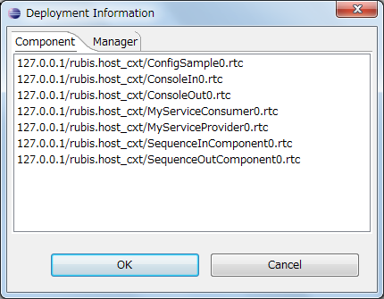</a>
</td>
    <td>
<a href="fig92DeployManager.png">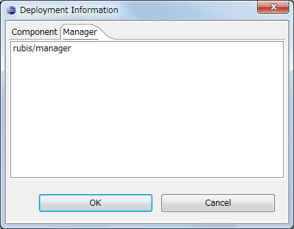</a>
</td>
  </tr>
  <tr>
    <td style="text-align: center;"><strong>稼働中のRTC</strong></td>
    <td style="text-align: center;"><strong>稼働中のManager</strong></td>
  </tr>
</table>

<strong>デプロイ情報設定画面</strong>

 

デプロイ情報設定画面では、現在稼働中の RTC、Manager の一覧が表示されます。対象 RTC をデプロイする際に使用する要素を選択してください。
 

※デプロイ情報設定画面の内容は、NameServiceView に表示されている項目を使用しています。稼働している要素の情報が表示されない場合は、NameServiceView の表示内容を確認し、必要に応じて Refresh を行ってください。
 

※複合 RTC を選択した場合、Manager 情報一覧のみが表示されます。デプロイ時に使用する Manager を選択してください。
 

#### デプロイ情報の保存・読み込み
設定したデプロイ情報は、RtsProfile とは別に保存、読込する事が可能です。オフラインエディタを右クリックして表示されるメニュー中から「Save Deploy Info.」｢Load Deploy Info.｣をそれぞれ選択してください。
 

<a href="fig93DeploySave.png">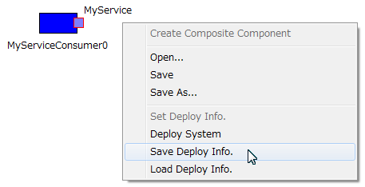</a>

<strong>デプロイ情報の保存・読み込み</strong>

 

※デプロイ情報を読み込む際には、コンポーネントID(ベンダ名、カテゴリ名、コンポーネント名、バージョン番号)をキーとして、該当 RTC の検索を行います。
 

#### デプロイの実行
設定したデプロイ情報を基に、実際のシステムを構築(デプロイ)する場合は、オフラインエディタを右クリックして表示されるメニュー内から｢Deploy System｣を選択します。
 

<a href="fig94Deploy.png">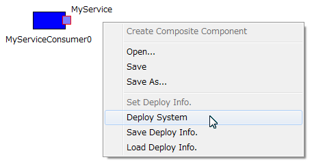</a>

<strong>デプロイ</strong>

 

デプロイを実行すると、設定されたデプロイ情報を基に実システムの構築(デプロイ)を行います。そして、新規オンラインエディタを開き、デプロイ結果を表示します。
 

対象となるオフラインシステム内に、デプロイ情報が設定されていないコンポーネントが存在する場合や、設定したデプロイターゲットがデプロイ時に起動していない場合には、以下のような警告画面が表示されます。
 

<a href="fig95DeployWarning.png">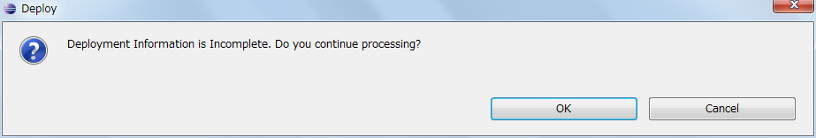</a>

<strong>デプロイ時警告画面</strong>

 

警告画面中で｢キャンセル｣を選択した場合は、デプロイ処理を中断します。[OK] を選択した場合は、起動中のデプロイターゲットを使用して、可能な限りシステムの構築(デプロイ)を実行します。

