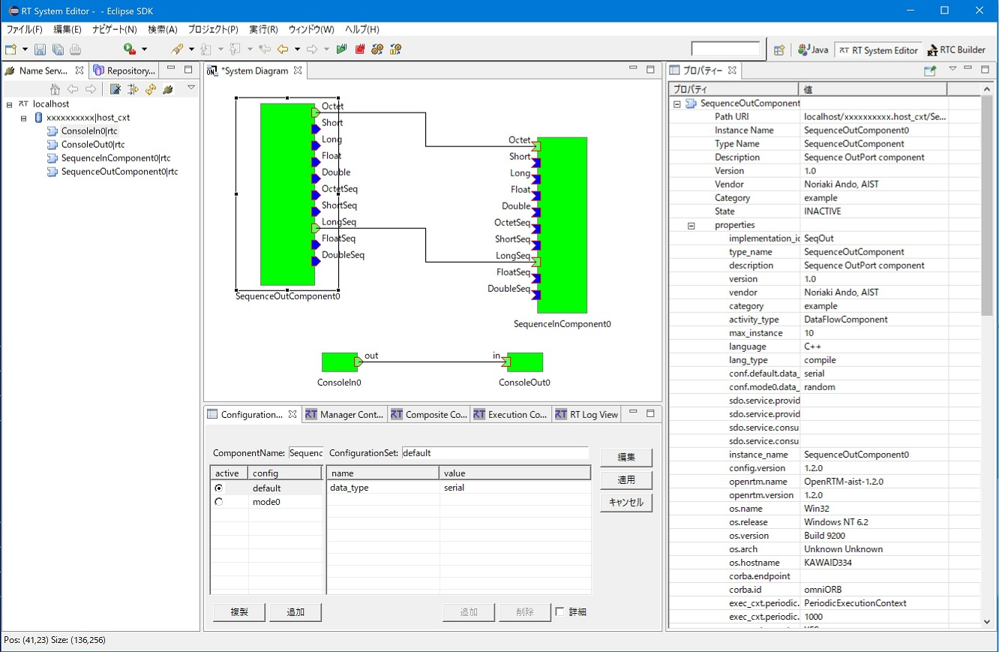

<!-- Title: 概要・システム構築の流れ -->
#contents(3)

<!-- **概要 -->
### Overview of OpenRTM-aist RT System Editor
At present, [OMG](http://www.omg.org) is developing specifications for Robot Technology Components (hereafter RTCs), which improve the efficiency of robot development.
As a common platform that implements and applies these RTC specifications, the Integrated Intelligence Research Group, Intelligent Systems Research Institute, National Institute of Advanced Industrial Science and Technology (AIST), provides [OpenRTM-aist]({{ site.baseurl }}/en/doc/installation/lets_start). 
RTSystemEditor is one of the development tools included in OpenRTM-aist, and it provides functions for graphically operating RTCs in real time.
Also, as its name suggests, it is created as a plugin for the Eclipse integrated development environment, and can be operated seamlessly with existing plugins on Eclipse.

&aname(target);
### Target Audience
This document is intended for those who already have basic knowledge of RTCs.
For details about RTCs, refer to the documents from [OMG](http://www.omg.org) or [here]({{ site.baseurl }}/en/doc/aboutopenrtm/rtmiddleware).

&aname(screen);
### Screen Example
This section shows an example screen of OpenRTM-aist RT System Editor (hereafter RTSystemEditor).

<strong>Example Screen of RTSystemEditor</strong>

 

&aname(kinou);
### Function Overview
RTSystemEditor provides functions for graphically operating RTCs in real time. The list of provided functions is as follows.
#clear

<strong>Function Overview List</strong>

<table class="table-alt">
  <tr>
    <th>No.</th>
    <th>Function Name</th>
    <th>Function Overview</th>
  </tr>
  <tr>
    <td>1</td>
    <td>Component Configuration Display/Edit Function</td>
    <td>Displays and edits the configuration profile information of the selected component in the Configuration View.</td>
  </tr>
  <tr>
    <td>2</td>
    <td>Component Operation Change Function</td>
    <td>Changes the operation of the selected component.</td>
  </tr>
  <tr>
    <td>3</td>
    <td>RT System Assembly Function</td>
    <td>Assembles a system on the System Editor.</td>
  </tr>
  <tr>
    <td>4</td>
    <td>System Save/Open Function</td>
    <td>Saves the contents of the System Editor as an RTS profile. Opens an RTS profile in the System Editor. The system port connections and configuration are not changed.</td>
  </tr>
  <tr>
    <td>5</td>
    <td>System Restore Function</td>
    <td>Opens an RTS profile in the System Editor and restores the system based on the contents of the profile. (Reconstructs the system port connections and configuration based on the contents of the profile.)</td>
  </tr>
</table>

&aname(kankyou);
### Operating Environment
The environment required for RTSystemEditor operation is as follows.

<strong>Operating Environment</strong>

<table class="table-alt">
  <tr>
    <th>No.</th>
    <th>Environment</th>
    <th>Notes</th>
  </tr>
  <tr>
    <td>1</td>
    <td><a href="http://java.sun.com/javase/ja/6/download.html">Java Development Kit 6</a></td>
    <td>Note: It does not work with Java 1.5 (5.0).;</td>
  </tr>
  <tr>
    <td>2</td>
    <td><a href="http://www.eclipse.org/downloads/index.php">Eclipse 3.4 or later</a></td>
    <td>Eclipse itself</td>
  </tr>
  <tr>
    <td>3</td>
    <td><a href="http://www.eclipse.org/modeling/emf/downloads/">Eclipse EMF 2.4 or later (including SDO and XSD)</a></td>
    <td>Eclipse plugin on which RTSystemEditor depends  * Use a version that matches the version of Eclipse you are using.</td>
  </tr>
  <tr>
    <td>4</td>
    <td><a href="http://www.eclipse.org/gef/downloads/">Eclipse GEF 3.4 or later</a></td>
    <td>Eclipse plugin on which RTSystemEditor depends  * Use a version that matches the version of Eclipse you are using.</td>
  </tr>
  <tr>
    <td>5</td>
    <td>RT Name Service View</td>
    <td>Development tool included in OpenRTM-aist on which RTSystemEditor depends</td>
  </tr>
  <tr>
    <td>6</td>
    <td>RT Repository View</td>
    <td>Development tool included in OpenRTM-aist on which RTSystemEditor depends</td>
  </tr>
</table>

### Restrictions
RTSystemEditor was developed for OpenRTM-aist. Operations for other RTC platforms are not assumed.

