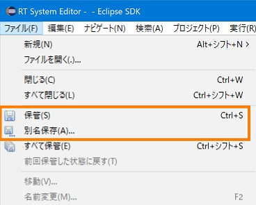
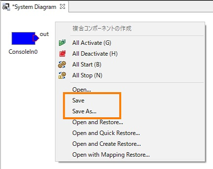
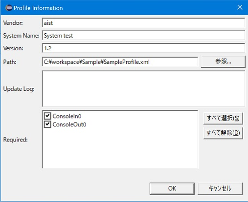
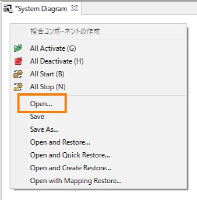
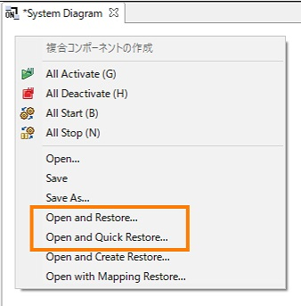
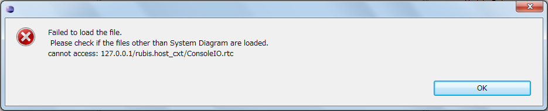

<!-- Title: システムエディタ（セーブ編） -->
#contents

システムエディタのセーブとオープンについて説明します。

### システムエディタをセーブする
システムエディタはセーブすることができます。セーブするには、メニューの [File] もしくはエディタを右クリックして「Save」を選択します。（「Save As…」では、セーブするファイルを任意選択することができます）
 

<table class="table-alt">
  <tr>
<td>

</td>
<td>

</td>
  </tr>
  <tr>
    <td style="text-align: center;"><strong>システムエディタのセーブ メニュー</strong></td>
    <td style="text-align: center;"><strong>コンテキストメニュー</strong></td>
  </tr>
</table>
 

システムのセーブを選択すると、プロファイル情報ダイアログが開き、必要な項目を設定して [OK] ボタンをクリックすると、システムの情報がファイルにセーブされます。 
 

<strong>プロファイル情報ダイアログ</strong>

 

<strong>プロファイル情報の項目</strong>

<table class="table-alt">
  <tr>
    <th>名前</th>
    <th>形状</th>
  </tr>
  <tr>
    <td>Vendor</td>
    <td>ベンダ名。RTシステムの識別子を構成する要素。 必須項目。</td>
  </tr>
  <tr>
    <td>System Name</td>
    <td>システム名。RTシステムの識別子を構成する要素。 必須項目。</td>
  </tr>
  <tr>
    <td>Version</td>
    <td>システムのバージョン。RTシステムの識別子を構成する要素。 必須項目。</td>
  </tr>
  <tr>
    <td>Path</td>
    <td>システムをセーブするファイル名。 必須項目。</td>
  </tr>
  <tr>
    <td>Update Log</td>
    <td>バージョンの補足説明などを記述。</td>
  </tr>
  <tr>
    <td>Required</td>
    <td>RTシステムを動作させるのに必須の RTC にチェックをつける。</td>
  </tr>
</table>

### セーブしたシステムエディタをオープンする
セーブしたシステムエディタをオープンするには、エディタを右クリックして「Open」を選択します。
 

<strong>システムエディタをオープンする</strong>

 

オープン後は、 RT System Editor はリモートのシステムを正として最新の情報へと更新を行います。セーブ内容をシステムへ復元するには、次の節で説明する「Open and Restore…」を使用してください。
 

### セーブしたシステムをオープンおよび復元する
セーブしたシステムエディタをオープンおよび復元するには、エディタを右クリックして「Open and Restore...」、もしくは「Open and Quick Restore...」を選択します。
 

<strong>システムエディタをオープンおよび復元する</strong>

 

システムへ復元されるのは以下の内容です。
- ポート間の接続（セーブ時のコネクタが存在しない場合）
- コンフィグレーション情報~
復元時には、コンポーネントのパスIDでネームサービスを検索してリモートのコンポーネントを取得します。 
「Quick Restore」を選択した場合は、ネームサービスにアクセスする前に、プロファイルに保存された IOR にてリモートのコンポーネントの取得を試み、取得できなかった場合にネームサービスから検索を行います。 
復元に失敗した場合には、エラー内容が表示されます。
 

<strong>復元失敗のエラーメッセージ </strong>

 

また、RT System Editorはエラー発生時でも、できる限りの復元を試みます。
 
 

