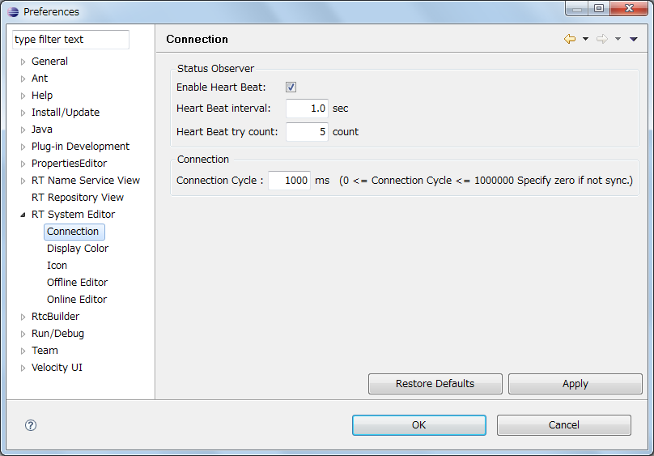
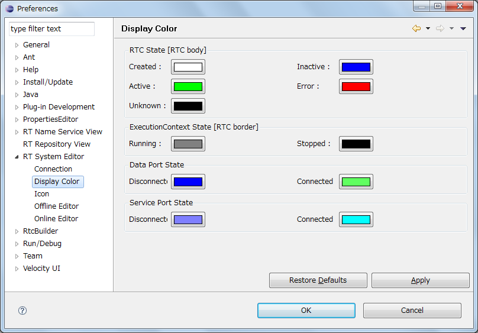
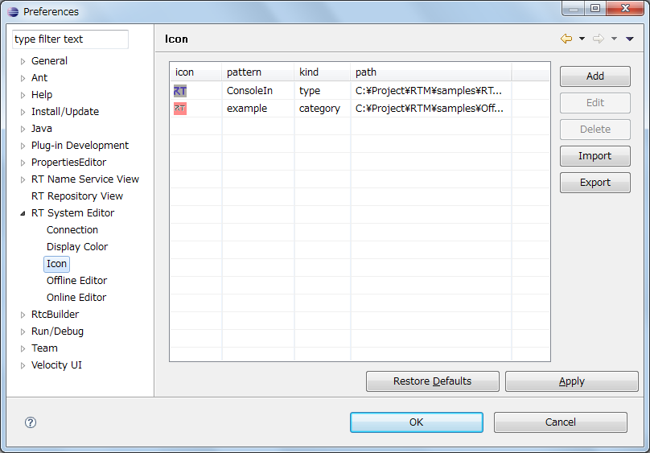
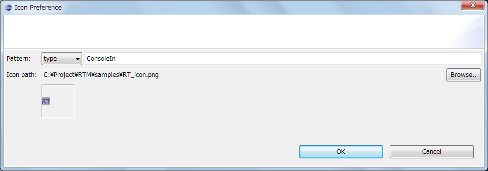
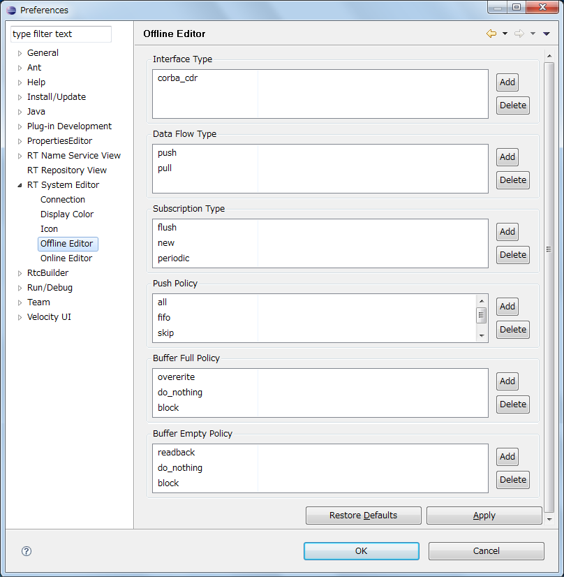
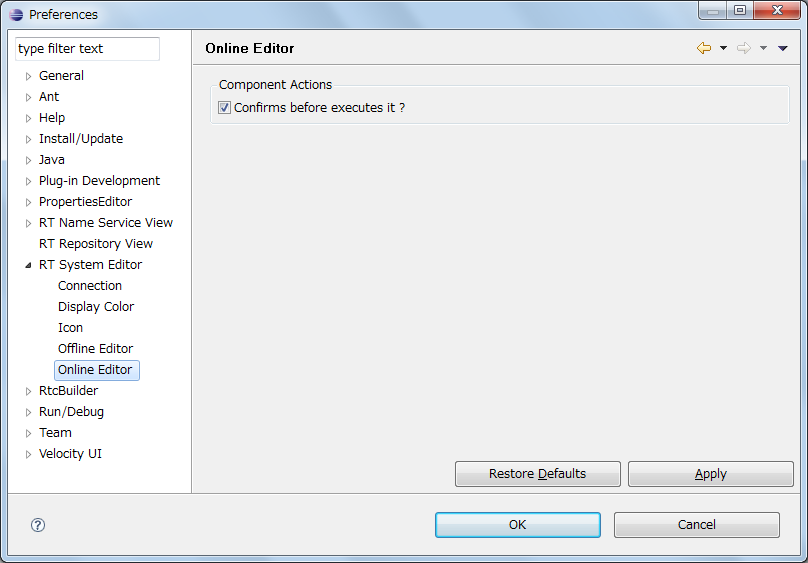
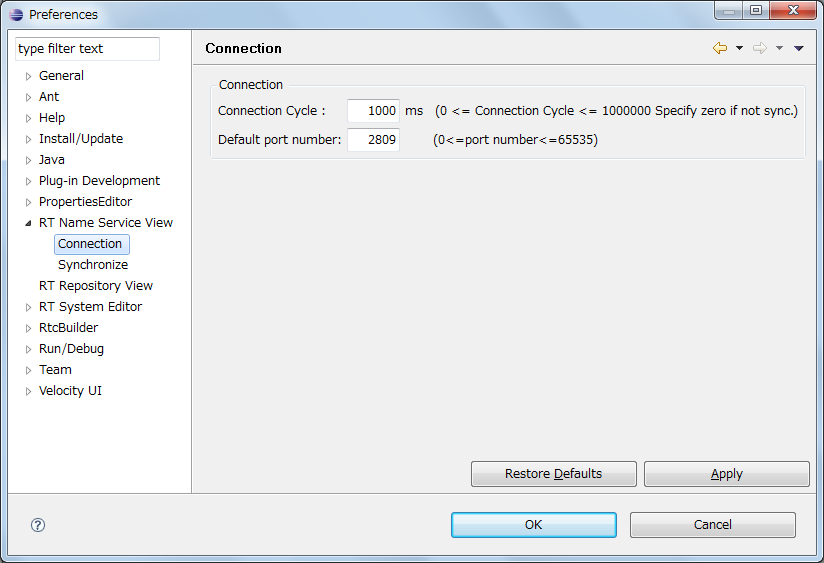
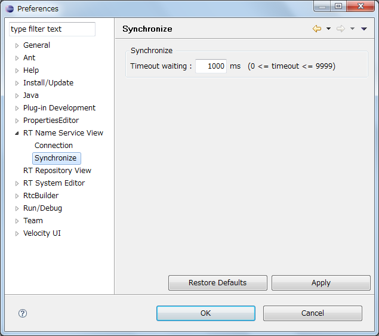
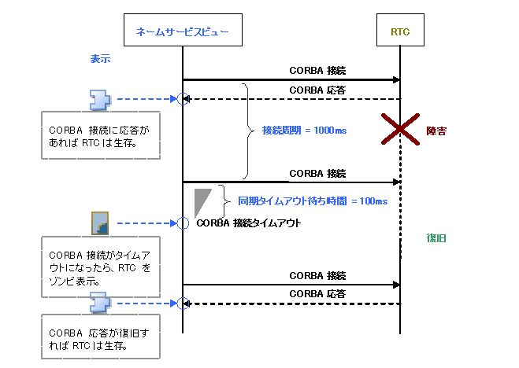

<!-- Title: 設定画面 -->
#contents

<!-- **設定画面 -->
## RT System Editor
ここでは、 RT System Editor の設定画面について説明します。
RT System Editor の設定画面は、メニューの [window] > [preferences] > [RT System Editor] で表示することができます。

&aname(cycle);
### 接続
接続設定では、状態通知オブザーバーのハートビートの設定、および接続周期の設定を行います。 
状態通知オブザーバー対応のミドルウェア（OpenRTM-aist 1.1以降）では、オブザーバーへのハートビート送信により RTC の生存確認を行います。ハートビートの設定項目は以下のとおりです。

<strong>ハートビートの設定項目</strong>

<table class="table-alt">
  <tr>
    <th>名前</th>
    <th>説明</th>
  </tr>
  <tr>
    <td>ハートビート有効化</td>
    <td>ハートビートによるタイムアウト検出を有効にするかを指定します。</td>
  </tr>
  <tr>
    <td>ハートビート受信間隔</td>
    <td>ハートビートの受信間隔を指定します。 単位は秒、デフォルトは1.0秒。</td>
  </tr>
  <tr>
    <td>ハートビート受信回数</td>
    <td>タイムアウト検出のためのハートビートの受信回数を指定します。 受信間隔ｘ受信回数＝タイムアウト時間 [秒] デフォルトは３回。</td>
  </tr>
</table>

接続周期は、従来のミドルウェア（OpenRTM-aist 1.0以前）において、システムエディタがシステム情報を収集し、表示へ反映する周期です。 
単位はミリ秒、0 を指定した場合には同期は行われません。
 

<strong>接続周期設定画面</strong>

 

&aname(color);
### 表示色
表示色の設定画面では、システムエディタにて表示される RTC と ExecutionContext 状態の色を設定することができます。
それぞれの状態の意味については、[システムエディタのRTCの表示]({{ site.baseurl }}/ja/doc/toolmanuals/rtsystemeditor-1_1_0/rtse-1_1_0_display#RTCcolor)をご覧ください。
 

<strong>表示色設定画面</strong>

 

&aname(icon);
### アイコン
アイコンの設定画面では、システムエディタで表示する RTC に付与されるアイコン画像と、表示対象のパターンを設定することができます。
表示対象は RTC の種別、もしくはカテゴリのパターンを設定します。
アイコン画像の表示イメージは、[システムエディタのRTCの表示]({{ site.baseurl }}/ja/doc/toolmanuals/rtsystemeditor-1_1_0/rtse-1_1_0_display#RTCcolor)をご覧ください。
 

<strong>アイコン画像設定画面</strong>

 

[Add]、[Edit]、[Delete] ボタンでアイコン画像のエントリを追加、編集、削除します。
[Add]、[Edit] ボタンをクリックするとアイコン画像設定ダイアログが開き、表示対象のパターンとアイコン画像ファイルを設定します。
 

<strong>アイコン画像設定画面</strong>

 

表示パターンを設定後、[Apply]、もしくは [OK] ボタンをクリックすると設定が反映されます。 
[Import]、[Export] ボタンをクリックすれば、アイコン画像設定の一覧を XML ファイルから読み込み、
XML ファイルへ保存することができます。
 

&aname(offline);
### オフラインエディタ
オフラインエディタでポート接続時に選択できるパラメーターを設定することができます。 
設定可能な項目は [Interface Type]、[Data Flow Type]、[Subscription Type] で、ポート接続時にここで設定したパラメーターから値を選択することができます。
それぞれの意味についてはデータポート間接続を参照してください。 
 

<strong>オフライン設定画面</strong>

 

&aname(online);
### オンラインエディタ
オンラインエディタで、RTC のアクション実行時に、事前の実行確認を行うかを設定します。
初期値はチェックなし（確認を行わない）です。

<strong>オンライン設定画面</strong>

 

## RT Name Service View

&aname(ns-conn);
### 接続周期
接続周期とは、RT Name Service View がシステムの情報を収集して表示へ反映する周期のことです。&br
接続周期は、ネームサービスビューとシステムエディタの2つがあります。単位はミリ秒で、0 を指定した場合には、同期は行われません。

<strong>接続周期設定画面</strong>

 

&aname(ns-sync);
### 同期
タイムアウト待ち時間は、システムの情報を収集する際、システムとの接続が確立されない場合に待機する時間です（単位はミリ秒）。

<strong>接続周期設定画面</strong>

 

接続周期と同期タイムアウト待ち時間の関係は下図のようになります。 
（例 接続周期が1000ms、同期タイムアウト待ち時間が100msの場合） 

<strong>接続周期と同期タイムアウト待ち時間の関係</strong>

 

