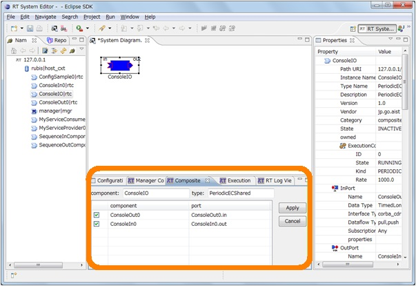
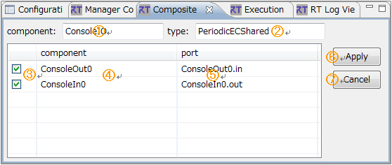
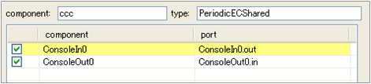

<!-- Title: ビュー（複合コンポーネントビュー編） -->
<!-- #contents -->

This section explains the Composite Component View.
 

<strong>Location of the Composite Component View</strong>

 

In the Composite Component View, port public/private information for the selected composite RTC is displayed, and you can set ports to public or private.
 

<strong>Composite Component View</strong>

 

<strong>Screen Layout of the Composite Component View</strong>

<table class="table-alt">
  <tr>
    <th>No.</th>
    <th>Description</th>
  </tr>
  <tr>
    <td>①</td>
    <td>Instance name of the composite RTC.</td>
  </tr>
  <tr>
    <td>②</td>
    <td>Type name of the composite RTC.</td>
  </tr>
  <tr>
    <td>③</td>
    <td>Public/private state of the port.</td>
  </tr>
  <tr>
    <td>④</td>
    <td>Instance name of the child RTC included in the composite RTC.</td>
  </tr>
  <tr>
    <td>⑤</td>
    <td>Port name of the child RTC included in the composite RTC.</td>
  </tr>
  <tr>
    <td>⑥</td>
    <td>Applies changes to the public/private state of ports.</td>
  </tr>
  <tr>
    <td>⑦</td>
    <td>Cancels changes to the public/private state of ports.</td>
  </tr>
</table>

Information being edited in the Composite Component View is not applied until the [Apply] button in ⑥ is clicked. Information being modified (not yet applied) is displayed in light red. Ports selected in the System Editor are displayed in light yellow.
 

<strong>Editing Port Public/Private Settings</strong>

 

<strong>Port Selected in the System Editor</strong>

 

If a port of a composite component is connected to a port of another component, the corresponding port is displayed in gray in the Composite Component View and cannot be edited.
 

<strong>When Connected to Another Port</strong>

 
