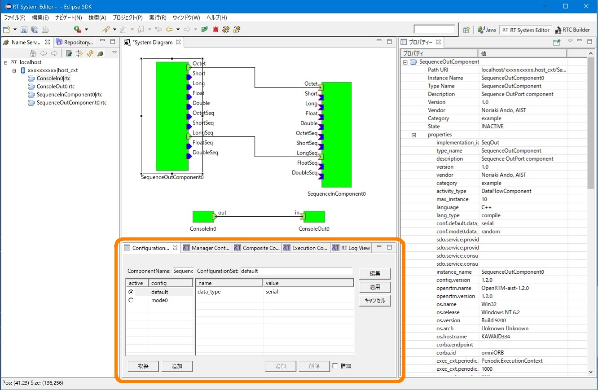
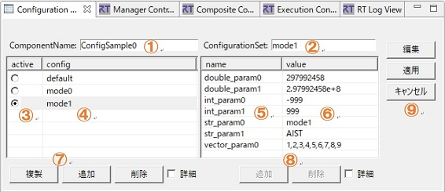
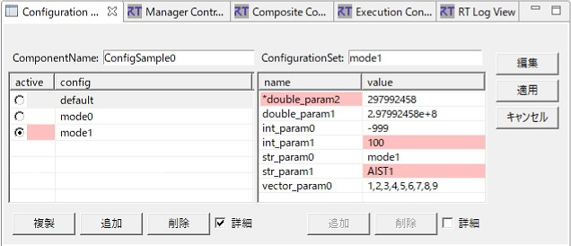
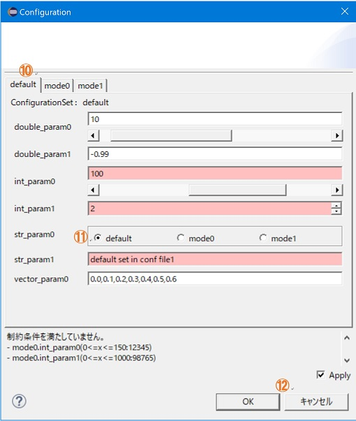
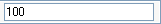
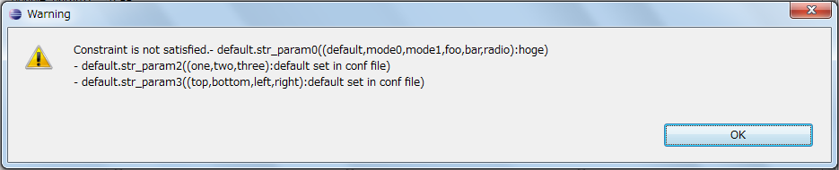

<!-- Title: ビュー（コンフィグレーションビュー編） -->
<!-- #contents -->

This section explains the Configuration View.
 

<strong>Location of the Configuration View</strong>

 

In the Configuration View, you can display and edit the configuration of the selected RTC. The list of CofigurationSets is displayed on the left, and the properties in the ConfigurationSet are displayed on the right.
 

<strong>Configuration View</strong>

 

<strong>Screen Layout of the Configuration View</strong>

<table class="table-alt">
  <tr>
    <th>No.</th>
    <th>Description</th>
  </tr>
  <tr>
    <td>①</td>
    <td>Name of the selected component.</td>
  </tr>
  <tr>
    <td>②</td>
    <td>Name of the selected ConfigurationSet.</td>
  </tr>
  <tr>
    <td>③</td>
    <td>The active ConfigurationSet. The active ConfigurationSet can also be changed.</td>
  </tr>
  <tr>
    <td>④</td>
    <td>List of ConfigurationSets.</td>
  </tr>
  <tr>
    <td>⑤</td>
    <td>Name of the property of the ConfigurationSet selected on the left.</td>
  </tr>
  <tr>
    <td>⑥</td>
    <td>Value of the property of the ConfigurationSet selected on the left.</td>
  </tr>
  <tr>
    <td>⑦</td>
    <td>Buttons for adding/deleting ConfigurationSets.</td>
  </tr>
  <tr>
    <td>⑧</td>
    <td>Buttons for adding/deleting properties.</td>
  </tr>
  <tr>
    <td>⑨</td>
    <td>Button for opening the settings value edit dialog, and buttons for applying/canceling changes.</td>
  </tr>
</table>

Information being edited in the Configuration View is not applied until the [Apply] button in ⑨ is clicked. Information being modified (not yet applied) is displayed in red.
 

<strong>Configuration View During Modification</strong>

 

To edit configuration settings values, click the [Edit] button in ⑨ to open the edit dialog and perform the editing.
 

<strong>Configuration Edit Dialog</strong>

 

If there are multiple ConfigurationSets, you can switch the target to edit using the tabs (⑩) at the top of the dialog. 
For each configuration parameter, you can specify a widget for editing. If a widget type is defined in the ConfigurationSet, the parameter can be edited with the specified widget (⑪).
Widget types include slider, spinner, radio button, checkbox, and ordered list. If no widget type is specified, a text box is used by default. 
Constraints can also be specified for each parameter. If the widget type is slider or spinner, specifying constraints is required. If the corresponding widget type is defined but no constraints are specified, the default text box is used.
 

<strong>List of Widget Types</strong>

<table class="table-alt">
  <tr>
    <th>Widget Type</th>
    <th>Image</th>
    <th>Description</th>
  </tr>
  <tr>
    <td>Slider</td>
    <td>

</td>
    <td>Select a value within the range from the minimum value to the maximum value specified by the constraints using the slider. Input in the text box is also possible.</td>
  </tr>
  <tr>
    <td>Spinner</td>
    <td>

</td>
    <td>Select a value within the range from the minimum value to the maximum value specified by the constraints using the spinner. Decimal precision follows the notation of the minimum and maximum values in the constraints. However, negative values cannot be specified. Example: If the maximum value is "10.00", two decimal places are used.</td>
  </tr>
  <tr>
    <td>Radio Button</td>
    <td>

</td>
    <td>Select a value with radio buttons.</td>
  </tr>
  <tr>
    <td>Checkbox</td>
    <td>

</td>
    <td>Select values with checkboxes. Multiple values can be selected and are set as comma-separated values.</td>
  <tr>
    <td>Ordered List</td>
    <td>

</td>
    <td>Select values from the selection list on the left. Multiple values can be selected, the order is preserved, and duplicates are allowed. The selected values are set as comma-separated values, as with checkboxes.</td>
  </tr>
  <tr>
    <td>Text Box</td>
    <td>

</td>
    <td>Set using normal text input.</td>
  </tr>
</table>

If constraints are specified for each parameter, the input value is checked against the constraints, and if the conditions are not satisfied, the form is shown in red.
Also, when editing is confirmed with the [OK] button, constraint checks are performed for all parameters of the ConfigurationSet that have been changed, and if any parameter does not satisfy the constraints, an error dialog is displayed.
 

<strong>Constraint Check Error Display</strong>

 

While the [Apply] checkbox (⑫) in the configuration edit dialog is checked, changes to settings values are reflected in real time in the RTC. 

The information displayed in the Configuration View is cached and displayed with the latest information when the RTC is selected (to prepare for editing the configuration).
Therefore, if the same RTC remains selected for a long time, differences from the system information may occur. Please note that when applying edits, RT System Editor completely overwrites the system with the edited information as the correct information, without considering these differences. 
Also, according to the RTC specification, any object can be registered as the Value of a property, but only strings can be registered/edited from RT System Editor.
 

