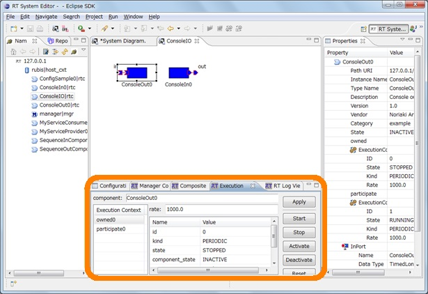
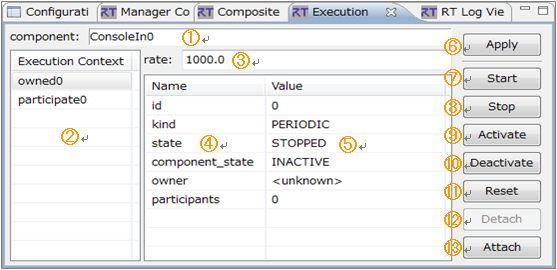
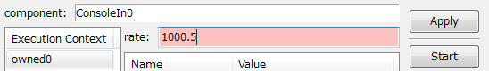
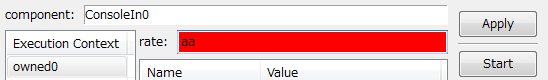
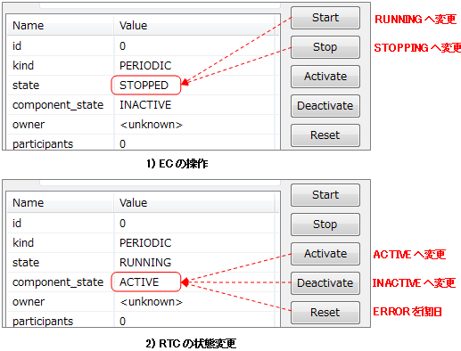
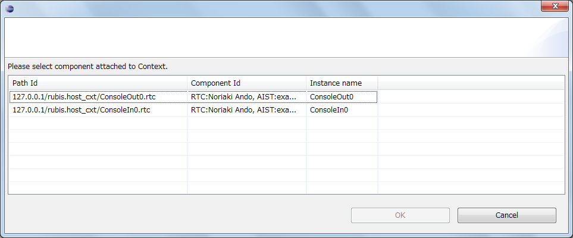
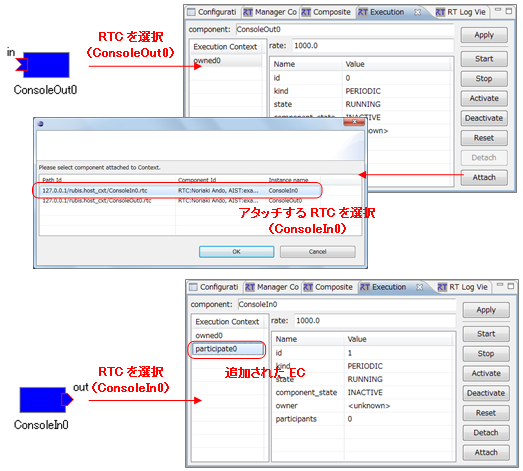
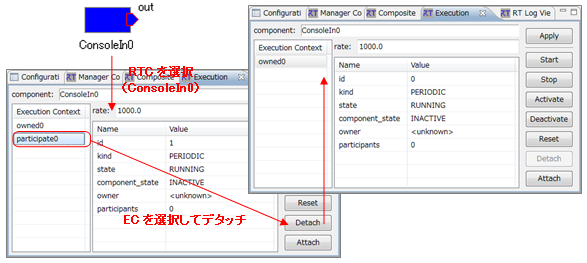

<!-- Title: ビュー（実行コンテキストビュー編） -->
<!-- #contents -->

ここでは実行コンテキストビューについて説明します。
 

<strong>実行コンテキストビューの位置</strong>

 

実行コンテキストビューでは、選択中の RTC が属する実行コンテキスト（EC）の一覧を表示し、EC の開始/終了、RTC のアクション実行、EC への RTC のアタッチ/デタッチを行うことができます。また、EC の実行周期の設定を行うことができます。
 

<strong>実行コンテキストビュー</strong>

 

<strong>実行コンテキストビューの画面構成</strong>

<table class="table-alt">
  <tr>
    <th>No.</th>
    <th>説明</th>
  </tr>
  <tr>
    <td>①</td>
    <td>RTC のインスタンス名。</td>
  </tr>
  <tr>
    <td>②</td>
    <td>RTC が属する EC のリストを表示。  RTC がオーナーの EC は「owned*」、RTC が参加のみの EC は「participate*」で表示。</td>
  </tr>
  <tr>
    <td>③</td>
    <td>②で選択中の EC の実行レート。</td>
  </tr>
  <tr>
    <td>④ ⑤</td>
    <td>選択中の EC のプロパティを Name、Value の一覧として表示。 　id： EC の ID。オンラインの場合は context_handle を ID として表示。 　kind： EC 種別 （PERIODIC/EVENT_DRIVEN/OTHER） 　state： EC の状態 （RUNNING/STOPPING） 　component_state： 選択中の RTC の EC 上での状態 （ACTIVE/INACTIVE/ERROR） 　owner： この EC のオーナー RTC のインスタンス名 　participants： この EC に参加中の RTC の数 その他、EC に設定された任意のプロパティを表示。</td>
  </tr>
  <tr>
    <td>⑥</td>
    <td>入力された実行レートを EC へ反映させる。</td>
  </tr>
  <tr>
    <td>⑦</td>
    <td>選択中の EC を開始する。（オフラインでは使用不可）</td>
  </tr>
  <tr>
    <td>⑧</td>
    <td>選択中の EC を停止する。（オフラインでは使用不可）</td>
  </tr>
  <tr>
    <td>⑨</td>
    <td>選択中の RTC の、選択中の EC 上での状態をアクティブにする。（オフラインでは使用不可）</td>
  </tr>
  <tr>
    <td>⑩</td>
    <td>選択中の RTC の、選択中の EC 上での状態を非アクティブにする。（オフラインでは使用不可）</td>
  </tr>
  <tr>
    <td>⑪</td>
    <td>選択中の RTC の、選択中の EC 上での状態をリセットする。（オフラインでは使用不可）</td>
  </tr>
  <tr>
    <td>⑫</td>
    <td>選択中の RTC を、選択中の EC からデタッチする。 ただし、RTC 自身が EC のオーナーの場合はデタッチ不可。</td>
  </tr>
  <tr>
    <td>⑬</td>
    <td>システムエディタ上の RTC の選択ダイアログを開き、選択した RTC を EC にアタッチする。</td>
  </tr>
</table>

実行レートの編集中の値は、⑥の [Apply] ボタンがクリックされるまで適用されません。また、修正中（未適用）の情報は薄い赤色で表示されます。入力値が不正な場合は赤色で表示されます。
 

<strong>実行レートの編集中</strong>

 

<strong>実行レートの設定値が不正な場合</strong>

 

オンラインエディタの場合は EC の操作や、その EC 上での RTC の状態を変更することができます。 
[Start] ボタンをクリックすると EC を開始し、プロパティの state が「RUNNING」となり、[Stop] ボタンをクリックすると EC を停止し、state が「STOPPING」となります。 
EC 上での RTC の状態を変更するには [Activate]、[Deactivate] ボタンをクリックします。アクティブ化すると、プロパティの component_state が「ACTIVE」となり、非アクティブ化すると component_state が「INACTIVE」となります。 
何らかの理由で RTC が「ERROR」状態となったときは、[Reset] ボタンをクリックして復旧します。
 

<strong> EC の操作、および RTC の状態変更</strong>

 

RTC は複数の EC にアタッチすることができます。 
RTC を追加したい EC を選択して、[Attach] ボタンをクリックすると、RTC の選択ダイアログが開きます。選択ダイアログには、システムエディタ上にある RTC の一覧が表示されます。
 

<strong>RTC 選択ダイアログ</strong>

 

RTC を選択して [OK] をクリックすると、EC に RTC が追加され、追加した RTC の participate ECの一覧に新しく EC が追加されます。
 

<strong>EC への RTC のアタッチ</strong>

 

EC のアタッチを解除するには、participate の EC を選択して [Detach] ボタンをクリックします。
 

<strong>EC から RTC をデタッチ</strong>

 

