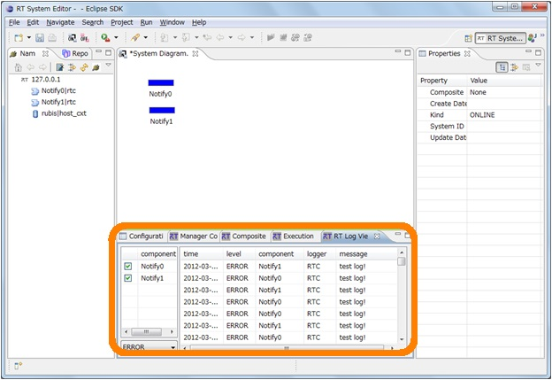
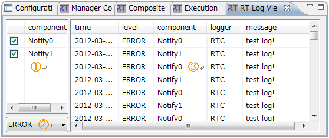
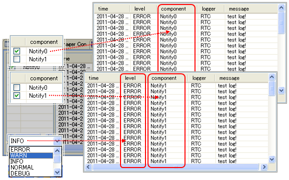

<!-- Title: ビュー（ログビュー編） -->
<!-- #contents -->

ここではログビューについて説明します。
 

<strong>ログビューの位置</strong>

 

ログビューは、選択したダイアグラム上のログ収集対象の RTC 一覧を表示し、RTC から通知されたログメッセージを表示します。 
表示したい RTC を選択でき、また、ログレベルによって表示をフィルタリングすることもできます。
 

<strong>ログビュー</strong>

 

<strong>ログビューの画面構成</strong>

<table class="table-alt">
  <tr>
    <th>No.</th>
    <th>説明</th>
  </tr>
  <tr>
    <td>①</td>
    <td>選択中のダイアグラム内の RTC のうち、ログ収集対象となっているものの一覧を表示。 ここでチェックをつけた RTC のログが表示される。</td>
  </tr>
  <tr>
    <td>②</td>
    <td>表示するログレベルのしきい値を指定。 指定されたレベル以上のログメッセージを表示する。</td>
  </tr>
  <tr>
    <td>③</td>
    <td>ログメッセージを表示。  RTC の選択、およびログレベル指定により、表示をフィルタリングする。 表示項目は次のとおり。 ・タイムスタンプ ・ログレベル（SILENT/ERROR/WARN/INFO/DEBUG/TRACE/VERBOSE/PARANOID） ・RTC のインスタンス名 ・ログ通知対象 ・ログメッセージ</td>
  </tr>
</table>
<!-- |③|ログメッセージを表示。&br; RTC の選択、およびログレベル指定により、表示をフィルタリングする。&br;表示項目は次のとおり。&br;・タイムスタンプ&br;・ログレベル（ERROR/WARN/INFO/NORMAL/DEBUG/TRACE/VERBOSE/PARANOID）&br;・RTC のインスタンス名&br;・ログ通知対象&br;・ログメッセージ| -->

ダイアグラムを選択すると、ダイアグラム上のログ収集対象 RTC の一覧を①に表示します。ログは、ログ通知オブザーバー機能により RTC から通知され、オブザーバーを登録したものがログ収集対象となります。 
一覧からログを表示したい RTC を選択（チェック）すると、③のログ表示テーブルにメッセージを表示します。 
また、ログメッセージはログレベルによって表示をフィルタリングすることができます。②のコンボボックスでしきい値となるレベルを選択すると、選択したレベル以上のログのみ表示します。たとえば、コンボボックスで「INFO」を選択すると、「ERROR」「WARN」「INFO」のメッセージのみ表示されます。
 

<strong>ログ表示のフィルタリング</strong>

 

