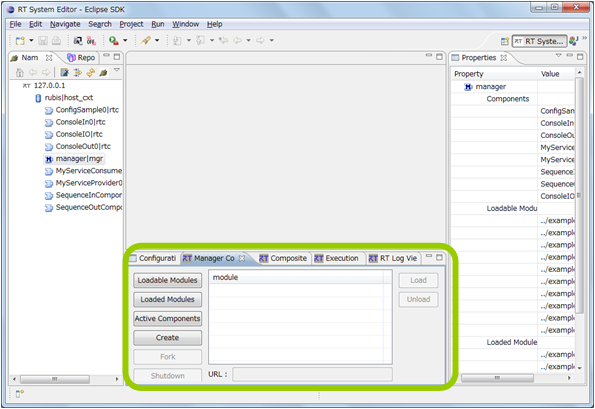
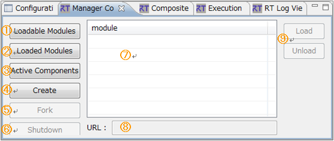
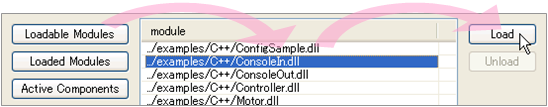
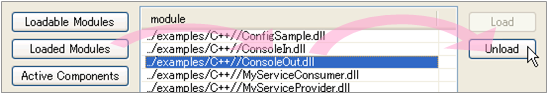
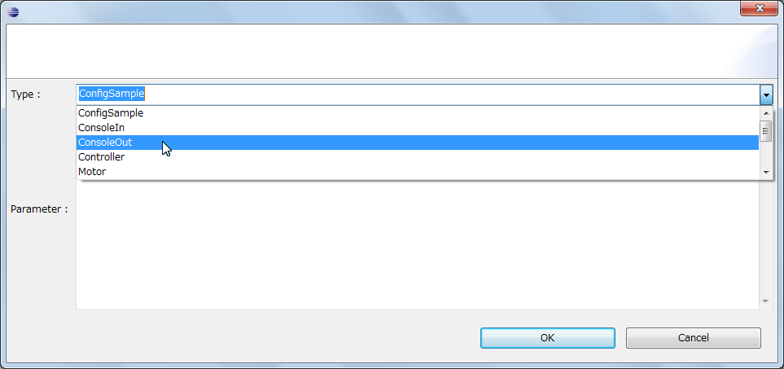
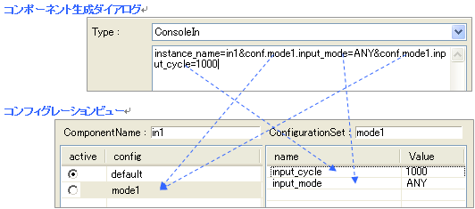

-------jp page!!-------
<!-- Title: ビュー（マネージャコントロールビュー編） -->
<!-- #contents -->

ここではマネージャコントロールビューについて説明します。
 

<strong>マネージャコントロールビューの位置</strong>

 

ネームサービスビューでマネージャを選択すると、マネージャコントロールビューがアクティブになり、選択されたマネージャを制御できるようになります。
 

<strong>マネージャコントロールビュー</strong>

 

<strong>マネージャコントロールビューの画面構成</strong>

<table class="table-alt">
  <tr>
    <th>No.</th>
    <th>説明</th>
  </tr>
  <tr>
    <td>①</td>
    <td>ロード可能モジュール一覧表示ボタン。</td>
  </tr>
  <tr>
    <td>②</td>
    <td>ロード済みモジュール一覧表示ボタン。</td>
  </tr>
  <tr>
    <td>③</td>
    <td>コンポーネント一覧表示ボタン。</td>
  </tr>
  <tr>
    <td>④</td>
    <td>コンポーネント生成ボタン。 コンポーネント作成ダイアログを開き、新しくコンポーネントを生成します。生成されたコンポーネントは③のコンポーネント一覧表示で表示されます。</td>
  </tr>
  <tr>
    <td>⑤</td>
    <td>マネージャ複製ボタン。新しいマネージャを起動します。※現在、仕様未定のため使用不可</td>
  </tr>
  <tr>
    <td>⑥</td>
    <td>マネージャ終了ボタン。選択中のマネージャを終了します。※現在、仕様未定のため使用不可</td>
  </tr>
  <tr>
    <td>⑦</td>
    <td>モジュール、およびコンポーネントの一覧を表示するテーブル。</td>
  </tr>
  <tr>
    <td>⑧</td>
    <td>モジュールを URL 指定でロードする場合に URL を指定します。</td>
  </tr>
  <tr>
    <td>⑨</td>
    <td>モジュールのロード、アンロードボタン。 ⑦のテーブルで選択中のモジュール、もしくは URL で指定したモジュールをロード、アンロードします。</td>
  </tr>
</table>

マネージャにモジュールをロードするには [Loadable Modules] ボタンをクリックし、表示されたロード可能モジュールを選択すると、[Load] ボタンが有効になり、クリックするとモジュールがロードされます。 
また、「URL:」のテキストボックスにモジュールの URL を入力して [Load] ボタンをクリックすることにより、URL 指定でモジュールを追加することもできます。
 

<strong>モジュールのロード</strong>

 

モジュールをアンロードするには [Loaded Modules] ボタンをクリックし、表示されたロード済みモジュールを選択すると、[Unload] ボタンが有効になり、クリックするとモジュールがアンロードされます。
 

<strong>モジュールのアンロード</strong>

 

新しくコンポーネントを生成するには [Create] ボタンをクリックして、コンポーネント生成ダイアログを開き、生成するコンポーネントの種別を選択し、[OK] をクリックするとコンポーネントが生成されます。 
生成されたコンポーネントはマネージャによってネームサービスに登録され、[Active Components] ボタンで表示されるコンポーネント一覧に表示されるようになります。
 

<strong>コンポーネント生成ダイアログ</strong>

 

コンポーネントの種別は、マネージャにロード済みのモジュールで定義されているコンポーネントから選択します。 
Parameter にはコンポーネント生成パラメーターを指定することができ、「param1=value1&param2=value2」の形式で記述します。以下の共通パラメーターは、すべてのコンポーネントで設定可能です。
 

<strong>コンポーネント生成の共通パラメーター</strong>

<table class="table-alt">
  <tr>
    <th>パラメーター名</th>
    <th>説明</th>
  </tr>
  <tr>
    <td>instance_name</td>
    <td>コンポーネントのインスタンス名。 指定しない場合はコンポーネント種別 (type_name)に通番を付与</td>
  </tr>
  <tr>
    <td>type_name</td>
    <td>コンポーネントの種別</td>
  </tr>
  <tr>
    <td>description</td>
    <td>コンポーネントの説明</td>
  </tr>
  <tr>
    <td>version</td>
    <td>コンポーネントのバージョン</td>
  </tr>
  <tr>
    <td>vendor</td>
    <td>コンポーネントの提供元</td>
  </tr>
  <tr>
    <td>category</td>
    <td>コンポーネントのカテゴリ</td>
  </tr>
</table>

 
また、コンポーネント生成パラメーターで ConfigurationSet の値も指定することができます。 
ConfigurationSet のパラメーターは「conf.NNNN.PPPP=VVVV」の形式で、NNNN には ConfigurationSet 名、PPPP にはパラメーター名、VVVV には設定値をそれぞれ指定します。 
例として、ConsoleIn のコンポーネントを生成し、mode1という名前の ConfigurationSet を作成し、input_mode、input_cycle というパラメーターを指定する場合は以下のようになります。
 

<strong>コンポーネント生成時に ConfigurationSet パラメーターを指定</strong>

 

その他にも、コンポーネントによって任意のパラメーターを指定することができます。
 

-------jp page!!-------
