-------jp page!!-------
<!-- Title: ビュー（ネームサービスビュー編 -->
#contents

ここでは、ネームサービスビューについて解説します。
 

OpenRTM-aist では RTC を管理・公開するためにネームサービスが使用されており、ネームサービスビューでは、この内容を表示/編集することができます。
 

### 機能概要
ネームサービスビューは、RTC をリアルタイムにグラフィカル操作する機能を持っています。提供される機能の一覧は以下のとおりです。
#clear

<strong>機能概要一覧</strong>

<table class="table-alt">
  <tr>
    <td>No.</td>
    <td>機能名称</td>
    <td>機能概要</td>
  </tr>
  <tr>
    <td>1</td>
    <td>ネームサーバー接続/編集機能</td>
    <td>ネームサーバーに接続し、登録されているコンポーネントをネームサービスビューにツリー形式で表示する。</td>
  </tr>
  <tr>
    <td>2</td>
    <td>コンポーネントプロファイル表示機能</td>
    <td>選択したコンポーネントのプロファイル情報をプロパティビューに表示する。</td>
  </tr>
</table>

### ネームサービスビューの起動
メニューから[ウインドウ] > [ビューの表示] > [Name Service View] を選択すると、ネームサービスビューが表示されます。
 

<a href="RTCBuilder1.1.2_0301.jpg">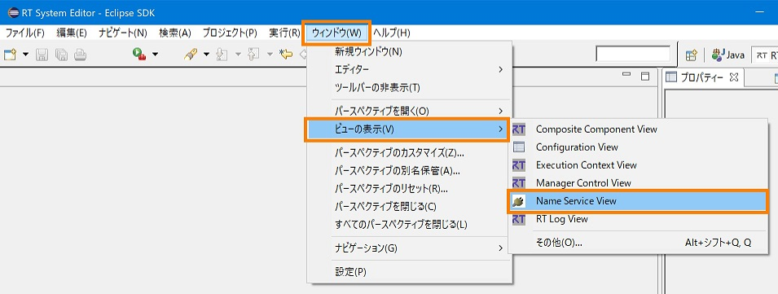</a>

<strong>ビューの表示</strong>

 

<a href="RTCBuilder1.1.2_0302.jpg">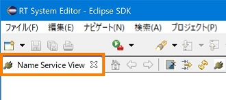</a>

<strong>ネームサービスビューの初期起動時画面</strong>

 

### ネームサーバーに接続するには
ネームサーバーに接続するには、ネームサービスビューの上部に存在する [ネームサーバを追加] ボタンをクリックするか、コンテキストメニューから [ネームサーバを追加] を選択します。
 

<a href="RTCBuilder1.1.2_0303.jpg">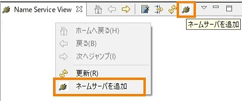</a>

<strong>ネームサーバーに接続する</strong>

 

ネームサーバー接続ダイアログでは、IPアドレスおよびポート番号を入力します。（ポート番号が省略された場合には、設定画面で設定されたポート番号が使用されます。デフォルトのポート番号は2809番ポートです）
 

<a href="RTCBuilder1.1.2_0304.jpg">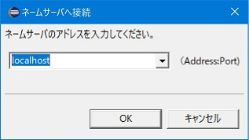</a>

<strong>ネームサーバーの接続ダイアログ</strong>

 

**※**Eclipseの（再）起動時には最後に接続したアドレスへ自動的に接続します。存在しない場合には、ローカルホストの2809番ポートに接続を試みます。

### ネームサーバーを画面から削除するには
接続しているネームサーバーを画面から削除するには、ネームサーバーを右クリックし [ビューから削除] を選択します。
 

<a href="RTCBuilder1.1.2_0305.jpg">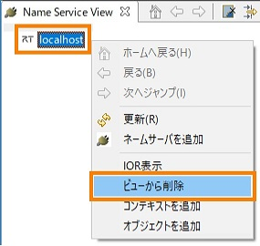</a>

<strong>ネームサーバーを画面から削除する</strong>

 

### ネームサーバーの内容を表示する
接続したネームサーバーにコンポーネントが登録されていると、以下のように登録内容がツリー形式で表示されます。
 

<a href="RTCBuilder1.1.2_0306.jpg">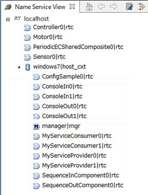</a>
 

<strong>ネームサービスビュー</strong>

 

各アイコンの意味は以下のとおりです。

<strong>ネームサーバーアイコンの一覧</strong>

<table class="table-alt">
  <tr>
    <th>№</th>
    <th>アイコン</th> 
    <th>種類（KIND）</th> 
    <th>名前</th>
  </tr>
  <tr>
    <td>1</td>
    <td>

</td>
    <td>host_cxt</td>
    <td>ホストコンテキスト</td>
  </tr>
  <tr>
    <td>2</td>
    <td>

</td>
    <td>mgr_cxt</td>
    <td>マネージャコンテキスト</td>
  </tr>
  <tr>
    <td>3</td>
    <td>

</td>
    <td>cate_cxt</td>
    <td>カテゴリコンテキスト</td>
  </tr>
  <tr>
    <td>4</td>
    <td>

</td>
    <td>mod_cxt</td>
    <td>モジュールコンテキスト</td>
  </tr>
  <tr>
    <td>5</td>
    <td>

</td>
    <td>上記以外</td>
    <td>フォルダー（上記以外のコンテキスト）</td>
  </tr>
  <tr>
    <td>6</td>
    <td>

</td>
    <td>なし</td>
    <td>RTC</td>
  </tr>
  <tr>
    <td>7</td>
    <td>

</td>
    <td>なし</td>
    <td>マネージャ</td>
  </tr>
  <tr>
    <td>8</td>
    <td>

</td>
    <td>なし</td>
    <td>オブジェクト（RTC 以外のオブジェクト）</td>
  </tr>
  <tr>
    <td>9</td>
    <td>

</td>
    <td>なし</td>
    <td>ネームサーバーにエントリされてはいるが、実体のオブジェクトにアクセスできないゾンビオブジェクト</td>
  </tr>
</table>

ネームサービスビューは、接続先の各ネームサーバーを常に監視し、表示の同期・更新を行っています。（監視の周期は、設定画面の[[接続周期:]]で変更することができます）。
また、明示的にネームサーバーの内容を再取得する場合は更新を行います。更新を行うには、ネームサービスビューの上部の [更新] ボタンをクリックするか、コンテキストメニューにて [更新] を選択します。
 

<a href="RTCBuilder1.1.2_0307.jpg">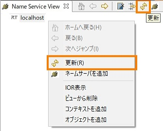</a>

<strong>リフレッシュ</strong>

 

### ネームサービスビューの表示範囲を変更する
ネームサービスビューでは、RTC の数が多くなることによって操作する範囲が煩雑化するのを防ぐために、表示ルートの位置を移動する機能があります。 
表示ルートを移動するには、移動する先を選択し、ネームサービスビューの上部の [次へジャンプ] ボタンをクリックするか、コンテキストメニューにて [次へジャンプ] を選択します。
 

<a href="RTCBuilder1.1.2_0308.jpg">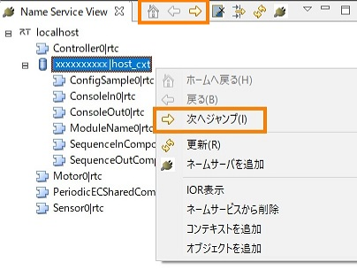</a>

<strong>表示ルート変更</strong>

 

<a href="RTCBuilder1.1.2_0309.jpg">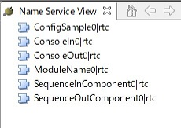</a>

<strong>表示ルート変更例</strong>

 

移動後は、[戻る] で1階層上に戻ることができます。また、[ホームへ戻る] で最上位の階層に戻ります。

### ネームサービスビューの表示内容をフィルターする
ネームサービスビューでは、RTC の数が多くなることによって操作する範囲が煩雑化するのを防ぐための、もうひとつの方法として、フィルター（表示するエントリの種類を限定）する機能があります。 
フィルターを設定するには、ネームサービスビューの上部に存在する [フィルタを設定] ボタンをクリックします。
 

<a href="RTCBuilder1.1.2_0310.jpg">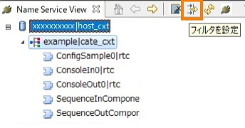</a>

<strong>フィルターの指示</strong>

 

「フィルタを設定」ダイアログでは、非表示にするエントリの種類を、「ビューから除外するエレメントを選択」欄から選択します。
 

<a href="RTCBuilder1.1.2_0311.jpg">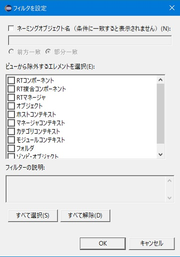</a>

<strong>ネームサービスフィルタダイアログ</strong>

 

ネームサービスビューの表示から除外したい要素にチェックをつけると、ネームサービスビューに表示されなくなります。 
「ネーミングオブジェクト名」を有効にすると、オブジェクト名の条件に一致するものが非表示となります。 
オブジェクト名の条件は前方一致と部分一致が選択できます。
 

<a href="RTCBuilder1.1.2_0312.jpg">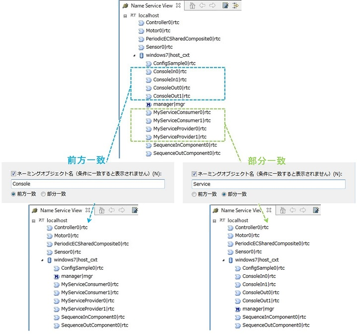</a>

<strong>オブジェクト名によるフィルタリング</strong>

 

### ネームサービスからエントリを削除する
ネームサービスビューでは、ネームサービスのネーミングオブジェクトのエントリを削除することができます。ネーミングオブジェクトを削除するには、コンテキストメニューにて [ネームサービスから削除] ボタンをクリックします。
 

<a href="RTCBuilder1.1.2_0313.jpg">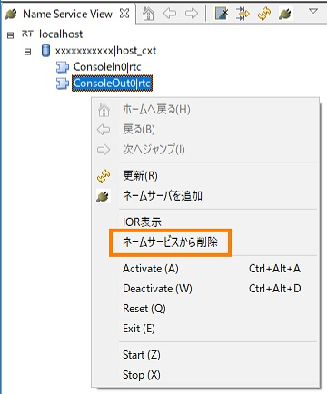</a>

<strong>ネームサービスから削除する</strong>

 

### ネームサービスへオブジェクトを登録する
ネームサービスビューで、ネームサービスにオブジェクトのエントリを登録することができます。 
オブジェクトを登録するには、配下にオブジェクトを追加したいコンテキストおよびオブジェクトのコンテキストメニューから、[オブジェクトを追加] を選択します。
 

<a href="RTCBuilder1.1.2_0314.jpg">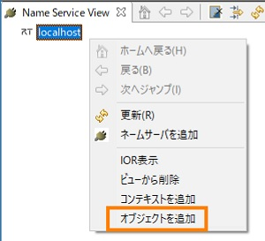</a>

<strong>オブジェクトを追加する</strong>

 

<a href="RTCBuilder1.1.2_0315.jpg">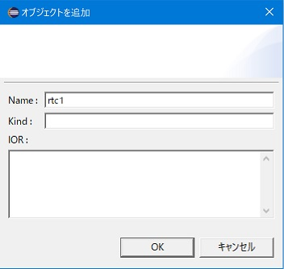</a>

<strong>オブジェクト追加ダイアログ</strong>

 

「オブジェクトを追加」ダイアログでは、オブジェクトの名前(Name)、種類(Kind)、および IOR を指定します。

### ネームサービスへコンテキストを登録する
ネームサービスビューで、ネームサービスにコンテキストのエントリを登録することができます。 
コンテキストを登録するには、配下にコンテキストを追加したいコンテキストのコンテキストメニューから、[コンテキストを追加] を選択します。
 

<a href="RTCBuilder1.1.2_0316.jpg">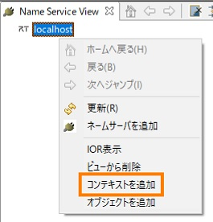</a>

<strong>コンテキストを追加する</strong>

 

<a href="RTCBuilder1.1.2_0317.jpg">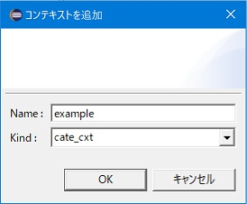</a>

<strong>コンテキスト追加ダイアログ</strong>

 

「コンテキストを追加」ダイアログでは、コンテキストの名前(Name)、種類(Kind)を指定します。 
種類(Kind)には以下のいずれかの値を選択します。

<strong>コンテキストの種類(kind)の一覧</strong>

<table class="table-alt">
  <tr>
    <th>№</th>
    <th>種類（Kind）</th>
    <th>名前</th>
  </tr>
  <tr>
    <td>1</td>
    <td>host_cxt</td>
    <td>ホストコンテキスト</td>
  </tr>
  <tr>
    <td>2</td>
    <td>mgr_cxt</td>
    <td>マネージャコンテキスト</td>
  </tr>
  <tr>
    <td>3</td>
    <td>cate_cxt</td>
    <td>カテゴリコンテキスト</td>
  </tr>
  <tr>
    <td>4</td>
    <td>mod_cxt</td>
    <td>モジュールコンテキスト</td>
  </tr>
  <tr>
    <td>5</td>
    <td>上記以外を入力</td>
    <td>フォルダー（上記以外のコンテキスト）</td>
  </tr>
</table>

### ゾンビオブジェクトを削除する
ネームサービスビューには、ゾンビオブジェクトを一括して削除する機能があります。ゾンビオブジェクトをすべて削除するには、ネームサービスビュー上部の [ゾンビをクリア] ボタンをクリックします。
 

<a href="RTCBuilder1.1.2_0318.jpg">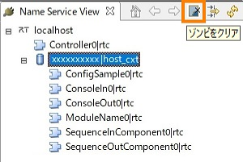</a>

<strong>ゾンビをクリア</strong>

 

-------jp page!!-------
