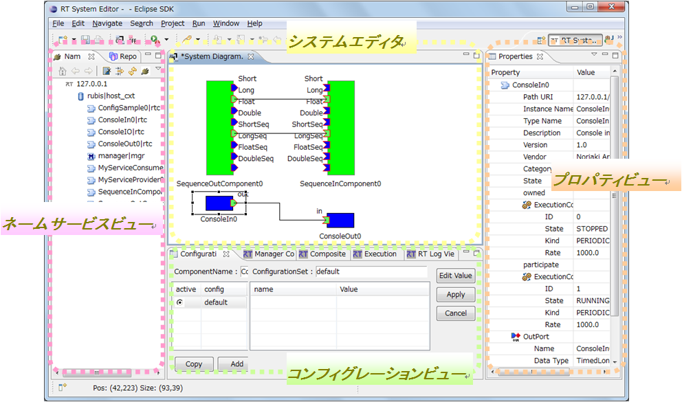
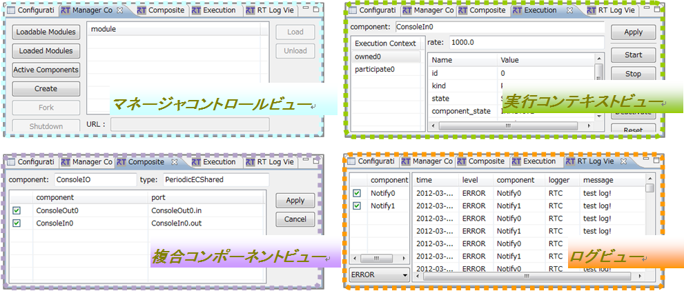

<!-- Title: ビュー（概要） -->
#contents

RTSystemEditor では、以下のようなビューを使用します。
 

<strong>RT System Editorのビュー</strong>

 

<strong>ビュー 一覧</strong>

<table class="table-alt">
  <tr>
    <td>№</td>
    <td>ビュー名</td>
    <td>説明</td>
  </tr>
  <tr>
    <td>１</td>
    <td>ネームサービスビュー</td>
    <td>RTC が登録されているネームサービスの内容をツリー表示します。</td>
  </tr>
  <tr>
    <td>２</td>
    <td>コンフィグレーションビュー</td>
    <td>選択されている RTC のコンフィグレーション情報を表示/編集します。</td>
  </tr>
  <tr>
    <td>３</td>
    <td>マネージャコントロールビュー</td>
    <td>選択されているマネージャを制御します。</td>
  </tr>
  <tr>
    <td>４</td>
    <td>複合コンポーネントビュー</td>
    <td>選択されている複合 RTC のポート公開情報を表示/設定します。</td>
  </tr>
  <tr>
    <td>５</td>
    <td>実行コンテキストビュー</td>
    <td>選択されている RTC が属する実行コンテキスト（EC）の一覧を表示し、RTC、EC のアクション実行、EC への RTC のアタッチ/デタッチを行います。</td>
  </tr>
  <tr>
    <td>６</td>
    <td>ログビュー</td>
    <td>ログ通知オブザーバーにより通知されるログメッセージを表示します。</td>
  </tr>
  <tr>
    <td>７</td>
    <td>プロパティビュー</td>
    <td>選択されている RTC のプロファイル情報を表示します。</td>
  </tr>
  <tr>
    <td>８</td>
    <td>システムエディタ</td>
    <td>RTC をグラフィカルに表示し、RTシステムを作成します。</td>
  </tr>
  <tr>
    <td>９</td>
    <td>オフラインシステムエディタ</td>
    <td>RTリポジトリやローカルの RTコンポーネント仕様ファイルの内容をグラフィカルに表示し、RTシステムを作成します。</td>
  </tr>
</table>

この後の節では、各ビューについてそれぞれ解説していきます。

